```{r eval = TRUE, echo=FALSE, warning=FALSE, results='hide'}
path_to_dir <- dirname(dirname(getwd())) # get path to repo 

# MOVE FIGURE FILES (Need to do this because I got an error when using the absolute path to call figures. However, it's not working at the moment, so did manual copy paste. )

#C cycle diagrams
#do.call(file.remove, list(list.files("/Users/kteixeira/Dropbox (Smithsonian)/GitHub/ForC-db/ERL-review/tables_figures/C_cycle_diagrams/", full.names = TRUE))) # first remove old files

#flist <- list.files("/Users/kteixeira/Dropbox (Smithsonian)/GitHub/EcoClimLab/ForC-db/ForC/figures/C_cycle_diagrams/Diagrams/", full.names = TRUE)
#file.copy(flist, "/Users/kteixeira/Dropbox (Smithsonian)/GitHub/ForC-db/ERL-review/tables_figures/C_cycle_diagrams/")

#Age diagrams
#do.call(file.remove, list(list.files("/Users/kteixeira/Dropbox (Smithsonian)/GitHub/ForC-db/ERL-review/tables_figures/age_trends/", full.names = TRUE))) # first remove old files

#flist <- list.files("/Users/kteixeira/Dropbox (Smithsonian)/GitHub/EcoClimLab/ForC-db/ForC/figures/age_trends/", full.names = TRUE)
#file.copy(flist, "/Users/kteixeira/Dropbox (Smithsonian)/GitHub/ForC-db/ERL-review/tables_figures/age_trends/")

# FIGURE NUMBERS

#SI
diagram_TrB_young= "S1"
diagram_TeB_young= "S2"
diagram_TeN_young= "S3"
diagram_BoN_young= "S4"
NEP_fig= "S5"
GPP_fig= "S6"
NPP_fig= "S7"
ANPP_fig= "S8"
ANPP_woody_fig= "S9"
ANPP_stem_fig= "S10"
ANPP_foliage_fig= "S11"
ANPP_litterfall_fig= "S12"
BNPP_fig= "S13"
BNPP_coarse_fig= "S14"
BNPP_fine_fig= "S15"
R_eco_fig= "S16"
R_root_fig= "S17"
R_soil_fig= "S18"
R_het_soil_fig= "S19"
B_tot_fig="S20"
B_ag_fig="S21"
B_ag_wood_fig="S22"
B_foliage_fig="S23"
B_root_fig="S24"
B_root_coarse_fig="S25"
B_root_fine_fig="S26"
DW_tot_fig="S27"
DW_standing_fig="S28"
DW_down_fig="S29"
OL_fig="S30"

```

\raggedright

\newpage
## Appendix S1. Duplicates and Conflicting Records within ForC

### Status of duplicates and conflicting records within ForC

*ForC* v3.0 contains potential duplicates that have arisen from importing intermediary data sets with overlap in data. 
In particular, the recent imports of *SRDB* and *GROA* resulted in the introduction of numerous potential duplicates. 
*SRDB* and *ForC* were developed independently (but with different foci), resulting in numerous duplicates.
The *GROA* database was developed semi-independently, incorporating *ForC* data partway through its development. 
For records retaining the same site names, *GROA* duplicates were not imported into *ForC* (although they were checked against corresponding *ForC* records, and differences reconciled).
There were, however, some records entered into *GROA* independently of *ForC*, resulting in mismatched names.

Prior to the merging of the three databases (*ForC* v2.0, *SRDB*, and *GROA*), there were potential duplicates within the *ForC* and *SRDB* portions, the latter an artifact of how data were recorded in *SRDB* and imported into *ForC.*
*GROA* has no known duplicates, with several steps having been taken to ensure independence of the records within the database. 

To the extent possible, we used automated scripts in R to detect and remove duplicate records in the creation of *ForC-simplified*.

### Handling within-plot duplicates

Duplicate records within a plot and taken in the same year were reconciled as follows.
Replicate measurements (*i.e.*, replicates from within a single study) were averaged. 
Records that subsumed others—- *i.e.*, the time period included that of $\ge$ 2 other records or dates were unknown and therefore conflicted with $\ge$ 2 other records—were removed. 
For each group of duplicate records—*i.e.*, measurements of the same variable in the same plot at the same time—one record was assigned precedence as follows. 
If duplicates were exact matches, one was dropped. 
When measurement periods overlapped or were not specified, precedence was given first to records representing longer measurement periods (*i.e.*, multi-year mean over a single year) and then to more recently published values. 
We manually reviewed duplicates that differed only in methodology, assigning precedence to the record employing a more comprehensive approach (*e.g.*, inclusion of understory, lianas, or bamboo as opposed to just trees) or using a favored methodology.

### Handling duplicate sites

To handle cases where duplicate records had different site and/or plot names (and often slightly different geographic coordinates), we detected potential duplicates and, for those that had not yet been resolved, included only one in *ForC-simplified* and the analyses that were based on it. 
Potential duplicates were defined as records for the same variable made in the same year (when known) on stands of similar age and in the same geographic area (see Methods).
Because records of stand age often lack precision and  were sometimes recorded differently in different intermediary databases, we considered records to be potential duplicates when ages fell within one of several broad age groups: <10, 10-50, 50-100, and >100 years (or mature and of undefined age). 
We then generated groups of potential duplicates grouped by variable, geographic area, stand age grouping, and measurement year.

Within each group, we flagged records as potential duplicates--and excluded them from *ForC-simplified* until they can be reconciled--as follows.
Because *GROA* is believed to contain no duplicates, all records originating from *GROA* were assumed independent, and any other records within the group flagged as potential duplicates.
If all records originated from *ForC v2.0* or *SRDB*, we gave precedence to *ForC* records, flagging *SRDB* records as potential duplicates.
If duplicates remained (within *ForC v2.0* or *SRDB*), we selected a record for retention based on citation year, keeping the oldest (presumably original) citations for most variables. 
For eddy-covariance variables ($NEP$, $GPP$, $R_{eco}$), we retained the record associated with the most recent publication, as these data are commonly re-assessed using new analysis methods.
If publication years were the same, we randomly selected one record.

This approach was conservative in that it removed some legitimately independent records. 
Future refinement of this process and manual review of potential duplicates will be needed to include legitimately-independent records in ForC-simplified and in analyses.


\newpage

## Table S1. Numbers of records by biome and age class
```{r eval = TRUE, echo=FALSE, warning=FALSE}
library(knitr)
library(kableExtra)
table <- read.csv("tables_figures/Biomes_n_records_variables_of_interest.csv",stringsAsFactors = FALSE, check.names = FALSE)
table_noAgeNA <- subset(table, Age != 'NA') # remove records with age unknown
table_wide <- reshape(table_noAgeNA, idvar = "Biome", timevar = "Age", direction = "wide")
colnames(table_wide)[2] <- "Mature"
colnames(table_wide)[3] <- "Young"
kable(table_wide, format = "latex", booktabs = TRUE, escape = F)%>%
  add_header_above(c(" ", "n records" = 2)) %>%
  pack_rows("Boreal climate zones", 1, 3, latex_gap_space = "1em", colnum = 3, hline_before = FALSE) %>%
  pack_rows("Excluded climate zones", 4, 6, latex_gap_space = "1em", colnum = 3, hline_before = FALSE) %>%
  pack_rows("Temperate climate zones", 7, 9, latex_gap_space = "1em", colnum = 3, hline_before = FALSE) %>%
  pack_rows("Tropical climate zones", 10, 12, latex_gap_space = "1em", colnum = 3, hline_before = FALSE) %>%
  row_spec(2, bold = T) %>%
  row_spec(7:8, bold = T) %>%
  row_spec(10, bold = T) %>%
  kable_styling( protect_latex = T, font_size = 10)
```
Sample sizes refer to data set after merging of duplicates, removal of stands with no age or history data, and removal of managed and disturbed stands. For vegetation type, "Other" refers to stands that are mixed broadleaf/ conifer or that have not been classified. Focal biomes are indicated in bold. 

\newpage
## Table S2. Model parameter estimates for age trends and biome differences in young forests

```{r eval = TRUE, echo=FALSE, warning=FALSE}
library(knitr)
library(kableExtra)
table_pt <- read.csv("tables_figures/SI_age_trend_model_summaries_manually_edited.csv", 
                     #colClasses=c("NULL", NA, NA, NA, NA), 
                     #col.names=c("NULL", "Parameter", "Estimate", "SE", "$t_{value}$"), 
                     stringsAsFactors = FALSE, check.names = FALSE)
kable(table_pt, format = "latex", booktabs = TRUE, longtable = TRUE,  escape = F)%>%
  pack_rows("", 1, 6, latex_gap_space = "1em", colnum = 4, hline_before = FALSE) %>% #NEP
  pack_rows("", 7, 12, latex_gap_space = "1em", colnum = 4, hline_before = FALSE) %>% #GPP
  pack_rows("", 13, 17, latex_gap_space = "1em", colnum = 4, hline_before = FALSE) %>% #NPP
  pack_rows("", 18, 25, latex_gap_space = "1em", colnum = 4, hline_before = FALSE) %>% #ANPP
  pack_rows("", 26, 29, latex_gap_space = "1em", colnum = 4, hline_before = FALSE) %>% #ANPP_woody
  pack_rows("", 30, 34, latex_gap_space = "1em", colnum = 4, hline_before = FALSE) %>% #ANPP_stem
  pack_rows("", 35, 37, latex_gap_space = "1em", colnum = 4, hline_before = FALSE) %>% #ANPP_branch
  pack_rows("", 38, 42, latex_gap_space = "1em", colnum = 4, hline_before = FALSE) %>% #ANPP_foliage
  pack_rows("", 43, 45, latex_gap_space = "1em", colnum = 4, hline_before = FALSE) %>% #ANPP_litterfall
  pack_rows("", 46, 48, latex_gap_space = "1em", colnum = 4, hline_before = FALSE) %>% #skipped variables
  pack_rows("", 49, 53, latex_gap_space = "1em", colnum = 4, hline_before = FALSE) %>% #
  pack_rows("", 54, 57, latex_gap_space = "1em", colnum = 4, hline_before = FALSE) %>% #
  pack_rows("", 58, 62, latex_gap_space = "1em", colnum = 4, hline_before = FALSE) %>% #
  pack_rows("", 63, 67, latex_gap_space = "1em", colnum = 4, hline_before = FALSE) %>% #
  pack_rows("", 68, 69, latex_gap_space = "1em", colnum = 4, hline_before = FALSE) %>% # 2 skipped
  pack_rows("", 70, 74, latex_gap_space = "1em", colnum = 4, hline_before = FALSE) %>% #
  pack_rows("", 75, 79, latex_gap_space = "1em", colnum = 4, hline_before = FALSE) %>% #
  pack_rows("", 80, 84, latex_gap_space = "1em", colnum = 4, hline_before = FALSE) %>% #
  pack_rows("", 85, 92, latex_gap_space = "1em", colnum = 4, hline_before = FALSE) %>% #B_tot
  pack_rows("", 93, 100, latex_gap_space = "1em", colnum = 4, hline_before = FALSE) %>% # B_ag
  pack_rows("", 101, 108, latex_gap_space = "1em", colnum = 4, hline_before = FALSE) %>% # 
  pack_rows("", 109, 116, latex_gap_space = "1em", colnum = 4, hline_before = FALSE) %>% # 
  pack_rows("", 117, 124, latex_gap_space = "1em", colnum = 4, hline_before = FALSE) %>% # 
  pack_rows("", 125, 132, latex_gap_space = "1em", colnum = 4, hline_before = FALSE) %>% # 
  pack_rows("", 133, 140, latex_gap_space = "1em", colnum = 4, hline_before = FALSE) %>% # 
  pack_rows("", 141, 144, latex_gap_space = "1em", colnum = 4, hline_before = FALSE) %>% # 
  pack_rows("", 145, 145, latex_gap_space = "1em", colnum = 4, hline_before = FALSE) %>% # 
  pack_rows("", 146, 153, latex_gap_space = "1em", colnum = 4, hline_before = FALSE) %>% # 
  pack_rows("", 154, 161, latex_gap_space = "1em", colnum = 4, hline_before = FALSE) %>% #
  kable_styling(latex_options =c("repeat_header"), protect_latex = T, font_size = 7)
```


\blandscape
## Figure `r diagram_TrB_young`. C cycle diagram for young tropical broadleaf forests.
```{r eval = TRUE, echo=FALSE, fig.align = "center", fig.cap = "C cycle diagram for young tropical broadleaf forests. Arrows indicate fluxes (Mg C ha$^{-1}$ yr$^{-1}$); boxes indicate stocks (Mg C ha$^{-1}$), with variables as defined in Table 1. Presented are observed ranges, where geographically distinct areas are treated as the unit of replication. All units are Mg C ha$^{-1}$ yr$^{-1}$ (fluxes) or Mg C ha$^{-1}$ (stocks). Dashed shape outlines indicate variables with records from <7 distinct geographic areas, and dashed arrows indicate fluxes with no data. To illustrate the magnitude of different fluxes, arrow size is proportional to the square root of corresponding flux.", out.width='90%', fig.pos='H'}

  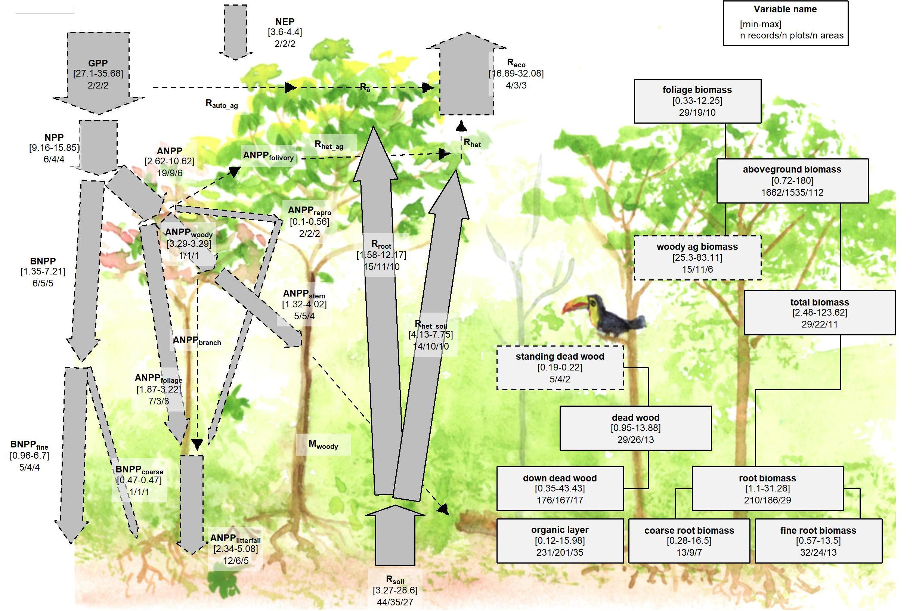
```

## Figure `r diagram_TeB_young`. C cycle diagram for young temperate broadleaf forests.
```{r eval = TRUE, echo=FALSE, fig.align = "center", fig.cap = "C cycle diagram for young temperate broadleaf forests. Arrows indicate fluxes (Mg C ha$^{-1}$ yr$^{-1}$); boxes indicate stocks (Mg C ha$^{-1}$), with variables as defined in Table 1. Presented are observed ranges, where geographically distinct areas are treated as the unit of replication. All units are Mg C ha$^{-1}$ yr$^{-1}$ (fluxes) or Mg C ha$^{-1}$ (stocks). Dashed shape outlines indicate variables with records from <7 distinct geographic areas, and dashed arrows indicate fluxes with no data. To illustrate the magnitude of different fluxes, arrow size is proportional to the square root of corresponding flux.", out.width='90%', fig.pos='H'}

  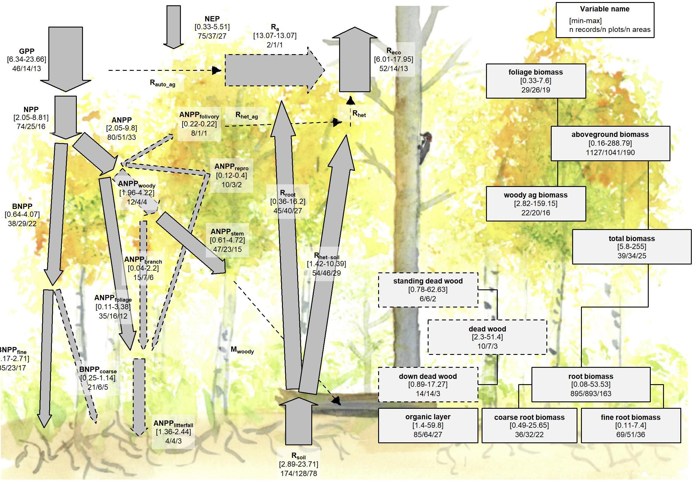
```

## Figure `r diagram_TeN_young`. C cycle diagram for young temperate conifer forests.
```{r eval = TRUE, echo=FALSE, fig.align = "center", fig.cap = " C cycle diagram for young temperate conifer forests. Arrows indicate fluxes (Mg C ha$^{-1}$ yr$^{-1}$); boxes indicate stocks (Mg C ha$^{-1}$), with variables as defined in Table 1. Presented are observed ranges, where geographically distinct areas are treated as the unit of replication. All units are Mg C ha$^{-1}$ yr$^{-1}$ (fluxes) or Mg C ha$^{-1}$ (stocks). Dashed shape outlines indicate variables with records from <7 distinct geographic areas, and dashed arrows indicate fluxes with no data. To illustrate the magnitude of different fluxes, arrow size is proportional to the square root of corresponding flux.", out.width='90%', fig.pos='H'}

  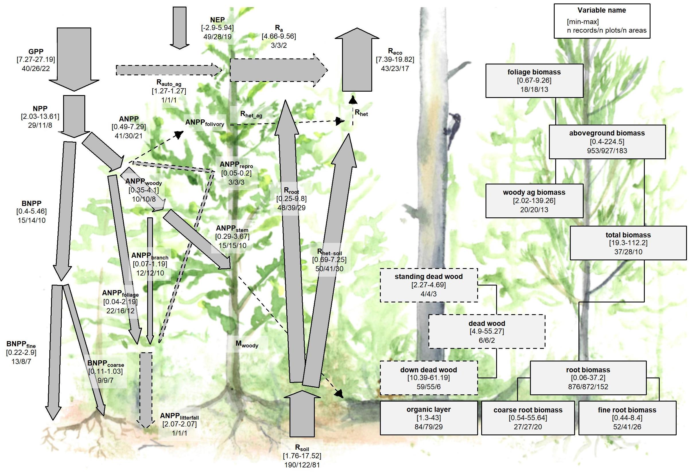
```

## Figure `r diagram_BoN_young`. C cycle diagram for young boreal conifer forests.
```{r eval = TRUE, echo=FALSE, fig.align = "center", fig.cap = "C cycle diagram for young boreal conifer forests. Arrows indicate fluxes (Mg C ha$^{-1}$ yr$^{-1}$); boxes indicate stocks (Mg C ha$^{-1}$), with variables as defined in Table 1. Presented are observed ranges, where geographically distinct areas are treated as the unit of replication. All units are Mg C ha$^{-1}$ yr$^{-1}$ (fluxes) or Mg C ha$^{-1}$ (stocks). Dashed shape outlines indicate variables with records from <7 distinct geographic areas, and dashed arrows indicate fluxes with no data. To illustrate the magnitude of different fluxes, arrow size is proportional to the square root of corresponding flux.", out.width='90%', fig.pos='H'}

  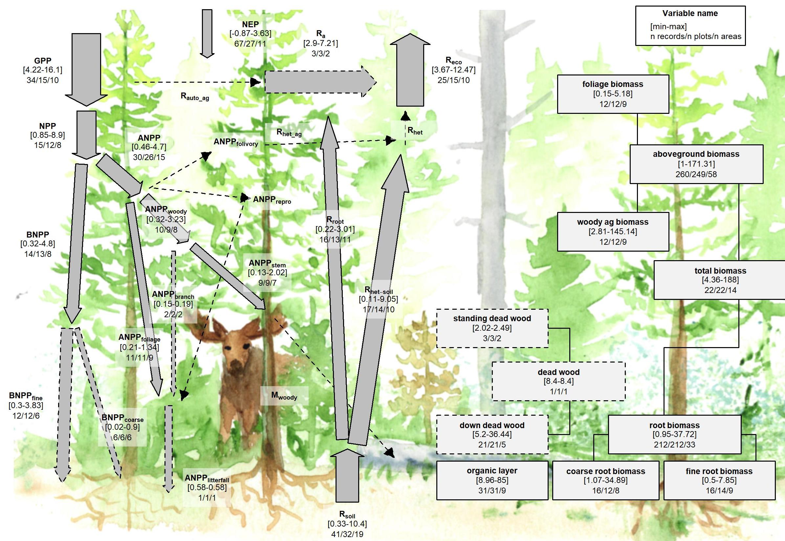
```
\elandscape

\newpage
## Figure `r NEP_fig`. Age trends and biome differences for $NEP$

```{r echo=FALSE, fig.align = "center", fig.cap = "Age trends and biome differences for $NEP$. Map shows data sources ($x$ and $o$ indicate young and mature stands, respectively). In each panel, the left scatterplot shows age trends in forests up to 100 years old, as characterized by a linear mixed effects model with fixed effects of age and biome. The fitted line indicates the effect of age on flux (solid lines: significant at p<0.05, dashed lines: non-significant), and non-parallel lines indicate a significant age x biome interaction. Boxplot illustrates distribution across mature forests, with different letters indicating significant differences between biomes. Data from biomes that did not meet the sample size criteria (see Methods) are plotted, but lack regression lines (young forests) or test of differences across biomes (mature forests).", out.width='100%', fig.pos='H'}

  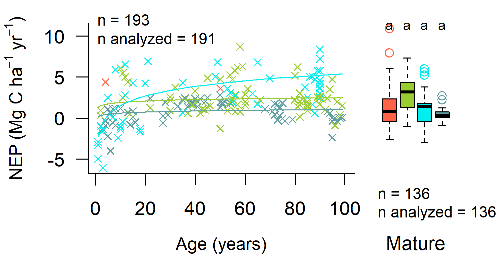
```

\newpage
## Figure `r GPP_fig`. Age trends and biome differences for $GPP$

```{r echo=FALSE, fig.align = "center", fig.cap = "Age trends and biome differences for $GPP$. Map shows data sources ($x$ and $o$ indicate young and mature stands, respectively). In each panel, the left scatterplot shows age trends in forests up to 100 years old, as characterized by a linear mixed effects model with fixed effects of age and biome. The fitted line indicates the effect of age on flux (solid lines: significant at p<0.05, dashed lines: non-significant), and non-parallel lines indicate a significant age x biome interaction. Boxplot illustrates distribution across mature forests, with different letters indicating significant differences between biomes. Data from biomes that did not meet the sample size criteria (see Methods) are plotted, but lack regression lines (young forests) or test of differences across biomes (mature forests).", out.width='100%', fig.pos='H'}

  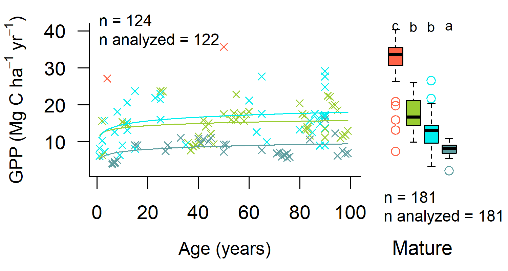
```


\newpage
## Figure `r NPP_fig`. Age trends and biome differences for $NPP$

```{r echo=FALSE, fig.align = "center", fig.cap = "Age trends and biome differences for $NPP$. Map shows data sources ($x$ and $o$ indicate young and mature stands, respectively). In each panel, the left scatterplot shows age trends in forests up to 100 years old, as characterized by a linear mixed effects model with fixed effects of age and biome. The fitted line indicates the effect of age on flux (solid lines: significant at p<0.05, dashed lines: non-significant), and non-parallel lines indicate a significant age x biome interaction. Boxplot illustrates distribution across mature forests, with different letters indicating significant differences between biomes. Data from biomes that did not meet the sample size criteria (see Methods) are plotted, but lack regression lines (young forests) or test of differences across biomes (mature forests).", out.width='100%', fig.pos='H'}

  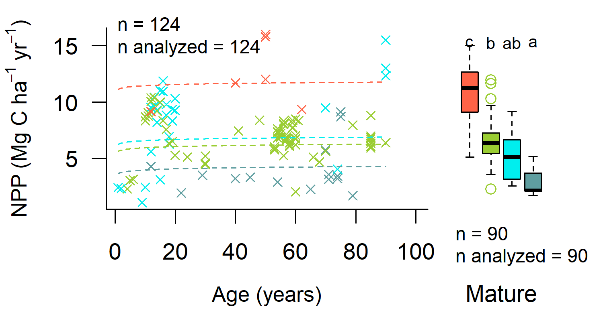
```

\newpage
## Figure `r ANPP_fig`. Age trends and biome differences for $ANPP$

```{r echo=FALSE, fig.align = "center", fig.cap = "Age trends and biome differences for $ANPP$. Map shows data sources ($x$ and $o$ indicate young and mature stands, respectively). In each panel, the left scatterplot shows age trends in forests up to 100 years old, as characterized by a linear mixed effects model with fixed effects of age and biome. The fitted line indicates the effect of age on flux (solid lines: significant at p<0.05, dashed lines: non-significant), and non-parallel lines indicate a significant age x biome interaction. Boxplot illustrates distribution across mature forests, with different letters indicating significant differences between biomes. Data from biomes that did not meet the sample size criteria (see Methods) are plotted, but lack regression lines (young forests) or test of differences across biomes (mature forests).", out.width='100%', fig.pos='H'}

  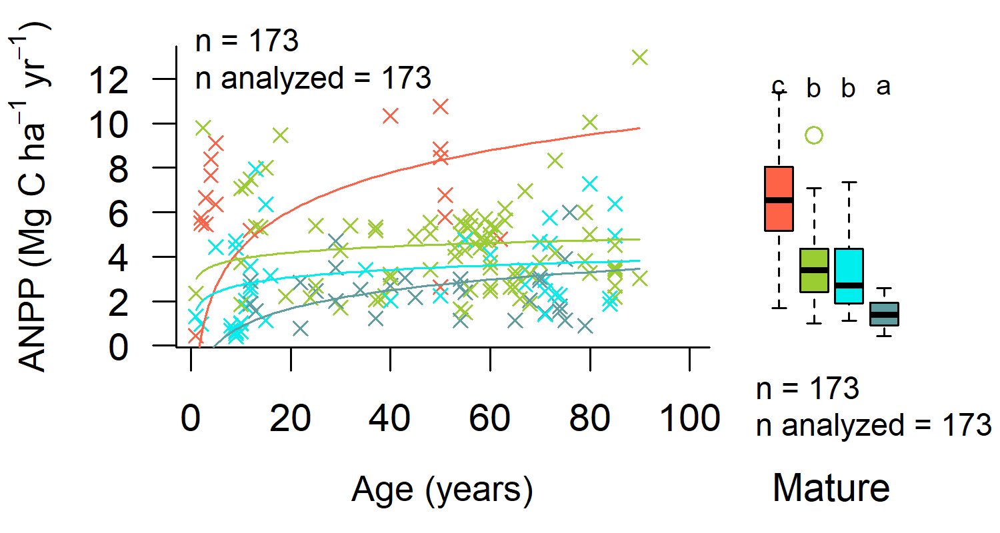
```


\newpage
## Figure `r ANPP_woody_fig`. Age trends and biome differences for $ANPP_{woody}$

```{r echo=FALSE, fig.align = "center", fig.cap = "Age trends and biome differences for $ANPP_{woody}$. Map shows data sources ($x$ and $o$ indicate young and mature stands, respectively). In each panel, the left scatterplot shows age trends in forests up to 100 years old, as characterized by a linear mixed effects model with fixed effects of age and biome. The fitted line indicates the effect of age on flux (solid lines: significant at p<0.05, dashed lines: non-significant), and non-parallel lines indicate a significant age x biome interaction. Boxplot illustrates distribution across mature forests, with different letters indicating significant differences between biomes. Data from biomes that did not meet the sample size criteria (see Methods) are plotted, but lack regression lines (young forests) or test of differences across biomes (mature forests).", out.width='100%', fig.pos='H'}

  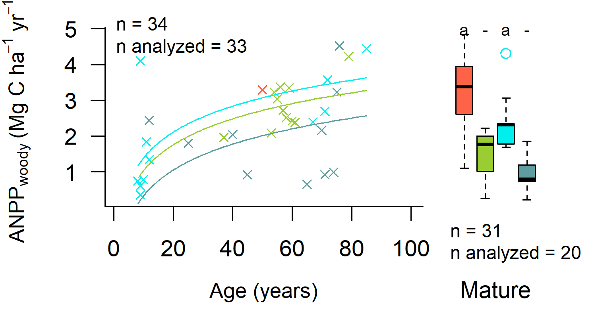
```

\newpage
## Figure `r ANPP_stem_fig`. Age trends and biome differences for $ANPP_{stem}$

```{r echo=FALSE, fig.align = "center", fig.cap = "Age trends and biome differences for $ANPP_{stem}$. Map shows data sources ($x$ and $o$ indicate young and mature stands, respectively). In each panel, the left scatterplot shows age trends in forests up to 100 years old, as characterized by a linear mixed effects model with fixed effects of age and biome. The fitted line indicates the effect of age on flux (solid lines: significant at p<0.05, dashed lines: non-significant), and non-parallel lines indicate a significant age x biome interaction. Boxplot illustrates distribution across mature forests, with different letters indicating significant differences between biomes. Data from biomes that did not meet the sample size criteria (see Methods) are plotted, but lack regression lines (young forests) or test of differences across biomes (mature forests).", out.width='100%', fig.pos='H'}

  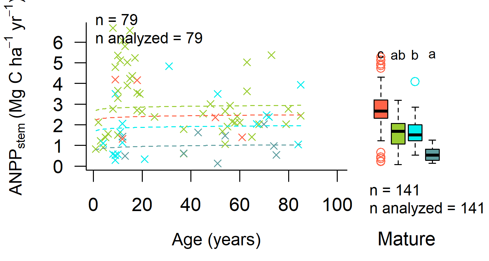
```

\newpage
## Figure `r ANPP_foliage_fig`. Age trends and biome differences for $ANPP_{foliage}$

```{r echo=FALSE, fig.align = "center", fig.cap = "Age trends and biome differences for $ANPP_{foliage}$. Map shows data sources ($x$ and $o$ indicate young and mature stands, respectively). In each panel, the left scatterplot shows age trends in forests up to 100 years old, as characterized by a linear mixed effects model with fixed effects of age and biome. The fitted line indicates the effect of age on flux (solid lines: significant at p<0.05, dashed lines: non-significant), and non-parallel lines indicate a significant age x biome interaction. Boxplot illustrates distribution across mature forests, with different letters indicating significant differences between biomes. Data from biomes that did not meet the sample size criteria (see Methods) are plotted, but lack regression lines (young forests) or test of differences across biomes (mature forests).", out.width='100%', fig.pos='H'}

  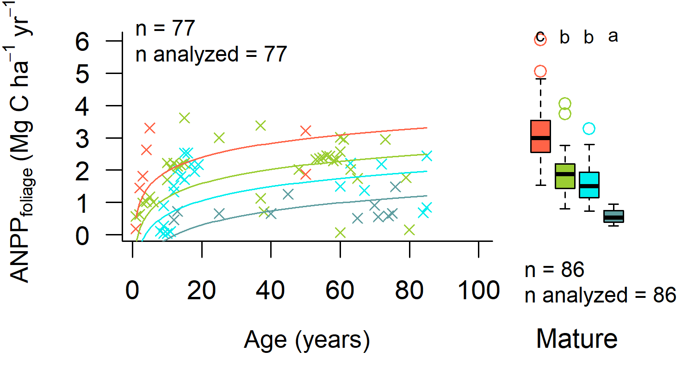
```

\newpage
## Figure `r ANPP_litterfall_fig`. Age trends and biome differences for $ANPP_{litterfall}$

```{r echo=FALSE, fig.align = "center", fig.cap = "Age trends and biome differences for $ANPP_{litterfall}$. Map shows data sources ($x$ and $o$ indicate young and mature stands, respectively). In each panel, the left scatterplot shows age trends in forests up to 100 years old, as characterized by a linear mixed effects model with fixed effects of age and biome. The fitted line indicates the effect of age on flux (solid lines: significant at p<0.05, dashed lines: non-significant), and non-parallel lines indicate a significant age x biome interaction. Boxplot illustrates distribution across mature forests, with different letters indicating significant differences between biomes. Data from biomes that did not meet the sample size criteria (see Methods) are plotted, but lack regression lines (young forests) or test of differences across biomes (mature forests).", out.width='100%', fig.pos='H'}

  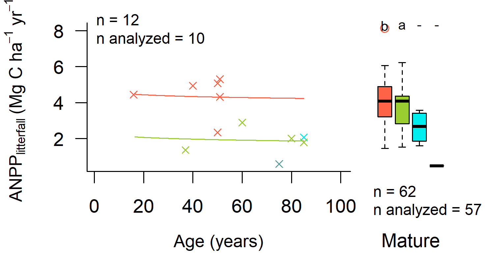
```

\newpage
## Figure `r BNPP_fig`. Age trends and biome differences for $BNPP$

```{r echo=FALSE, fig.align = "center", fig.cap = "Age trends and biome differences for $BNPP$. Map shows data sources ($x$ and $o$ indicate young and mature stands, respectively). In each panel, the left scatterplot shows age trends in forests up to 100 years old, as characterized by a linear mixed effects model with fixed effects of age and biome. The fitted line indicates the effect of age on flux (solid lines: significant at p<0.05, dashed lines: non-significant), and non-parallel lines indicate a significant age x biome interaction. Boxplot illustrates distribution across mature forests, with different letters indicating significant differences between biomes. Data from biomes that did not meet the sample size criteria (see Methods) are plotted, but lack regression lines (young forests) or test of differences across biomes (mature forests).", out.width='100%', fig.pos='H'}

  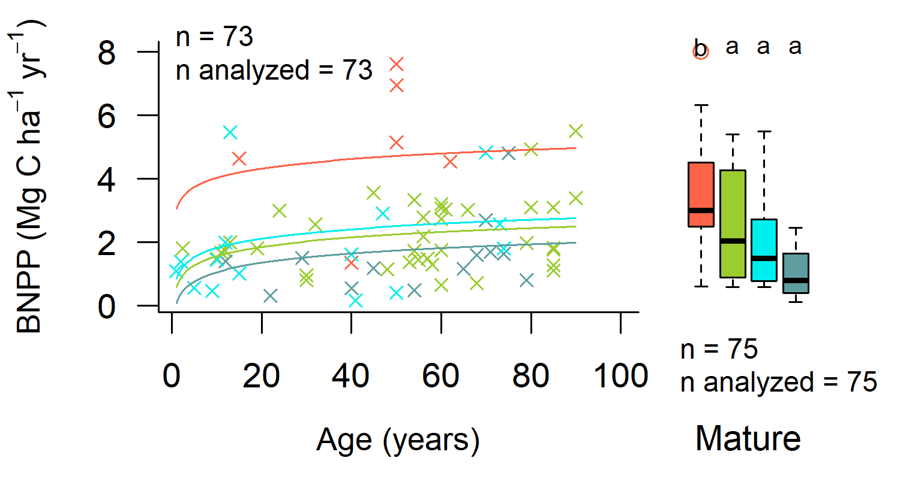
```

\newpage
## Figure `r BNPP_coarse_fig`. Age trends and biome differences for $BNPP_{coarse}$

```{r echo=FALSE, fig.align = "center", fig.cap = "Age trends and biome differences for $BNPP_{coarse}$. Map shows data sources ($x$ and $o$ indicate young and mature stands, respectively). In each panel, the left scatterplot shows age trends in forests up to 100 years old, as characterized by a linear mixed effects model with fixed effects of age and biome. The fitted line indicates the effect of age on flux (solid lines: significant at p<0.05, dashed lines: non-significant), and non-parallel lines indicate a significant age x biome interaction. Boxplot illustrates distribution across mature forests, with different letters indicating significant differences between biomes. Data from biomes that did not meet the sample size criteria (see Methods) are plotted, but lack regression lines (young forests) or test of differences across biomes (mature forests).", out.width='100%', fig.pos='H'}

  knitr::include_graphics("tables_figures/age_trends/BNPP_coarse.png")
```

\newpage
## Figure `r BNPP_fine_fig`. Age trends and biome differences for $BNPP_{fine}$

```{r echo=FALSE, fig.align = "center", fig.cap = "Age trends and biome differences for $BNPP_{fine}$. Map shows data sources ($x$ and $o$ indicate young and mature stands, respectively). In each panel, the left scatterplot shows age trends in forests up to 100 years old, as characterized by a linear mixed effects model with fixed effects of age and biome. The fitted line indicates the effect of age on flux (solid lines: significant at p<0.05, dashed lines: non-significant), and non-parallel lines indicate a significant age x biome interaction. Boxplot illustrates distribution across mature forests, with different letters indicating significant differences between biomes. Data from biomes that did not meet the sample size criteria (see Methods) are plotted, but lack regression lines (young forests) or test of differences across biomes (mature forests).", out.width='100%', fig.pos='H'}

  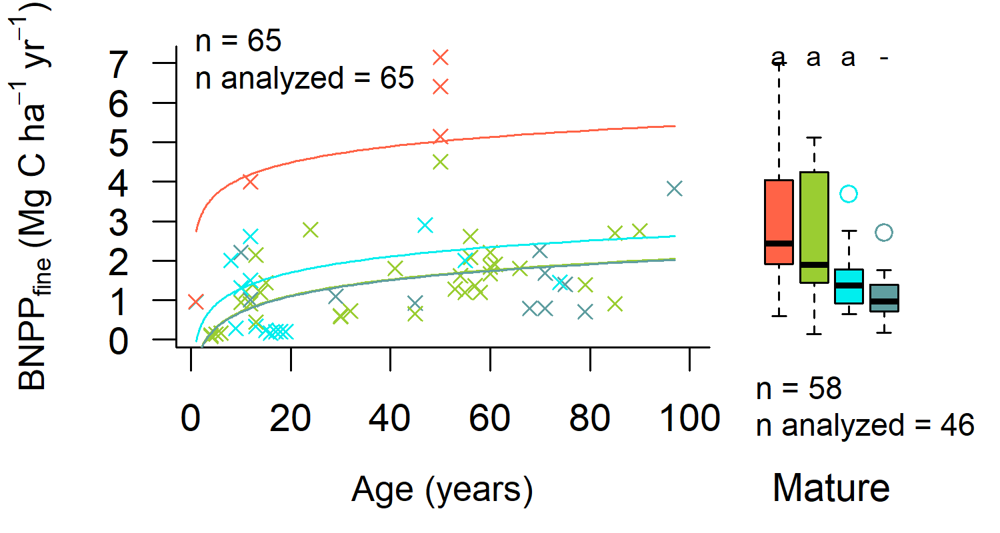
```

\newpage
## Figure `r R_eco_fig`. Age trends and biome differences for $R_{eco}$

```{r echo=FALSE, fig.align = "center", fig.cap = "Age trends and biome differences for $R_{eco}$. Map shows data sources ($x$ and $o$ indicate young and mature stands, respectively). In each panel, the left scatterplot shows age trends in forests up to 100 years old, as characterized by a linear mixed effects model with fixed effects of age and biome. The fitted line indicates the effect of age on flux (solid lines: significant at p<0.05, dashed lines: non-significant), and non-parallel lines indicate a significant age x biome interaction. Boxplot illustrates distribution across mature forests, with different letters indicating significant differences between biomes. Data from biomes that did not meet the sample size criteria (see Methods) are plotted, but lack regression lines (young forests) or test of differences across biomes (mature forests).", out.width='100%', fig.pos='H'}

  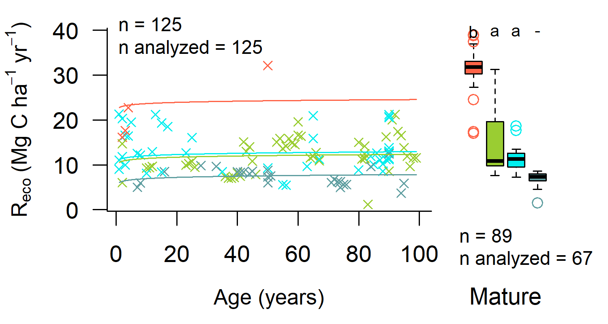
```

\newpage
## Figure `r R_root_fig`. Age trends and biome differences for $R_{root}$

```{r echo=FALSE, fig.align = "center", fig.cap = "Age trends and biome differences for $R_{root}$. Map shows data sources ($x$ and $o$ indicate young and mature stands, respectively). In each panel, the left scatterplot shows age trends in forests up to 100 years old, as characterized by a linear mixed effects model with fixed effects of age and biome. The fitted line indicates the effect of age on flux (solid lines: significant at p<0.05, dashed lines: non-significant), and non-parallel lines indicate a significant age x biome interaction. Boxplot illustrates distribution across mature forests, with different letters indicating significant differences between biomes. Data from biomes that did not meet the sample size criteria (see Methods) are plotted, but lack regression lines (young forests) or test of differences across biomes (mature forests).", out.width='100%', fig.pos='H'}

  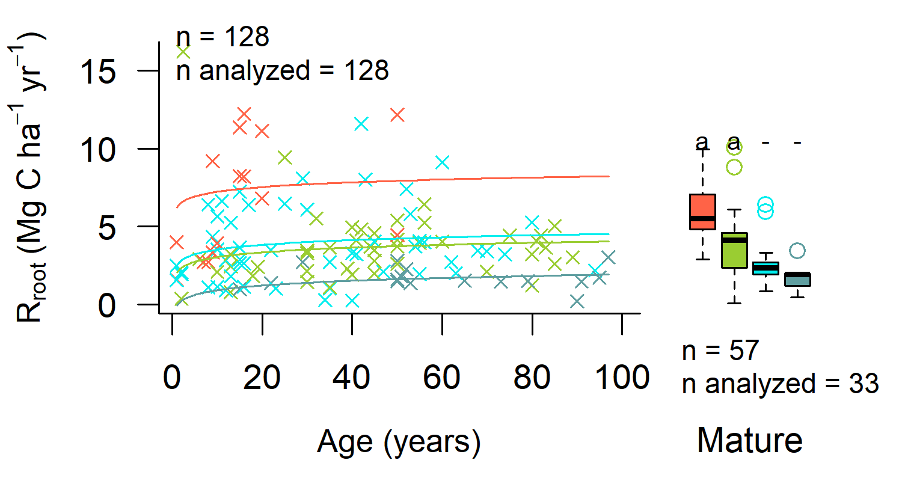
```

\newpage
## Figure `r R_soil_fig`. Age trends and biome differences for $R_{soil}$

```{r echo=FALSE, fig.align = "center", fig.cap = "Age trends and biome differences for $R_{soil}$. Map shows data sources ($x$ and $o$ indicate young and mature stands, respectively). In each panel, the left scatterplot shows age trends in forests up to 100 years old, as characterized by a linear mixed effects model with fixed effects of age and biome. The fitted line indicates the effect of age on flux (solid lines: significant at p<0.05, dashed lines: non-significant), and non-parallel lines indicate a significant age x biome interaction. Boxplot illustrates distribution across mature forests, with different letters indicating significant differences between biomes. Data from biomes that did not meet the sample size criteria (see Methods) are plotted, but lack regression lines (young forests) or test of differences across biomes (mature forests).", out.width='100%', fig.pos='H'}

  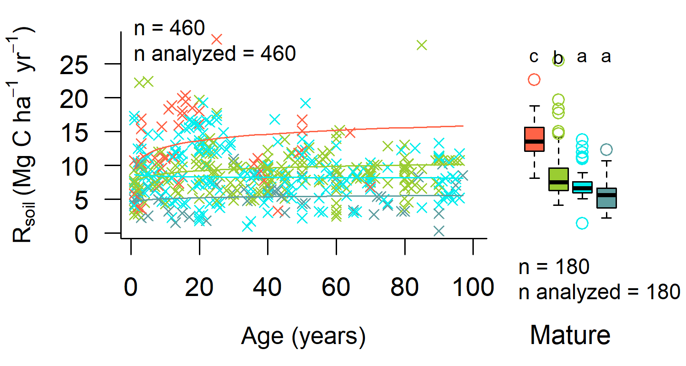
```

\newpage
## Figure `r R_het_soil_fig`. Age trends and biome differences for $R_{het-soil}$

```{r echo=FALSE, fig.align = "center", fig.cap = "Age trends and biome differences for $R_{het-soil}$. Map shows data sources ($x$ and $o$ indicate young and mature stands, respectively). In each panel, the left scatterplot shows age trends in forests up to 100 years old, as characterized by a linear mixed effects model with fixed effects of age and biome. The fitted line indicates the effect of age on flux (solid lines: significant at p<0.05, dashed lines: non-significant), and non-parallel lines indicate a significant age x biome interaction. Boxplot illustrates distribution across mature forests, with different letters indicating significant differences between biomes. Data from biomes that did not meet the sample size criteria (see Methods) are plotted, but lack regression lines (young forests) or test of differences across biomes (mature forests).", out.width='100%', fig.pos='H'}

  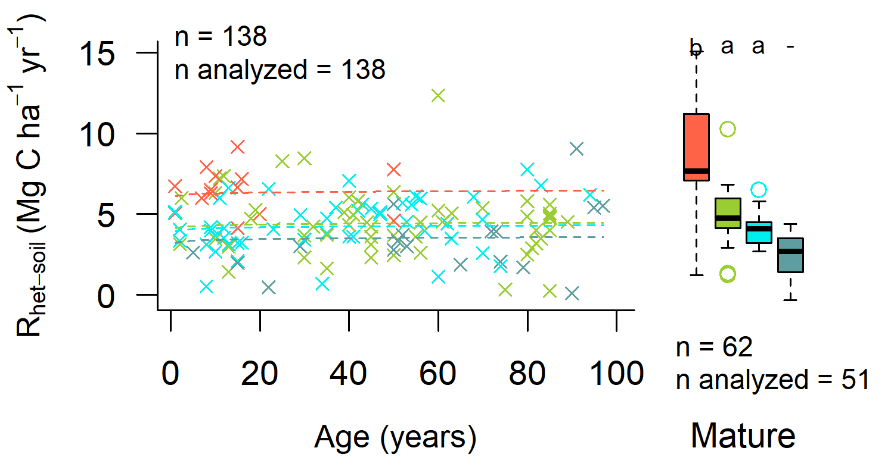
```

\newpage
## Figure `r B_tot_fig`. Age trends and biome differences for $B_{tot}$

```{r echo=FALSE, fig.align = "center", fig.cap = "Age trends and biome differences for $B_{tot}$. Map shows data sources ($x$ and $o$ indicate young and mature stands, respectively). In each panel, the left scatterplot shows age trends in forests up to 100 years old, as characterized by a linear mixed effects model with fixed effects of age and biome. The fitted line indicates the effect of age on flux (solid lines: significant at p<0.05, dashed lines: non-significant), and non-parallel lines indicate a significant age x biome interaction. Boxplot illustrates distribution across mature forests, with different letters indicating significant differences between biomes. Data from biomes that did not meet the sample size criteria (see Methods) are plotted, but lack regression lines (young forests) or test of differences across biomes (mature forests).", out.width='100%', fig.pos='H'}

  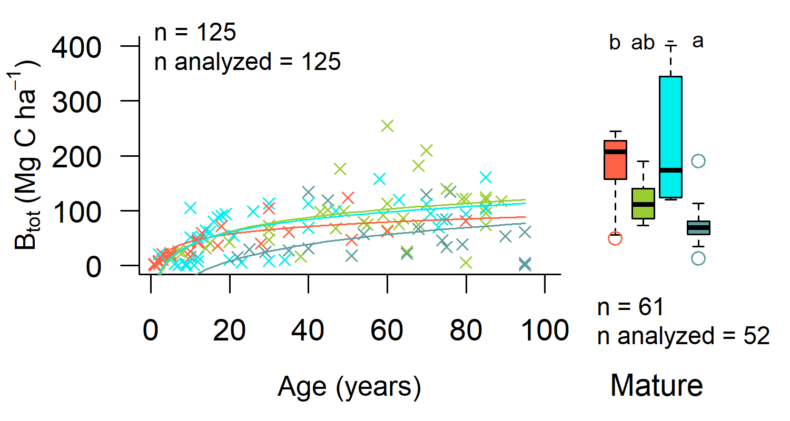
```

\newpage
## Figure `r B_ag_fig`. Age trends and biome differences for $B_{ag}$

```{r echo=FALSE, fig.align = "center", fig.cap = "Age trends and biome differences for $B_{ag}$. Map shows data sources ($x$ and $o$ indicate young and mature stands, respectively). In each panel, the left scatterplot shows age trends in forests up to 100 years old, as characterized by a linear mixed effects model with fixed effects of age and biome. The fitted line indicates the effect of age on flux (solid lines: significant at p<0.05, dashed lines: non-significant), and non-parallel lines indicate a significant age x biome interaction. Boxplot illustrates distribution across mature forests, with different letters indicating significant differences between biomes. Data from biomes that did not meet the sample size criteria (see Methods) are plotted, but lack regression lines (young forests) or test of differences across biomes (mature forests).", out.width='100%', fig.pos='H'}

  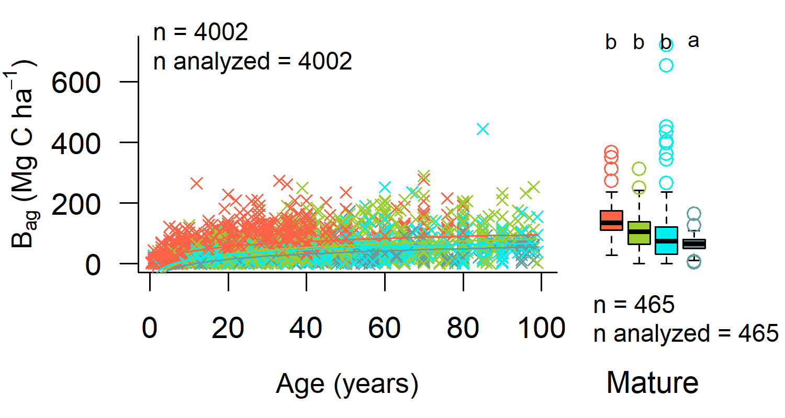
```

\newpage
## Figure `r B_ag_wood_fig`. Age trends and biome differences for $B_{ag-wood}$

```{r echo=FALSE, fig.align = "center", fig.cap = "Age trends and biome differences for $B_{ag-wood}$. Map shows data sources ($x$ and $o$ indicate young and mature stands, respectively). In each panel, the left scatterplot shows age trends in forests up to 100 years old, as characterized by a linear mixed effects model with fixed effects of age and biome. The fitted line indicates the effect of age on flux (solid lines: significant at p<0.05, dashed lines: non-significant), and non-parallel lines indicate a significant age x biome interaction. Boxplot illustrates distribution across mature forests, with different letters indicating significant differences between biomes. Data from biomes that did not meet the sample size criteria (see Methods) are plotted, but lack regression lines (young forests) or test of differences across biomes (mature forests).", out.width='100%', fig.pos='H'}

  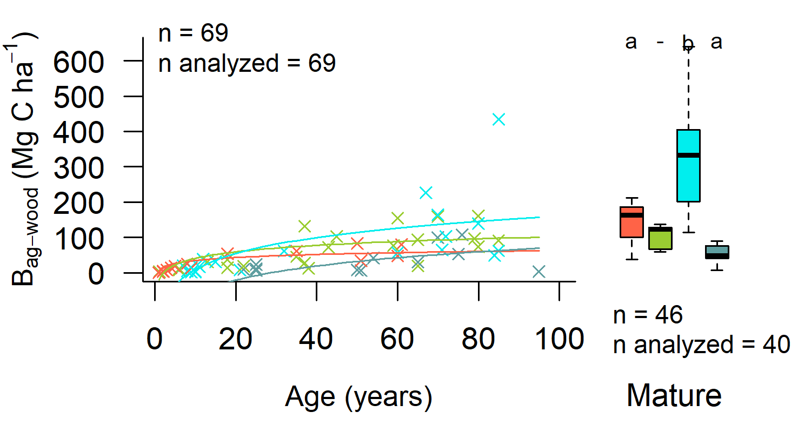
```

\newpage
## Figure `r B_foliage_fig`. Age trends and biome differences for $B_{foliage}$

```{r echo=FALSE, fig.align = "center", fig.cap = "Age trends and biome differences for $B_{foliage}$. Map shows data sources ($x$ and $o$ indicate young and mature stands, respectively). In each panel, the left scatterplot shows age trends in forests up to 100 years old, as characterized by a linear mixed effects model with fixed effects of age and biome. The fitted line indicates the effect of age on flux (solid lines: significant at p<0.05, dashed lines: non-significant), and non-parallel lines indicate a significant age x biome interaction. Boxplot illustrates distribution across mature forests, with different letters indicating significant differences between biomes. Data from biomes that did not meet the sample size criteria (see Methods) are plotted, but lack regression lines (young forests) or test of differences across biomes (mature forests).", out.width='100%', fig.pos='H'}

  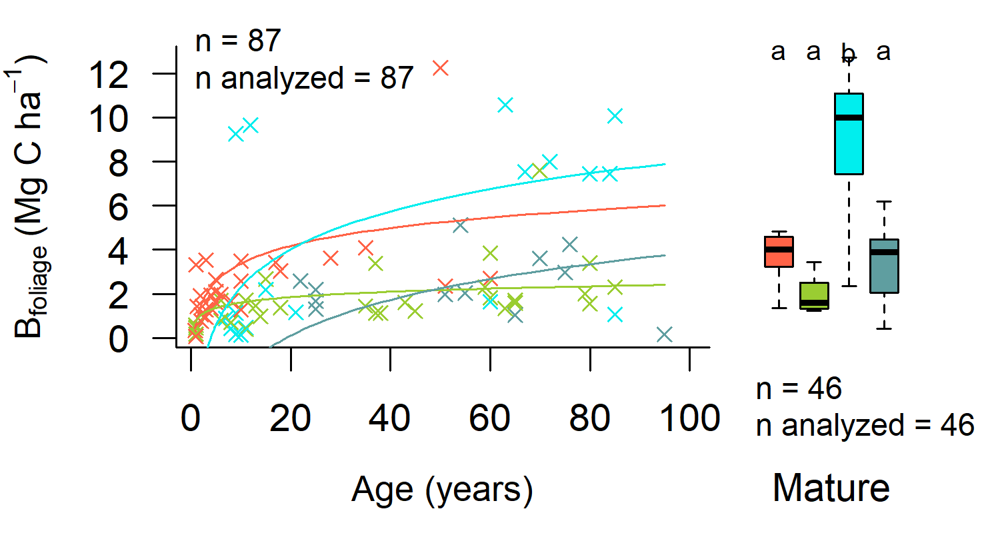
```

\newpage
## Figure `r B_root_fig`. Age trends and biome differences for $B_{root}$

```{r echo=FALSE, fig.align = "center", fig.cap = "Age trends and biome differences for $B_{root}$. Map shows data sources ($x$ and $o$ indicate young and mature stands, respectively). In each panel, the left scatterplot shows age trends in forests up to 100 years old, as characterized by a linear mixed effects model with fixed effects of age and biome. The fitted line indicates the effect of age on flux (solid lines: significant at p<0.05, dashed lines: non-significant), and non-parallel lines indicate a significant age x biome interaction. Boxplot illustrates distribution across mature forests, with different letters indicating significant differences between biomes. Data from biomes that did not meet the sample size criteria (see Methods) are plotted, but lack regression lines (young forests) or test of differences across biomes (mature forests).", out.width='100%', fig.pos='H'}

  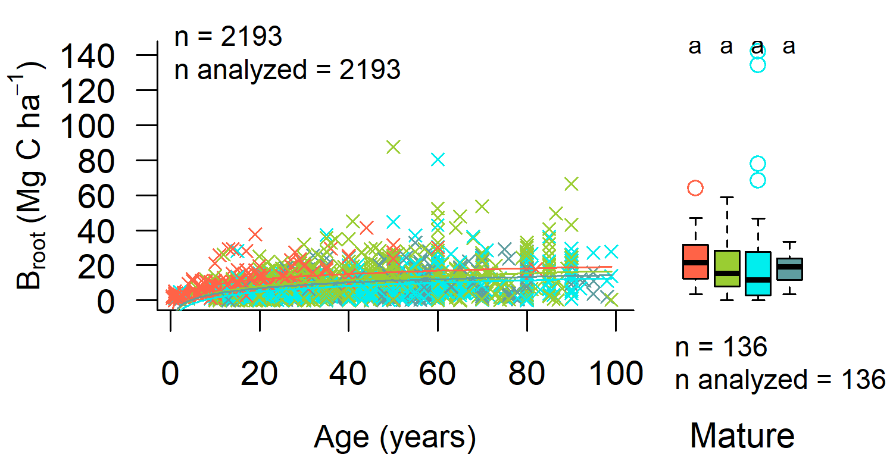
```

\newpage
## Figure `r B_root_coarse_fig`. Age trends and biome differences for $B_{root-coarse}$

```{r echo=FALSE, fig.align = "center", fig.cap = "Age trends and biome differences for $B_{root-coarse}$. Map shows data sources ($x$ and $o$ indicate young and mature stands, respectively). In each panel, the left scatterplot shows age trends in forests up to 100 years old, as characterized by a linear mixed effects model with fixed effects of age and biome. The fitted line indicates the effect of age on flux (solid lines: significant at p<0.05, dashed lines: non-significant), and non-parallel lines indicate a significant age x biome interaction. Boxplot illustrates distribution across mature forests, with different letters indicating significant differences between biomes. Data from biomes that did not meet the sample size criteria (see Methods) are plotted, but lack regression lines (young forests) or test of differences across biomes (mature forests).", out.width='100%', fig.pos='H'}

  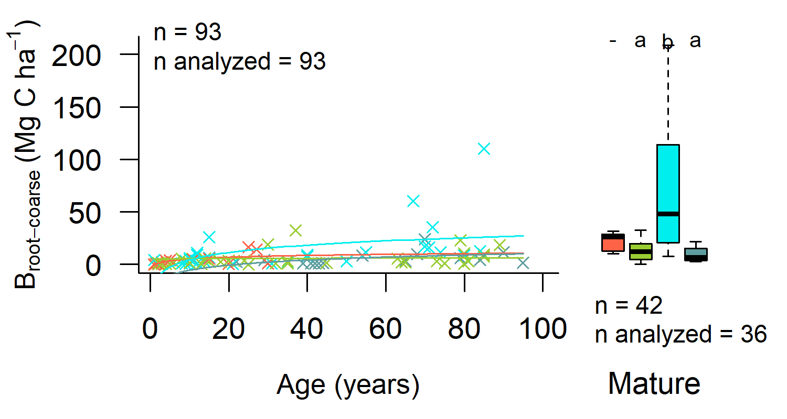
```

\newpage
## Figure `r B_root_fine_fig`. Age trends and biome differences for $B_{root-fine}$

```{r echo=FALSE, fig.align = "center", fig.cap = "Age trends and biome differences for $B_{root-fine}$. Map shows data sources ($x$ and $o$ indicate young and mature stands, respectively). In each panel, the left scatterplot shows age trends in forests up to 100 years old, as characterized by a linear mixed effects model with fixed effects of age and biome. The fitted line indicates the effect of age on flux (solid lines: significant at p<0.05, dashed lines: non-significant), and non-parallel lines indicate a significant age x biome interaction. Boxplot illustrates distribution across mature forests, with different letters indicating significant differences between biomes. Data from biomes that did not meet the sample size criteria (see Methods) are plotted, but lack regression lines (young forests) or test of differences across biomes (mature forests).", out.width='100%', fig.pos='H'}

  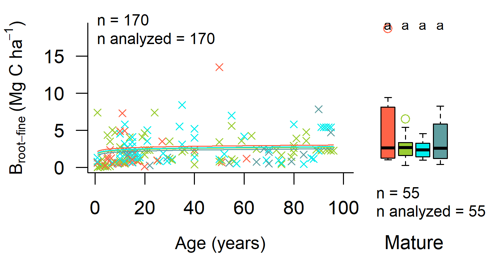
```

\newpage
## Figure `r DW_tot_fig`. Age trends and biome differences for $DW_{tot}$

```{r echo=FALSE, fig.align = "center", fig.cap = "Age trends and biome differences for $DW_{tot}$. Map shows data sources ($x$ and $o$ indicate young and mature stands, respectively). In each panel, the left scatterplot shows age trends in forests up to 100 years old, as characterized by a linear mixed effects model with fixed effects of age and biome. The fitted line indicates the effect of age on flux (solid lines: significant at p<0.05, dashed lines: non-significant), and non-parallel lines indicate a significant age x biome interaction. Boxplot illustrates distribution across mature forests, with different letters indicating significant differences between biomes. Data from biomes that did not meet the sample size criteria (see Methods) are plotted, but lack regression lines (young forests) or test of differences across biomes (mature forests).", out.width='100%', fig.pos='H'}

  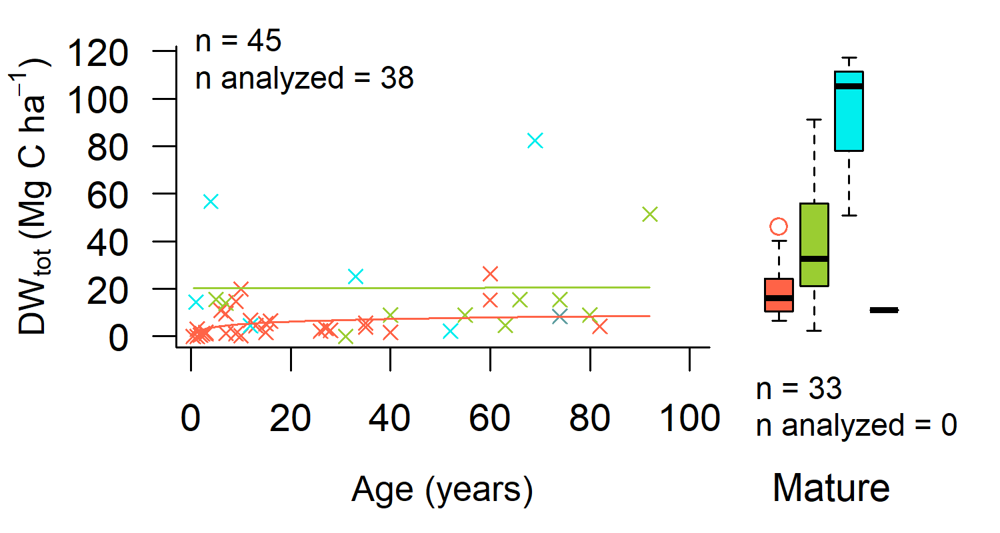
```

\newpage
## Figure `r DW_standing_fig`. Age trends and biome differences for $DW_{standing}$

```{r echo=FALSE, fig.align = "center", fig.cap = "Age trends and biome differences for $DW_{standing}$. Map shows data sources ($x$ and $o$ indicate young and mature stands, respectively). In each panel, the left scatterplot shows age trends in forests up to 100 years old, as characterized by a linear mixed effects model with fixed effects of age and biome. The fitted line indicates the effect of age on flux (solid lines: significant at p<0.05, dashed lines: non-significant), and non-parallel lines indicate a significant age x biome interaction. Boxplot illustrates distribution across mature forests, with different letters indicating significant differences between biomes. Data from biomes that did not meet the sample size criteria (see Methods) are plotted, but lack regression lines (young forests) or test of differences across biomes (mature forests).", out.width='100%', fig.pos='H'}

  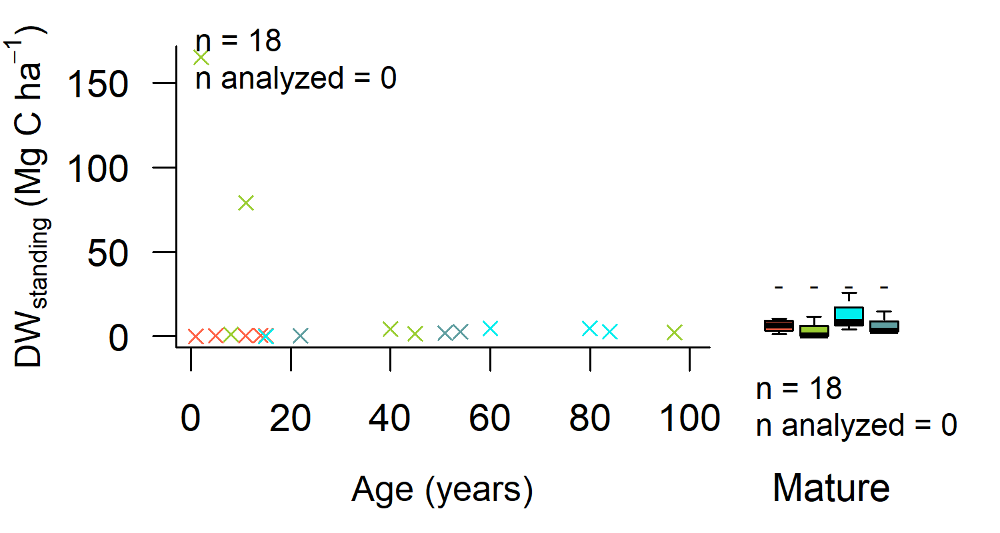
```

\newpage
## Figure `r DW_down_fig`. Age trends and biome differences for $DW_{down}$

```{r echo=FALSE, fig.align = "center", fig.cap = "Age trends and biome differences for $DW_{down}$. Map shows data sources ($x$ and $o$ indicate young and mature stands, respectively). In each panel, the left scatterplot shows age trends in forests up to 100 years old, as characterized by a linear mixed effects model with fixed effects of age and biome. The fitted line indicates the effect of age on flux (solid lines: significant at p<0.05, dashed lines: non-significant), and non-parallel lines indicate a significant age x biome interaction. Boxplot illustrates distribution across mature forests, with different letters indicating significant differences between biomes. Data from biomes that did not meet the sample size criteria (see Methods) are plotted, but lack regression lines (young forests) or test of differences across biomes (mature forests).", out.width='100%', fig.pos='H'}

  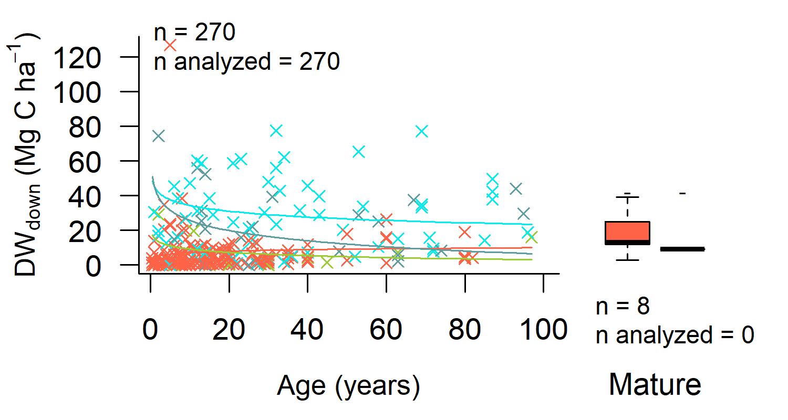
```

\newpage
## Figure `r OL_fig`. Age trends and biome differences for $OL$

```{r echo=FALSE, fig.align = "center", fig.cap = "Age trends and biome differences for $OL$. Map shows data sources ($x$ and $o$ indicate young and mature stands, respectively). In each panel, the left scatterplot shows age trends in forests up to 100 years old, as characterized by a linear mixed effects model with fixed effects of age and biome. The fitted line indicates the effect of age on flux (solid lines: significant at p<0.05, dashed lines: non-significant), and non-parallel lines indicate a significant age x biome interaction. Boxplot illustrates distribution across mature forests, with different letters indicating significant differences between biomes. Data from biomes that did not meet the sample size criteria (see Methods) are plotted, but lack regression lines (young forests) or test of differences across biomes (mature forests).", out.width='100%', fig.pos='H'}

  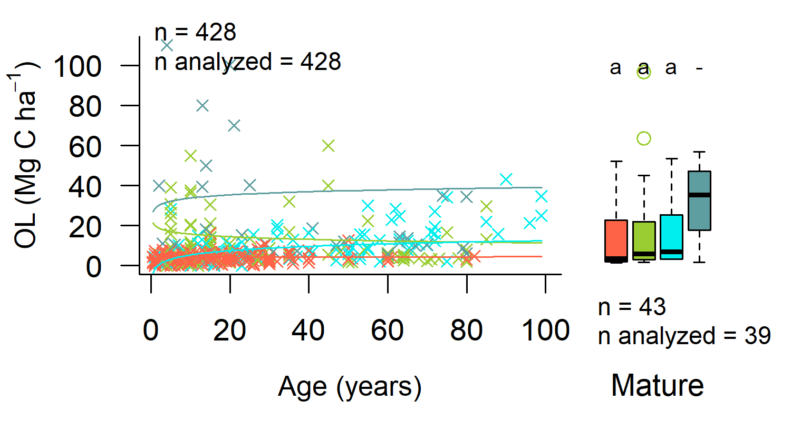
```
