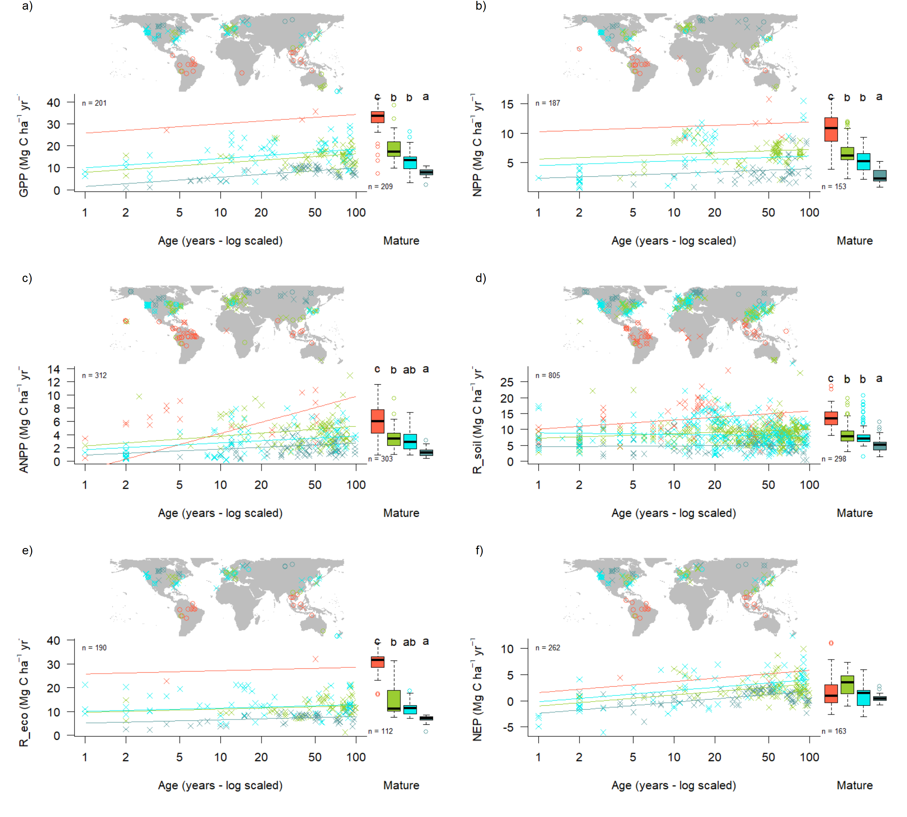
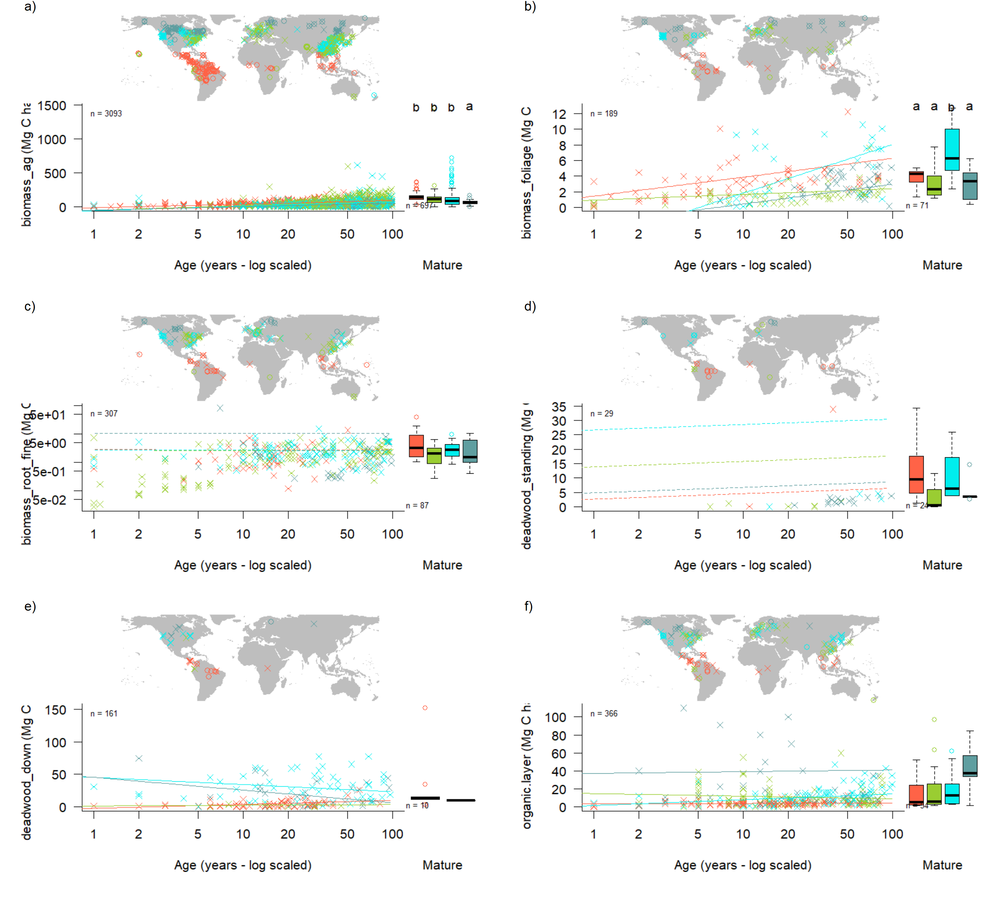

\raggedright

**Title:** Carbon cycling in mature and regrowth forests globally: a macroecological synthesis based on the global Forest Carbon (ForC) database

**Authors:**

Kristina J. Anderson-Teixeira^1,2^*

Valentine Herrmann^1^

Becky Banbury Morgan^3^

Ben Bond-Lamberty^4

Susan C. Cook-Patton^5^

Abigail E. Ferson^1,6^

Jennifer C. McGarvey^1^

Helene C. Muller-Landau^1^

Maria M. H. Wang^1,7^


**Author Affiliations:**

1. Conservation Ecology Center; Smithsonian Conservation Biology Institute; National Zoological Park, Front Royal, VA 22630, USA
2. Center for Tropical Forest Science-Forest Global Earth Observatory; Smithsonian Tropical Research Institute; Panama, Republic of Panama
3. School of Geography, University of Leeds, Leeds, UK
4. Joint Global Change Research Institute, Pacific Northwest National Laboratory, College Park Maryland 20740, USA
5. The Nature Conservancy; Arlington VA 22203, USA
6. College of Natural Resources, University of Idaho; Moscow, Idaho 83843, USA
7. Grantham Centre for Sustainable Futures and Department of Animal and Plant Sciences, University of Sheffield, Western Bank, Sheffield, South Yorkshire S10 2TN, UK


*corresponding author: teixeirak@si.edu; +1 540 635 6546


```{r eval = TRUE, echo=FALSE, warning=FALSE}
#READING IN TABLES TO GET STATS FOR TEXT
path_to_ForC <- paste0(dirname(dirname(getwd())), "/ForC/") # this is to allow anybody to knit (assuming current working direcoty is in forc-db/ERL-review/manuscript and its "nesting" withing the ForC repo does not change)

#ForC raw
ForC_measurements <- read.csv(paste0(path_to_ForC, "/data/ForC_measurements.csv"), stringsAsFactors = FALSE, check.names = FALSE)
  n_records_age_unk <- sum(is.na(as.numeric(ForC_measurements[, "stand.age"])))  #total n records no age info
  n_records_age_0 <- sum(as.numeric(ForC_measurements[, "stand.age"]) %in% 0)

  n_SRDB <- sum(ForC_measurements$ForC.investigator %in% "Ben Bond-Lamberty")
  n_GROA <- sum(ForC_measurements$ForC.investigator %in% "Dr. Susan Cook-Patton")

  ForC_plots <- read.csv(paste0(path_to_ForC, "/data/ForC_plots.csv"), stringsAsFactors = FALSE, check.names = FALSE)
ForC_sites <- read.csv(paste0(path_to_ForC, "/data/ForC_sites.csv"), stringsAsFactors = FALSE, check.names = FALSE)

n_sites_coord_unk <- sum(is.na(as.numeric(ForC_sites[, "lat"])))  #total n records no geographic coordinates

n_areas <- length(unique(na.omit(ForC_sites[,"geographic.area"])))


#ForC simplified
ForC_simplified <- read.csv(paste0(path_to_ForC, "ForC_simplified/ForC_simplified.csv"), stringsAsFactors = FALSE, check.names = FALSE)

n_no_history <- sum(ForC_simplified[,"history.no.info"]) #(relative to ForC_simplified)
n_managed_in_ForC_simplified <- sum(ForC_simplified[,"managed"])
n_disturbed_in_ForC_simplified <- sum(ForC_simplified[,"disturbed"])
records_eligible_for_inclusion <- sum(ForC_simplified$managed ==0 & ForC_simplified$disturbed ==0 & ForC_simplified$history.no.info == 0)  #number in ForC_simplified that are not disturbed, managed, or no.history


# limiting to variables and biomes of interest:
 Biomes_n_records <- read.csv("tables_figures/Biomes_n_records_variables_of_interest.csv", check.names = F)
n_focal_variable_records_eligible_for_inclusion <- sum(Biomes_n_records$n_records) # n records_eligible_for_inclusion, limited to focal variables
# # records for excluded biome groupings ? 
# n_records_BoB <- NA #Biomes_n_records$n_records[Biomes_n_records$Biome %in% "Boreal broadleaf"] # for all n, subset by Age if needed
# n_records_Bomixed <- NA
# n_records_Te_mixed <- NA


#Records included in the analysis
T1 <- read.csv("tables_figures/C_variables.csv", stringsAsFactors = FALSE, check.names = FALSE)
n_records <- sum(T1[,"records"])

global_counts <- read.csv("tables_figures/Count_n_record_n_plot_n_area.csv", check.names = FALSE)
n_records - global_counts$n_records # one count difference... not sure why. probably the filter thing... will ignore dor now.
n_plots_tot <- global_counts$n_plots #total numbers of plots used in the analysis (all variables combined)
n_areas_tot <- global_counts$n_areas #total numbers of areas used in the analysis (all variables combined)


#numbers of variables with records from ≥7 geographic areas, by biomes/ age class:
ForC_biome_averages <- read.csv(paste0(path_to_ForC, "numbers_and_facts/ForC_variable_averages_per_Biome.csv"), stringsAsFactors = F)

idx_fluxes <- ForC_biome_averages$n.areas >= 7 & ForC_biome_averages$variable.type %in% "flux"
idx_stocks <- ForC_biome_averages$n.areas >= 7 & ForC_biome_averages$variable.type %in% "stock"

n_fluxes_with_ge7_areas <- table(ForC_biome_averages$Biome[idx_fluxes])
n_stocks_with_ge7_areas <- table(ForC_biome_averages$Biome[idx_stocks])


```

\newpage

## Summary
```{r eval=FALSE, echo=FALSE}
# The Summary should be no longer than 300 words and divided into the following sections: Background, Methods/Design, Review results/ Synthesis and Discussion. Up to 7 Keywords should also be provided. The total length of the article is flexible.
```


*Background.* The fate of Earth’s climate is closely linked to forests, which strongly influence atmospheric carbon dioxide (CO~2~) and climate through their influential role in the global carbon (C) cycle. Synthetic understanding of global forest C cycles is needed to constrain model estimates of forest feedbacks to climate change and to more accurately quantify the influence of land use decisions on climate.

*Methods/Design.* Here, we draw from the Global Forest C Database, ForC, to provide a macroscopic overview of C cycling in the world’s forests, giving special attention to stand age-related variation. Specifically, we draw upon `r n_records` records from `r n_areas_tot` geographic locations representing `r nrow(T1)` C cycle variables to characterize ensemble C budgets for four broad forest types (tropical broadleaf evergreen, temperate broadleaf, temperate conifer, and taiga), including estimates for both mature and regrowth (age <100 years) forests. For regrowth forests, we quantify age trends for all variables.

*Review Results/ Synthesis.*  ForC v.XX yielded a fairly comprehensive picture of C cycling in the world's major forest biomes, with broad closure of C budgets. The rate of C cycling generally increased from boreal to tropical regions in both mature and regrowth forests, whereas C stocks showed less directional variation. The majority of flux variables, together with most live biomass pools, increased significantly with stand age, *and the rate of increase again tended to increase from boreal to tropical regions*.

*Discussion.* This analysis yields a comprehensive and broadly consistent picture of C cycling across the world's forests.   *[Discussion section will interpret results, highlighting new and significant findings, and discuss implications. Tentative headings are “Stand level C cycling in forests globally”, “Age trends in C cycling”, and “Implications for climate change mitigation”.]*

*Key words*: forest ecosystems; carbon cycle; stand age; productivity; respiration; biomass; global

## Background
```{r eval=FALSE, echo=FALSE}
# The Background section needs to present the rationale for why a systematic review of this topic is needed along with a history of what has been done to date and an expectation of what new will emerge from the review, especially if quantitative meta-analyses of studies are being considered.
```

*(Abby has offered to update stats in this paragraph:)*

Forest ecosystems will play a critical role in shaping the course of climate change (IPCC1.5) through their influence on atmospheric carbon dioxide (CO~2~).
Their annual gross CO~2~ sequestration (gross primary productivity, $GPP$) is estimated at >69 Gt C yr^-1^ [@badgley_terrestrial_2019], or >7 times average annual fossil fuel emissions from 2007-2016 (9.4 ± 0.5 Gt C yr-1; Le Quéré et al 2017) (**update**).
While most of this enormous C flux is couterbalanced by CO~2~ releases to the atmosphere through ecosystem respiration ($R_{eco}$) or fire, a small portion was retained in ecosystems over recent decades.
The resulting CO~2~ sink averaged 3.0 ± 0.8 Gt C yr^{-1} from 2007-2016, offsetting 32% of anthropogenic fossil fuel emissions (Le Quéré et al 2017) (**update, give range**).
Moreover, forests contain substantial carbon (C) stocks: an estimated 92% of terrestrial biomass (Pan et al 2013) and 45% of terrestrial C [biomass and soils; @bonan_forests_2008].
Globally, net deforestation (*i.e.*, gross deforestation - regrowth) has been a source of CO~2~ emissions, estimated at ~1.1 Gt C yr-1 from YEAR-YEAR (Pan et al 2011), reducing the net forest sink to ~1.2-1.7 Gt C yr^-1^ across Earth's forests [Le Quéré et al 2017, @schimel_observing_2015] (**update, give range**).
The future of this sink is dependent both upon forest responses to a broad suite of global change drivers and to future land use decisions, and will strongly influence the course of climate change.
Regrowth forests in particular will play an important role [@pugh_role_2019], as these represent a large (~#%) and growing proportion of Earth's forests.
Understanding, modeling, and managing forest-atmosphere CO~2~ exchange is thereby central to efforts to mitigate climate change [@grassi_key_2017; @griscom_natural_2017; Cavaleri et al 2015].

Despite the centrality of forest C cycling in regulating atmospheric CO~2~, important uncertainties in climate models [@friedlingstein_climate-carbon_2006; @krause_large_2018; REFS] and CO~2~ accounting frameworks [@pan_large_2011] can be traced to lack of accessible, comprehensive data on how C cycling varies across forest types and in relation to stand history.
These require large-scale databases with global coverage, which runs contrary to the nature in which forest C stocks and fluxes are measured and published.
While remote sensing measurements are increasingly useful for global- or regional-scale estimates of a few critical variables [@li_mapping_2019; **REFS for biomass, biomass change, net CO2 flux**], measurement of most forest C stocks and fluxes require intensive on-the-ground data collection.
Original studies typically cover only a small numbers of sites at a time, with rare exceptions spanning regions or continents [e.g., @lutz_global_2018; FLUXNET_REF), typically coordinated through research networks such as ForestGEO [@anderson-teixeira_ctfs-forestgeo_2015] or FLUXNET [@baldocchi_fluxnet_2001].
The result of decades of research on forest C cycling is that tens of thousands of records have been distributed across literally thousands of scientific articles --often behind paywalls-- along with variation in data formats, units, measurement methods, *etc.*.
In this format, the data are effectively inaccessible for many global-scale analyses, including those attempting to benchmark model performance with global data (Clark et al 2017, Luo et al 2012), quantify the the role of forests in the global C cycle [*e.g.*, @pan_large_2011], or use book-keeping methods to quantify actual or scenario-based exchanges of CO~2~ between forests and the atmosphere (REFS).  

To address the need for global-scale analyses of forest C cycling, we recently developed an open-access Global Forest Carbon database, ForC (@anderson-teixeira_carbon_2016, @anderson-teixeira_forc_2018).
ForC contains published estimates of forest ecosystem C stocks and annual fluxes (>50 variables) based on ground-based measurements, along with associated data required for interpretation (*e.g.*, stand history, measurement methods).
These data have been amalgamated from original peer-reviewed publications, either directly or via intermediary data compilations.
Since the its most recent publication [@anderson-teixeira_forc_2018], ForC has been integrated with two large databases: the Global Soil Respiration Database [SRDB; @bond-lamberty_global_2010] and the Global Reforestation Opportunity Assessment database [GROA; @cook-patton_mapping_2020], both of which have also synthesized published forest C data.
Following these additions, ForC currently contains `r nrow(ForC_measurements)` records from `r nrow(ForC_plots)` plots and `r n_areas` distinct geographic areas representing all forested biogeographic and climate zones.

Here, we synthesize ForC data (Fig. 1) to provide a macroscopic overview of stand-level carbon cycling of the world’s major forest biomes and how it varies with stand age. Our primary goal is to provide a data-based summary of our current state of knowledge on broad trends in forest C cycling. We address three broad questions:

1. To what extent can we fully represent, and "close", C budgets for each of the world's major forest biomes (*i.e.*, tropical, temperate broadleaf and deciduous, boreal) based on the current ForC data?

2. How do C cycling vary across the world's major forest biomes?

3. How does C cycling vary with stand age (in interaction with biome)?

While components of these questions have been previously addressed [@luyssaert_co2_2007; @anderson-teixeira_carbon_2016; @cook-patton_mapping_2020; @banbury_morgan_global_nodate], our analysis represents by far the most comprehensive analysis of C cycling in global forests, and thereby stands to serve as a foundation for improved understanding of global forest C cycling.

```{r echo=FALSE, fig.align = "center", fig.cap = "Figure 1 | Map of sites included in this analysis. Symbols are colored according to the number of records at each site. Underlying map shows coverage of evergreen, deciduous, and mixed forests (from SYNMAP; Jung et al. 2006) and biomes. Distribution of sites, plots, and records among biomes is shown in the inset.", out.width='100%', fig.pos='H'}

  knitr::include_graphics("tables_figures/World_Map_records_in_Biomes.png")
```


## Methods/ Design
```{r eval=FALSE, echo=FALSE}
# The Methods/Design section needs to describe how articles in the reviews were identified and what criteria were used for justifying inclusion in the review. While traditional reviews relying on past experience and expert knowledge are acceptable, editors should encourage reviews that are set up as so-called ‘systematic reviews’ (see the Cochrane Review procedure which initiated the process in the medical and health science: http://community.cochrane.org/ about-us/evidence-based-health-care).
```


This review synthesizes data from the ForC database [Fig. 1; https://github.com/forc-db/ForC; @anderson-teixeira_carbon_2016, @anderson-teixeira_forc_2018].
ForC amalgamates numerous intermediary data sets (*e.g.*, REFS) and original studies.
Original publications were referenced to check values and obtain information not contained in intermediary data sets, although this process has not been completed for all records.
The database was developed with goals of understanding how C cycling in forests varies across broad geographic scales and as a function of stand age.
As such, there has been a focus on incorporating data from regrowth forests (*e.g.*, Anderson et al 2006, Martin et al 2013, Bonner et al 2013) and obtaining stand age data when possible [83% of records in v.2.0; @anderson-teixeira_forc_2018].
Particular attention was given to developing the database for tropical forests [@anderson-teixeira_carbon_2016], yet these represented only approximately one-third of records in ForC v.2.0 [@anderson-teixeira_forc_2018].
Since publication of ForC v.2.0, we added the following data to ForC: the Global Database of Soil Respiration Database [SRDB v.##, `r n_SRDB` records; @bond-lamberty_global_2010], the Global Reforestation Opportunity Assessment database [GROA v1.0, `r n_GROA` records; @cook-patton_mapping_2020; @anderson-teixeira_forc-dbgroa_2020], and data from several publications [e.g., @taylor_temperature_2017, @lutz_global_2018, @johnson_climate_2018; detailed list at https://github.com/forc-db/ForC/blob/master/database_management_records/ForC_data_additions_log.csv].
We note that there remains a significant amount of relevant data that is not yet included in ForC, particularly biomass data from national forest inventories (*e.g.*,: REFS).
The database version used for this analysis has been tagged as a new release on Github (XX) and assigned a DOI through Zenodo (DOI: TBD).

Analyses drew from ForC-simplified (https://github.com/forc-db/ForC/blob/master/ForC_simplified), which is a rearrangement of ForC intended to facilitate analyses.
In generating ForC-simplified, all measurements originally expressed in units of dry organic matter ($OM$) were converted to units of C using the IPCC default of $C = 0.47 * OM$ (IPCC 2006).
Duplicate or otherwise conflicting records were reconciled as described in *APPENDIX S1*, resulting in a total of `r nrow(ForC_simplified)` records (`r round(nrow(ForC_simplified)/nrow(ForC_measurements)*100,digits=1)`% size of total database).
Records were filtered to remove plots that had undergone significant anthropogenic management or major disturbance since the most recent stand initiation event.
Specifically, we removed all plots flagged as managed in ForC-simplified (`r round(n_managed_in_ForC_simplified/nrow(ForC_simplified)*100,digits=1)`%).
This included plots with any record of managements manipulating CO~2~, temperature, hydrology, nutrients, or biota, as well as any plots whose site or plot name contained the terms “plantation”, "planted", “managed”, “irrigated”, or “fertilized”.
Plots flagged as disturbed in ForC-simplified (`r round(n_disturbed_in_ForC_simplified/nrow(ForC_simplified)*100,digits=1)`%) included stands that had undergone anthropogenic thinning or partial harvest unless this was very minor.
We retained sites that were grazed or had undergone low severity natural disturbances (<10% mortality) including droughts, major storms, fires, and floods.
We removed all plots for which no stand history information had been retrieved (`r round(n_no_history/nrow(ForC_simplified)*100,digits=1)`%).
In total, this resulted in `r records_eligible_for_inclusion` records (`r round(records_eligible_for_inclusion/nrow(ForC_measurements)*100,digits=1)`% of the records in the database) being eligible for inclusion in the analysis.

We selected 23 annual flux and 11 C stock variables for inclusion in the analysis, although two flux variables ($R_{het-ag}$ and $R_{het}$) were included for conceptual completeness but had no records in ForC (Table 1).
Records for these variables represented `r round(n_focal_variable_records_eligible_for_inclusion/records_eligible_for_inclusion*100,digits=1)`% of the total records eligible for inclusion.
For this analysis, we combined some of ForC’s specific variables (*e.g.*, multiple variables for net primary productivity including various components) into more broadly defined variables (Tables 1, S#(variable mapping)).
Throughout ForC, for all measurements drawing from tree census data (*e.g.*, biomass, productivity), the minimum stem diameter sampled was $\le$ 10cm. All records were measured directly or derived from field measurements (as opposed to modeled).

```{r eval = TRUE, echo=FALSE, warning=FALSE}
library(knitr)
library(kableExtra)
S1 <- read.csv("tables_figures/C_variables.csv", stringsAsFactors = FALSE, check.names = FALSE)
names(S1) [6]  <- paste0(names(S1) [6], footnote_marker_symbol(1))
names(S1) [7]  <- paste0(names(S1) [7], footnote_marker_symbol(2))
kable(S1, format = "latex", booktabs = TRUE, caption = "Table 1. Carbon cycle variables included in this analysis, their sample sizes, and summary of biome differences and age trends.", escape = F)%>%
  # footnote(general = "Complete list of variables with full definitions and association to ForC variables is given in [XXXXX](https://github.com/forc-db/ForC/blob/master/figures/C_cycle_diagrams/ForC_variables_mapping_for_C_cycle_diagrams.csv). ") %>%
  kable_styling(latex_options = c("scale_down", "hold_position"), font_size = 12)  %>%
  add_header_above(c(" ", " ", "N records" = 3, " " , " " )) %>%
  #column_spec(1, width = "4cm") %>%
  column_spec(2, width = "7cm") %>%
  column_spec(3, width = "1.1cm") %>%
  column_spec(4, width = "1cm") %>%
  column_spec(5, width = "1.8cm") %>%
  pack_rows("Annual fluxes", 1, 23, colnum = 2, hline_before = FALSE) %>%
  pack_rows("Stocks", 24, 34, colnum = 2, hline_before = FALSE) %>%
kableExtra::footnote(symbol = c("Tr: Tropical, TeB: Temperate Broadleaf, TeN: Temperate Needleleaf, B: Boreal, n.s.: no significant differences", "+ or -: significant positive or negative trend, xB: significant age x biome interaction, n.s.: no significant age trend"), footnote_as_chunk = FALSE)
```

For this analysis, we grouped forests into four broad biome types (tropical broadleaf, temperate broadleaf, temperate needleleaf, and boreal needleleaf) and two age classifications (young and mature).
Climate zones (Fig. 1) were defined based on site geographic coordinates according to Köppen-Geiger zones (Rubel and Kottek 2010).
Tropical climates were defined to include all equatorial (A) zones, temperate climates were defined to include all warm temperate (C) zones and warmer snow climates (Dsa, Dsb, Dwa, Dwb, Dfa, and Dfb), and boreal climates were defined to include the colder snow climates (Dsc, Dsd, Dwc, Dwd, Dfc, and Dfd).
Any forests in dry (B) and polar (E) Köppen-Geiger zones were excluded from the analysis.
Leaf type (broadleaf / needleleaf) was defined based on descriptions in original publications (prioritized) or values extracted from a global map based on satellite observations [SYNMAP; @jung_exploiting_2006].
Forests were classified as “young” (< 100 years) or “mature” ($\ge$ 100 years or classified as “mature”, “old growth”, “intact”, or “undisturbed” in original publication).
Assigning stands to these groupings required the exclusion of records for which ForC lacked records of stand age (n=`r round(n_records_age_unk/nrow(ForC_measurements)*100, digits=1)`% of records in full database), or geographic coordinates (n=`r round(n_sites_coord_unk/nrow(ForC_sites)*100, digits=1)`% of sites in full database). We also excluded records of stand age = 0 year (n=`r round(n_records_age_0/nrow(ForC_measurements)*100, digits=1)`% of records in full database).
In total, our analysis retained `r round(n_records/n_focal_variable_records_eligible_for_inclusion*100, digits=1)` of the focal variable records for forests of known age.

Data were analyzed to produce
*Schematics:*
Data were summarized to produce schematics of C cycling across the eight biome - age group combinations identified above.
For mature forests, to obtain the values reported in the C cycle schematics, we first averaged any repeated measurements within a plot.
Values were then averaged across plots clustered within 25 km of one another [*sensu* @anderson-teixeira_forc_2018], weighting by area sampled if available for all records.
This step was taken to avoid pseudo-replication and to combine any records from sites with more than one name in ForC.

*FIgs 6-7*
Finally, for figures 6 and 7, the original values were analyzed via a linear mixed effects model ('lmer' function in 'lme4' R package) with biome as fixed effect and plot nested within geographic.area as random effects on the intercept.
When Biome had a significant effect, we looked at a Tukey's pairwise comparison to see which biomes were significantly different from one another. There were enough data to run this analysis for all focal variables but $DW_{down}$.

For young (<100yrs) forest types, we employed a mixed effects model with biome and log10[stand.age] as fixed effects and plot nested within geographic.area as a random effect on the intercept.
When the effect of stand.age was significant at p $\le$ 0.05 and when each biome had records for stands of at least 10 different ages, a biome - stand.age interaction was included in the model.


All database manipulation, analyses, and figure production were fully automated in R (version, citation).
Materials required to fully reproduce these analyses, including data, R scripts, and image files, are archived in Zenodo (DOI: TBD].
Data, scripts, and results presented here are also available through the open-access ForC GitHub repository (https://github.com/forc-db/ForC), where many will be updated as the database develops.

## Review Results/ Synthesis
```{r eval=FALSE, echo=FALSE}
# The Review Results/Synthesis section presents the findings of the analyses.
```

*NOTE TO COAUTHORS: THIS SECTION HAS A TON OF FIGURES, BUT VERY LITTLE TEXT. IS THERE ANYTHING THAT SHOULD BE ADDED?*

### Data Coverage

Of the `r nrow(ForC_measurements)` records in ForC v.#, `r n_records` met the criteria for inclusion in this study (Fig. 1).
These records were distributed across `r n_plots_tot` plots in `r n_areas_tot` distinct geographic areas.
Of the 23 flux and 11 stock variables mapped in these diagrams, ForC contained mature forest estimates from $\ge$ 7 distinct geographic areas for `r n_fluxes_with_ge7_areas[["Tropical broadleaf MATURE"]]` fluxes and `r n_stocks_with_ge7_areas[["Tropical broadleaf MATURE"]]` stocks in tropical broadleaf forests, `r n_fluxes_with_ge7_areas[["Temperate broadleaf MATURE"]]` fluxes and `r n_stocks_with_ge7_areas[["Temperate broadleaf MATURE"]]` stocks in temperate broadleaf forests, `r n_fluxes_with_ge7_areas[["Temperate conifer MATURE"]]` fluxes and `r n_stocks_with_ge7_areas[["Temperate conifer MATURE"]]` stocks in temperate conifer forests, and `r n_fluxes_with_ge7_areas[["Boreal conifer MATURE"]]` fluxes and `r n_stocks_with_ge7_areas[["Boreal conifer MATURE"]]` stocks in boreal forests.
For regrowth forests (<100 yrs), ForC contained estimates from $\ge$ 7 distinct geographic areas for `r n_fluxes_with_ge7_areas[["Tropical broadleaf YOUNG"]]` fluxes and `r n_stocks_with_ge7_areas[["Tropical broadleaf YOUNG"]]` stocks in tropical broadleaf forests, `r n_fluxes_with_ge7_areas[["Temperate broadleaf YOUNG"]]` fluxes and `r n_stocks_with_ge7_areas[["Temperate broadleaf YOUNG"]]` stocks in temperate broadleaf forests, `r n_fluxes_with_ge7_areas[["Temperate conifer YOUNG"]]` fluxes and `r n_stocks_with_ge7_areas[["Temperate conifer YOUNG"]]` stocks in temperate conifer forests, and `r n_fluxes_with_ge7_areas[["Boreal conifer YOUNG"]]` fluxes and `r n_fluxes_with_ge7_areas[["Boreal conifer YOUNG"]]` stocks in boreal forests.

### C cycling in mature forests

Average C cycles for tropical broadleaf, temperate broadleaf, temperate conifer, and boreal forests $\ge$ 100 years old and with no known major disturbance or significant anthropogenic management are presented in Figures 2-5 (and available in tabular format in the ForC release accompanying this publication).

For variables with records from $\ge$ 7 distinct geographic areas, these ensemble C budgets were generally consistent.
That is, component fluxes and stocks summed to within one standard deviation of more inclusive fluxes in all but two instances, both for living C stocks in temperate conifer forests (Fig. 5). **(check this with final results: https://github.com/forc-db/ForC/blob/master/numbers_and_facts/C_cycle_closure.csv) **
Within this biome, $B_{ag}<B_{ag-wood}+B_{foliage}$ and $B_{root}<B_{root-coarse}+B_{root-fine}$ because $B_{ag-wood}$ and $B_{root-coarse}$ were very high, with strongly disproportionate numbers of records from the high-biomass forests of the US Pacific Northwest (Figs. S18, S21).


\blandscape
```{r echo=FALSE, fig.align = "center", fig.cap = "Figure 2 | C cycle diagram for mature tropical broadleaf forests. All units are Mg C ha$^{-1}$ yr$^{-1}$ (fluxes) or Mg C ha$^{-1}$. Presented are mean ± std, where geographically distinct areas are treated as the unit of replication.  Arrows indicate fluxes, boxes indicate stocks. Dashed shape outlines indicate variables with records from <7 distinct geographic areas, and dashed arrows indicate fluxes with no data. Arrows are scaled as the **square root of flux divided by 5**.", out.width='100%', fig.pos='H'}

  knitr::include_graphics(paste0(path_to_ForC, "figures/C_cycle_diagrams/Diagrams/Tropical broadleaf MATURE.png"))
```

```{r echo=FALSE, fig.align = "center", fig.cap = "Figure 3 | C cycle diagram for mature temperate broadleaf forests. All units are Mg C ha$^{-1}$ yr$^{-1}$ (fluxes) or Mg C ha$^{-1}$. Presented are mean ± std, where geographically distinct areas are treated as the unit of replication.  Arrows indicate fluxes, boxes indicate stocks. Dashed shape outlines indicate variables with records from <7 distinct geographic areas, and dashed arrows indicate fluxes with no data.", out.width='100%', fig.pos='H'}

  knitr::include_graphics(paste0(path_to_ForC, "figures/C_cycle_diagrams/Diagrams/Temperate broadleaf MATURE.png"))
```

```{r echo=FALSE, fig.align = "center", fig.cap = "Figure 4 | C cycle diagram for mature temperate conifer forests. All units are Mg C ha$^{-1}$ yr$^{-1}$ (fluxes) or Mg C ha$^{-1}$. Presented are mean ± std, where geographically distinct areas are treated as the unit of replication.  Arrows indicate fluxes, boxes indicate stocks. Dashed shape outlines indicate variables with records from <7 distinct geographic areas, and dashed arrows indicate fluxes with no data.", out.width='100%', fig.pos='H'}

  knitr::include_graphics(paste0(path_to_ForC, "figures/C_cycle_diagrams/Diagrams/Temperate conifer MATURE.png"))
```

```{r echo=FALSE, fig.align = "center", fig.cap = "Figure 5 | C cycle diagram for mature boreal conifer forests. All units are Mg C ha$^{-1}$ yr$^{-1}$ (fluxes) or Mg C ha$^{-1}$. Presented are mean ± std, where geographically distinct areas are treated as the unit of replication.  Arrows indicate fluxes, boxes indicate stocks. Dashed shape outlines indicate variables with records from <7 distinct geographic areas, and dashed arrows indicate fluxes with no data.", out.width='100%', fig.pos='H'}

  knitr::include_graphics(paste0(path_to_ForC, "figures/C_cycle_diagrams/Diagrams/Boreal conifer MATURE.png"))
```
\elandscape

**(The following covers only the variables with age trends figures; there maybe a few more without much age data)**
With only ## exceptions, C fluxes were highest in tropical forests, intermediate in temperate (broadleaf or conifer) forests, and lowest in boreal forests (Table 1, Figs. 6, S1-S15).
In this majority of cases, differences between tropical and boreal forests were always significant, with temperate forests intermediate and significantly different from one or both.
Fluxes tended to be greater in temperate broadleaf than conifer forests, but the difference was never significant.
This pattern held for the following variables: $GPP$, $NPP$, $ANPP$, $ANPP_{woody}$, $ANPP_{stem}$, $ANPP_{foliage}$, $ANPP_{litterfall}$, $BNPP$, $BNPP_fine$, $R_{eco}$, $R_{root}$, $R_{soil}$, and $R_{het-soil}$.  

The most notable exception to this pattern was $NEP$, with no significant differences across biomes but with the largest average in temperate broadleaf forests, followed by temperate conifer, boreal, and tropical forests (Figs. 5,S1).
Another exception was for $BNPP_{root-coarse}$, where all records came from high-biomass forests in the US Pacific Northwest, resulting in high values for the temperate conifer biome and no significant differences across biomes (Fig. S10).  
Thus, C cycling rates generally decreased from tropical to temperate to boreal forests, with the important exception in the overall C balance ($NEP$).


```{r echo=FALSE, fig.align = "center", fig.cap = "Figure 6 | Age trends and biome differences in some of the major C fluxes: (a) $GPP$, (b) $NPP$, (c) $ANPP$, (d) $R_{soil}$, (e) $R_{eco}$, and (f) $NEP$. Map shows data sources ($x$ and $o$ indicate young and mature stands, respectively). Left plot shows age trends in forests up to 100 years old, as characterized by a linear mixed effects model with fixed effects of age and biome. Solid lines indicate signficant effect of age, non-pareallel lines indicate a significant age x biome interaction. Boxplot illustrates distribution across mature forests, with different letters indicating signifant differences between biomes. Individual figures for each flux with sufficient data given in the Supplement (Figs. S1-S15).", out.width='100%', fig.pos='H'}

  
```

There were fewer distinct trends in C stocks across biomes (Figs. 7, S16-S26).
Specifically, there were significant differences for only *##* of *##* variables: *LIST*.
In all of these cases, temperate conifer forests were in the highest significance grouping, and boreal forests in the lowest.
Tropical and temperate broadleaf forests fell in between--most commonly being significantly different from temperate conifer but not boreal forests.
Once again, the high values for the temperate conifer biome were driven by the very high-biomass forests of the US Pacific Northwest, which are disproportionately represented in the current version of ForC.
Thus, biome differences should be interpreted more as driven more by geographic distribution of sampling than by true differences.)*

```{r echo=FALSE, fig.align = "center", fig.cap = "Figure 7 | Age trends and biome differences in some of the major forest C stocks: (a) aboveground biomass, (b) foliage, (c) fine roots, (d) dead wood. Map shows data sources ($x$ and $o$ indicate young and mature stands, respectively). Left plot shows age trends in forests up to 100 years old, as characterized by a linear mixed effects model with fixed effects of age and biome. Solid lines indicate signficant effect of age, non-pareallel lines indicate a significant age x biome interaction. Boxplot illustrates distribution across mature forests, with different letters indicating signifant differences between biomes. Individual figures for each stock with sufficient data given in the Supplement (Figs. S16-S26).", out.width='100%', fig.pos='H'}

  
```


### C cycling in young forests

Average C cycles for forests <100 years old are presented in Figures 8-11.  
Both C stocks and fluxes commonly displayed significant trends with stand age for within-biome analyses (Table 1, Figs. 6-11, S1-S26; detailed below).

ForC contained *14* flux variables with sufficient data for cross-biome analyses of age trends in regrowth forests (see Methods) (Fig. 6-7 and **S#- SI figures including plots for all variables**).
Of these, *9* increased significantly with log10[stand.age]: $GPP$, $NPP$, $ANPP$, $ANPP_{foliage}$, $ANPP_{woody}$, $ANPP_{woody-stem}$, $BNPP$, $BNPP_{root-fine}$, $R_{eco}$, and net C sequestration ($NEP$).
The remaining five--$ANPP_{woody-branch}$, $BNPP_{root-coarse}$, $R_{soil-het}$, and $R_{soil-het}$-–displayed no significant relationship to stand age, although all displayed a positive trend.

Differences in C fluxes across biomes typically paralleled those observed for mature forests, with C cycling generally most rapid in the tropics and slowest in boreal forests.  
The single exception was $ANPP_{stem}$, for which temperate broadleaf forests and temperate conifer forests of age >*~30* had slightly higher flux rates than tropical forests (*represented by a single chronosequence*).
Notably, the trend of tropical > temperate > boreal held for $NEP$ in regrowth forests, in contrast to the lack of biome differences in $NEP$ for mature forests (Fig. 6).

There were only *##* flux variables with sufficient data to test for biome x age interactions: $ANPP$, $ANPP_{woody}$, $ANPP_{stem}$, $ANPP_{litterfall}$, and $BNPP$. **(more could be added if age trends become significant after outliers are resolved)**
For three of these ($ANPP$, $ANPP_{litterfall}$, $BNPP$), the increase in C flux with age was steepest increase in tropical forests, followed by temperate and then boreal forests (Figs S#).
Similarly, $ANPP_{woody}$ displayed a steeper increase with age in temperate than boreal boreal forests (no tropical data for this variable).
In contrast, for $ANPP_{stem}$,  tropical and temperate broadleaf forests had the highest flux rates at young ages, but were surpassed by temperate conifer forests between ages 20 and 50 (Fig. S6).

(**this needs to be updated with latest data**)
In terms of C stocks, *10* variables had sufficient data to test for age trends.
*Six* of these—*total biomass, aboveground biomass, aboveground woody biomass, foliage biomass, root biomass, and coarse root biomass*— increased significantly with $log10[stand.age]$.
*The remaining four displayed non-significant positive trends:  fine root biomass, total dead wood, standing dead wood, and organic layer.*
*(discuss rates of increase)*

\newpage
\blandscape
```{r echo=FALSE, fig.align = "center", fig.cap = "Figure 8 | C cycle diagram for young tropical broadleaf forests. All units are Mg C ha$^{-1}$ yr$^{-1}$ (fluxes) or Mg C ha$^{-1}$. Presented are observed ranges, where geographically distinct areas are treated as the unit of replication.  Arrows indicate fluxes, boxes indicate stocks. Dashed shape outlines indicate variables with records from <7 distinct geographic areas, and dashed arrows indicate fluxes with no data.", out.width='100%', fig.pos='H'}

  knitr::include_graphics(paste0(path_to_ForC, "figures/C_cycle_diagrams/Diagrams/Tropical broadleaf YOUNG.png"))
```

```{r echo=FALSE, fig.align = "center", fig.cap = "Figure 9 | C cycle diagram for young temperate broadleaf forests. All units are Mg C ha$^{-1}$ yr$^{-1}$ (fluxes) or Mg C ha$^{-1}$. Presented are observed ranges, where geographically distinct areas are treated as the unit of replication.  Arrows indicate fluxes, boxes indicate stocks. Dashed shape outlines indicate variables with records from <7 distinct geographic areas, and dashed arrows indicate fluxes with no data.", out.width='100%', fig.pos='H'}

  knitr::include_graphics(paste0(path_to_ForC, "figures/C_cycle_diagrams/Diagrams/Temperate broadleaf YOUNG.png"))
```

```{r echo=FALSE, fig.align = "center", fig.cap = "Figure 10 | C cycle diagram for young temperate conifer forests. All units are Mg C ha$^{-1}$ yr$^{-1}$ (fluxes) or Mg C ha$^{-1}$. Presented are observed ranges, where geographically distinct areas are treated as the unit of replication.  Arrows indicate fluxes, boxes indicate stocks. Dashed shape outlines indicate variables with records from <7 distinct geographic areas, and dashed arrows indicate fluxes with no data.", out.width='100%', fig.pos='H'}

  knitr::include_graphics(paste0(path_to_ForC, "figures/C_cycle_diagrams/Diagrams/Temperate conifer YOUNG.png"))
```

```{r echo=FALSE, fig.align = "center", fig.cap = "Figure 11 | C cycle diagram for young boreal conifer forests. All units are Mg C ha$^{-1}$ yr$^{-1}$ (fluxes) or Mg C ha$^{-1}$. Presented are observed ranges, where geographically distinct areas are treated as the unit of replication.  Arrows indicate fluxes, boxes indicate stocks. Dashed shape outlines indicate variables with records from <7 distinct geographic areas, and dashed arrows indicate fluxes with no data.", out.width='100%', fig.pos='H'}

  knitr::include_graphics(paste0(path_to_ForC, "figures/C_cycle_diagrams/Diagrams/Boreal conifer YOUNG.png"))
```
\elandscape

## Discussion
```{r eval=FALSE, echo=FALSE}
# The Discussion section highlights the general conclusions, emphasizes novel findings, puts them in context and identifies issues and inferences for future work or policy considerations.
```

ForC v.XX yielded a fairly comprehensive and internally consistent picture of C cycling in the world's major forest biomes.
Carbon cycling rates generally increased from boreal to tropical regions and with stand age.
Specifically, the major C fluxes were highest in tropical forests, intermediate in temperate (broadleaf or conifer) forests, and lowest in boreal forests -- a pattern that generally held for regrowth as well as mature forests (Figs. 6-7).
In contrast to C fluxes, there was little directional variation in mature forest C stocks across biomes (Figs. 2-5, 7).
The majority of flux variables, together with most live biomass pools, increased significantly with stand age (Figs. 6-11).
Together, these results indicate that, moving from cold to tropical climates and from young to old stands, there is a general acceleration of C cycling, whereas C stocks and $NEP$ of mature forests are influenced by a different set of drivers.

### C variable coverage and budget closure

ForC provides fairly good coverage of most major variables.
*(discuss  how this improves upon previous data compilations/ for which variables does ForC make the greatest difference (e.g., not AGB or NEP/GPP/Reco, but by far the latest data compilation for dead wood, [variables])*
*(Noteable holes include: fluxes: R_auto_ag, woody mortality, folivary/ herbivory and respiration of herbivores (and therefore total R_het), ANPP_repro; also fluxes in tropical regrowth forests)*
*For the C stocks considered here, the most poorly covered is dead wood (none in E hemisphere!), despite a focused effort on this variable that has resulted in ForC being by far the largest collection of these data.*
Thus, overall, we're lacking coverage of fluxes to herbivores and higher consumers, along with the woody mortality and dead wood.
Geographically, all variables poorly covered in Africa and Siberia.

Closure of the C cycle budgets for mature forests (Figs. 2-5) is fairly good.
However, SD's are often large, reflective of significant within-biome variation. This makes the standard for closure relatively loose.
Lack of closure, in the few instances where it occurs, is probably more reflective of differences in the representation of forest types (e.g., disproportionate representation of US Pacific NW for aboveground woody biomass relative to AGB; Fig. 4) than of methodological accuracy.
Thus, overall, a high degree of closure implies that ForC gives a consistent picture of C cycling within biomes.
While these means are unlikely to be accurate representations of C cycling within any particular forest, they provide a useful baseline for comparison, always keeping in mind that sample means do not necessarily represent the true mean of the entire biome.


### C cycling across biomes

Our analysis reveals a general acceleration of carbon cycling from the tropics to the high latitudes.
For mature forests, this is consistent with a large body of previous work demonstrating that C fluxes generally decline with latitude [e.g.,  @banbury_morgan_global_nodate].
For regrowth forests, more rapid accumulation of biomass at lower latitudes has been well-established [@anderson_temperature-dependence_2006; @cook-patton_mapping_2020], whereas this is the first study to compare age trends in deadwood and organic layer across biomes [but see @cook-patton_mapping_2020].
For most C flux variables, this analysis is the first to examine flux trends in regrowth forests across biomes  (i.e., age x biome interaction).
Data remain sparse, but for better-represented variables, we often see faster acceleration of C cycling in the warmer climates.
Further work will be required to explore age x climate interactions, but our broad-brush overview indicates that C cycling of regrowth forests is not only higher in the tropics, parallel to fluxes in mature forests [ @banbury_morgan_global_nodate], but also that it accelerates more rapidly with stand age in the tropics, consistent with more rapid biomass accumulation.

In contrast to C fluxes and accumulation rates in regrowth forests, stocks...

Thus, biome differences should be interpreted more as driven more by geographic distribution of sampling than by true differences.

### Age trends in C cycling  

*(Just some rough notes at this point)*

A relative dearth of data on C cycling in secondary forests, particularly in the tropics (Anderson-Teixeira et al 2016), is problematic in that almost 2/3 of the world’s forests were secondary as of 2010 (FAO 2010), implying an under-filled need to characterize age-related trends in forest C cycling.

Moreover, as disturbances increase [@andela_human-driven_2017; @mcdowell_pervasive_2020], understanding the carbon dynamics of regrowth forests will be increasingly important.

It's also important to understand secondary forest C sequestration to reduce uncertainty regarding the potential for carbon uptake by regrowth forests [@kruase_large_2018; @cook-patton_mapping_2020].

NEP increases with log(age) to 100 --> strongest C sinks are established secondary forests.


### Relevance for climate change prediction and mitigation

The future of forest C cycling will shape trends in atmospheric CO~2~ and the course of climate change.
For a human society seeking to understand and mitigate climate change, the data contained in ForC and summarized here can help to meet two major challenges.

First, improved representation of forest C cycling in models is essential to improving predictions of the future course of climate change.
To ensure that models are giving the right answers for the right reasons, it is important benchmark against multiple components of the C cycle.
By making tens of thousands of records readily available in standardized format, ForC makes it feasible for the modeling community to draw upon these data to benchmark models.
Integration of ForC with models is a goal (Fer et al., in revision).
On a more cursory level, the values summarized here can serve as a sanity check for modelers to determine whether model predictions for multiple C cycle variables are reasonable--i.e., within the range of previous observations.

Second, ForC can serve as a pipeline through which forest science can inform forest-based climate change mitigation efforts.
Such efforts will be most effective when informed by the best available data, yet it is not feasible for the individuals and organizations designing such efforts to sort through literature, often behind paywalls, with data reported in varying units, terminology, etc.
One goal for ForC is to serve as a pipeline through which information can flow efficiently from forest researchers to decision-makers working to implement forest conservation strategies at global, national, or landscape scales.
This is already happening!
ForC has already contributed to updating the IPCC guidelines for carbon accounting in forests [IPCC 2019; @requena_suarez_estimating_2019; Rozendaal et al in prep], mapping C accumulation potential from natural forest regrowth globally [@cook-patton_mapping_2020], and informing ecosystem conservation priorities [@goldstein_protecting_2020].

There remain numerous data needs for improved accounting of forest carbon stocks and fluxes in GHG accounting.
AGB is the largest stock, and most of the emphasis is on this variable.
Remote sensing, with calibration based on high-quality ground-based data [@schepaschenko_forest_2019; @chave_ground_2019], is the best approach for mapping forest carbon (REFS).
However, it is limited in that it is not associated with stand age and disturbance history, except in recent decades when satellite data can be used to detect forest loss, gain, and some of their dominant drivers [@hansen_high-resolution_2013; @song_global_2018; @curtis_classifying_2018].
ForC  is therefore valuable in defining age-based trajectories in biomass, as in @cook-patton_mapping_2020.

 *remote sensing measurements are increasingly useful for global- or regional-scale estimates of forest $GPP$ (Bagdley et al. 2019, [@li_mapping_2019]), aboveground biomass ($B_{ag}$) (REFS), woody mortality (*i.e.*, $B_{ag}$ losses to mortality $M_{woody}$) [@clark_quantifying_2004; @leitold_nino_2018], and to some extent net ecosystem exchange ($NEP$) (REFS),*

Other variables cannot be remotely sensed.
In terms of C stocks, there is a paucity of data on dead wood and organic layer (Pan et al. ?).
These can be significant.
*(give some stats/ cite figures)*.
ForC does not include soil carbon, which is covered by other efforts (REFS).
For fluxes, Fluxnet is the keeper of the best data on NEE, GPP, Reco (REFS), and SRDB remains the authority on soil respiration (REFS). ForC includes recent data from both, but is not continuously integrated.
For C is the best source for most of the subsidiary fluxes: NPP, woody mortality...

We recommend that use of ForC data go to the original database, as opposed to using "off-the-shelf" values from this publication.
This is because
(1) ForC is constantly being updated,
(2) analyses should be designed to match the application,
(3) age equations presented here all fit a single functional form that is not necessarily the best possible for all the variables.

As climate change accelerates, understanding and managing the carbon dynamics of forests will be critical to forecasting, mitigation, and adaptation.
The C data in ForC, as summarized here, will be valuable to these efforts.

## Acknowledgements
All researchers whose data is included in ForC and this analysis.
Ian McGregor for help with the database.
Thanks to Norbert Kunert and [Helene's intern] for helpful input at an earlier phase.
A Smithsonian Scholarly Studies grant to KAT and HML.
WLS grant to KAT.

## References

```{r eval=FALSE, echo=FALSE}
# All references should be presented in alphabetical order and should also be bundled in ways that will help the reader to find those that are germane to each of the themes, topics or issues that the authors have used to organize the review. Such a matrix will be included as supplementary material. ERL has no standardized format for subdividing references by cross-cutting themes, but guidance from editors will be helpful to authors.
```
