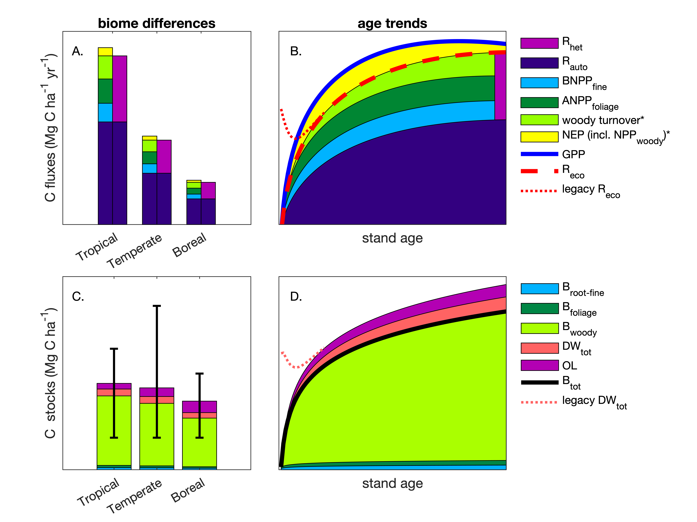
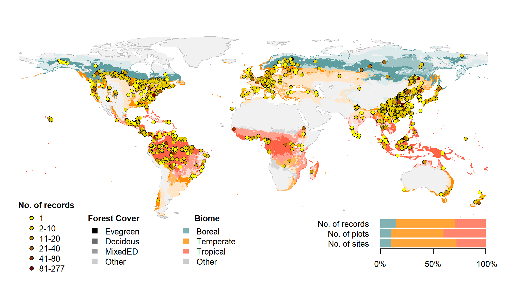
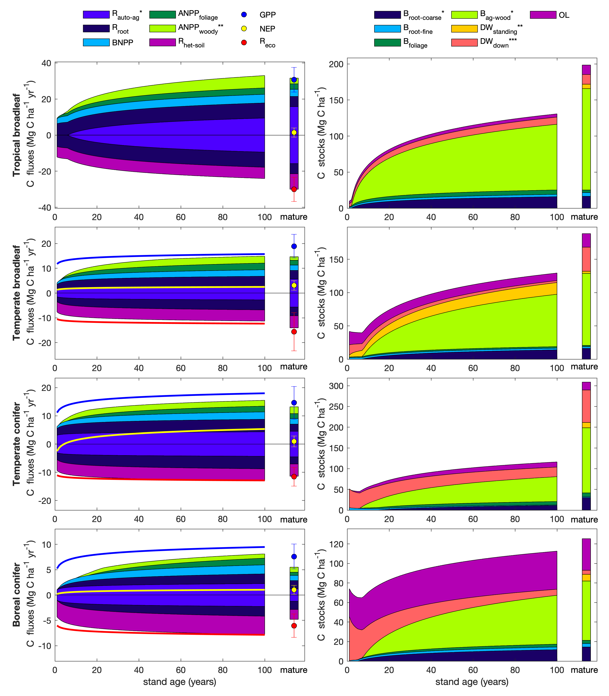

\raggedright

**Title:** Carbon cycling in mature and regrowth forests globally

**Authors:**

Kristina J. Anderson-Teixeira^1,2^*

Valentine Herrmann^1^

Becky Banbury Morgan^1,3^

Ben Bond-Lamberty^4^

Susan C. Cook-Patton^5^

Abigail E. Ferson^1,6^

Helene C. Muller-Landau^2^

Maria M. H. Wang^1,7^


**Author Affiliations:**

1. Conservation Ecology Center; Smithsonian Conservation Biology Institute; National Zoological Park, Front Royal, VA 22630, USA
2. Center for Tropical Forest Science-Forest Global Earth Observatory; Smithsonian Tropical Research Institute; Panama, Republic of Panama
3. School of Geography, University of Leeds, Leeds, UK
4. Joint Global Change Research Institute, Pacific Northwest National Laboratory, College Park Maryland 20740, USA
5. The Nature Conservancy; Arlington VA 22203, USA
6. College of Natural Resources, University of Idaho; Moscow, Idaho 83843, USA
7. Grantham Centre for Sustainable Futures and Department of Animal and Plant Sciences, University of Sheffield, Western Bank, Sheffield, South Yorkshire S10 2TN, UK


*corresponding author: teixeirak@si.edu; +1 540 635 6546
```{r eval = TRUE, echo=FALSE, warning=FALSE, results='hide'}

# KNIT IN FIGURES? 
generate_figures=TRUE
#note: table fails when knitting in word

# DISPLAY ITEMS
#tables
variables_table=1

#figures
schematic =1
schematic_fluxes_biome="1a"
  schematic_fluxes_age="1b"
  schematic_stocks_biome="1c"
  schematic_stocks_age="1d"
  schematic_fs_age = "1b,d"
figure_map=2
diagram_TrB_mature= 3
diagram_TeB_mature=4
diagram_TeN_mature=5
diagram_BoN_mature=6
all_diagrams_mature="3-6"
flux_age_trends=7
stock_age_trends=8
age_trends_all=9

schematics_caption_generic ="Arrows indicate fluxes (Mg C ha$^{-1}$ yr$^{-1}$); boxes indicate stocks (Mg C ha$^{-1}$), with variables as defined in Table 1. Presented are mean ± std, where geographically distinct areas are treated as the unit of replication. Dashed shape outlines indicate variables with records from <7 distinct geographic areas, and dashed arrows indicate fluxes with no data. To illustrate the magnitude of different fluxes, arrow width is proportional to the square root of the corresponding flux. Mean component fluxes do not necessarily add up to the mean total fluxes because different sets of sites are included depending on availability of data (Figs. S5-S30). "
TrB_mature_caption = paste( "Figure 3 | C cycle diagram for mature tropical broadleaf forests. ", schematics_caption_generic)  
TeB_mature_caption = paste( "Figure 4 | C cycle diagram for mature temperate broadleaf forests. ", schematics_caption_generic)  
TeN_mature_caption = paste( "Figure 5 | C cycle diagram for mature temperate conifer forests. ", schematics_caption_generic, "The temperate conifer biome in particular is subject to high variability, with highest fluxes and stocks in the high-biomass forests of the US Pacific Northwest. An asterisk after a variable name indicates lack of C cycle closure.")  
BoN_mature_caption = paste( "Figure 6 | C cycle diagram for mature boreaal conifer forests. ", schematics_caption_generic)  

age_trends_all_caption= "Figure 9 | Age trends in C cycling. Selection of variables for plotting seeks to maximize sample size and broad geographic representation while representing all elements of C cycle. Asterisks indicate variables whose age trends were calculated based on other variables (* young and mature forests; ** young forests only; *** mature forests only), as follows. For all forests: $B_{ag-wood}=max(0,B_{ag}-B_{foliage})$, $B_{root-coarse}=max(0,B_{root}-B_{root-fine})$, $DW_{standing}=max(0, DW_{tot}-DW_{down})$. For tropical forests: $ANPP_{woody}=max(0,ANPP-ANPP_{foliage})$, $R_{auto-ag}=R_{auto}-R{root}$, where $R_{auto}=NPP(1/CUE-1)$ and $CUE$=0.46 (Collati et al. 2020). for non-tropical forests: $ANPP_{woody}=min(ANPP_{stem},ANPP_{woody})$, $R_{auto-ag}=R_{eco}-R{soil}$, . Note that there remain substantial uncertainties as to the functional form of age trends and discrepencies in closure among related variables."


#SI

all_diagrams_young="S1-S4"
all_flux_age_trends="S5-S19"
all_stock_age_trends= "S20-S30"
all_age_trends="S5-S30"


#copied from SI
diagram_TrB_young= "S1"
diagram_TeB_young= "S2"
diagram_TeN_young= "S3"
diagram_BoN_young= "S4"
NEP_fig= "S5"
GPP_fig= "S6"
NPP_fig= "S7"
ANPP_fig= "S8"
ANPP_woody_fig= "S9"
ANPP_stem_fig= "S10"
ANPP_foliage_fig= "S11"
ANPP_litterfall_fig= "S12"
BNPP_fig= "S13"
BNPP_coarse_fig= "S14"
BNPP_fine_fig= "S15"
R_eco_fig= "S16"
R_root_fig= "S17"
R_soil_fig= "S18"
R_het_soil_fig= "S19"
B_tot_fig="S20"
B_ag_fig="S21"
B_ag_wood_fig="S22"
B_foliage_fig="S23"
B_root_fig="S24"
B_root_coarse_fig="S25"
B_root_fine_fig="S26"
DW_tot_fig="S27"
DW_standing_fig="S28"
DW_down_fig="S29"
OL_fig="S30"


#READING IN TABLES TO GET STATS FOR TEXT
path_to_ForC <- paste0(dirname(dirname(getwd())), "/ForC/") # this is to allow anybody to knit (assuming current working directory is in forc-db/ERL-review/manuscript and its "nesting" withing the ForC repo does not change)

#ForC raw
ForC_measurements <- read.csv(paste0(path_to_ForC, "/data/ForC_measurements.csv"), stringsAsFactors = FALSE, check.names = FALSE)
  n_records_age_unk <- sum(is.na(as.numeric(ForC_measurements[, "stand.age"])))  #total n records no age info
  n_records_age_0 <- sum(as.numeric(ForC_measurements[, "stand.age"]) %in% 0)

  n_SRDB <- sum(ForC_measurements$ForC.investigator %in% "Ben Bond-Lamberty")
  n_GROA <- sum(ForC_measurements$ForC.investigator %in% "Dr. Susan Cook-Patton")

ForC_plots <- read.csv(paste0(path_to_ForC, "/data/ForC_plots.csv"), stringsAsFactors = FALSE, check.names = FALSE)
ForC_sites <- read.csv(paste0(path_to_ForC, "/data/ForC_sites.csv"), stringsAsFactors = FALSE, check.names = FALSE)

n_sites_coord_unk <- sum(is.na(as.numeric(ForC_sites[, "lat"])))  #total n records no geographic coordinates

n_areas <- length(unique(na.omit(ForC_sites[,"geographic.area"])))


#ForC simplified
ForC_simplified <- read.csv(paste0(path_to_ForC, "ForC_simplified/ForC_simplified.csv"), stringsAsFactors = FALSE, check.names = FALSE)
ForC_simplified_duplicates_removed <- sum(ForC_simplified$suspected.duplicate ==0) 

n_no_history <- sum(ForC_simplified$suspected.duplicate ==0 & ForC_simplified$history.no.info ==1) #(relative to ForC_simplified)
n_managed_in_ForC_simplified <- sum(ForC_simplified$suspected.duplicate ==0 & ForC_simplified$managed ==1)
n_disturbed_in_ForC_simplified <- sum(ForC_simplified$suspected.duplicate ==0 & ForC_simplified$disturbed ==1)
records_eligible_for_inclusion <- sum(ForC_simplified$suspected.duplicate ==0 & ForC_simplified$managed ==0 & ForC_simplified$disturbed ==0 & ForC_simplified$history.no.info == 0)  #number in ForC_simplified that are not disturbed, managed, or no.history

# limiting to variables and biomes of interest:
 Biomes_n_records <- read.csv("tables_figures/Biomes_n_records_variables_of_interest.csv", check.names = F)
n_focal_variable_records_eligible_for_inclusion <- sum(Biomes_n_records$n_records) # n records_eligible_for_inclusion, limited to focal variables
# # records for excluded biome groupings ? 
# n_records_BoB <- NA #Biomes_n_records$n_records[Biomes_n_records$Biome %in% "Boreal broadleaf"] # for all n, subset by Age if needed

#Records included in the analysis
T1 <- read.csv("tables_figures/C_variables.csv", stringsAsFactors = FALSE, check.names = FALSE)
n_records <- sum(T1[,"records"])

global_counts <- read.csv("tables_figures/Count_n_record_n_plot_n_area.csv", check.names = FALSE)
n_records - global_counts$n_records # one count difference... not sure why. probably the filter thing... will ignore dor now.
n_plots_tot <- global_counts$n_plots #total numbers of plots used in the analysis (all variables combined)
n_areas_tot <- global_counts$n_areas #total numbers of areas used in the analysis (all variables combined)


#numbers of variables with records from ≥7 geographic areas, by biomes/ age class:
ForC_biome_averages <- read.csv(paste0(path_to_ForC, "numbers_and_facts/ForC_variable_averages_per_Biome.csv"), stringsAsFactors = F)

idx_fluxes7 <- ForC_biome_averages$n.areas >= 7 & ForC_biome_averages$variable.type %in% "flux"
idx_stocks7 <- ForC_biome_averages$n.areas >= 7 & ForC_biome_averages$variable.type %in% "stock"
idx_fluxes3 <- ForC_biome_averages$n.areas >= 3 & ForC_biome_averages$variable.type %in% "flux"
idx_stocks3 <- ForC_biome_averages$n.areas >= 3 & ForC_biome_averages$variable.type %in% "stock"

n_fluxes_with_ge7_areas <- table(ForC_biome_averages$Biome[idx_fluxes7])  
n_stocks_with_ge7_areas <- table(ForC_biome_averages$Biome[idx_stocks7])
n_fluxes_with_ge3_areas <- table(ForC_biome_averages$Biome[idx_fluxes3])  
n_stocks_with_ge3_areas <- table(ForC_biome_averages$Biome[idx_stocks3])  
```


\newpage

## Summary
```{r eval=FALSE, echo=FALSE}
# The Summary should be no longer than 300 words and divided into the following sections: Background, Methods/Design, Review results/ Synthesis and Discussion. Up to 7 Keywords should also be provided. The total length of the article is flexible.
```


*Background.* Forests are major components of the global carbon (C) cycle and thereby strongly influence atmospheric carbon dioxide (CO~2~) and climate. However, efforts to incorporate forests into climate models and CO~2~ accounting frameworks have been constrained by a lack of accessible, global-scale synthesis on how C cycling varies across forest types and stand ages. 

*Methods/Design.* Here, we draw from the Global Forest Carbon Database, ForC, to provide a macroscopic overview of C cycling in the world’s forests, giving special attention to stand age-related variation. Specifically, we use `r n_records` *ForC* records for `r nrow(T1)` C cycle variables from `r n_areas_tot` geographic locations to characterize ensemble C budgets for four broad forest types -- tropical broadleaf evergreen, temperate broadleaf, temperate conifer, and boreal. We calculaate statistics for both mature and regrowth (age <100 years) forests, and quantify trends with stand age in regrowth forests for all variables with sufficient data.

*Review Results/ Synthesis.*   The rate of C cycling generally decreased from tropical to boreal regions in both mature and regrowth forests, whereas C stocks showed less directional variation. Net ecosystem production of mature forests was indistinguishable across biomes. The majority of flux variables, together with most live biomass pools, increased significantly with stand age when fit with logarithmic functions.

*Discussion.* As climate change accelerates, understanding and managing the carbon dynamics of forests is critical to forecasting, mitigation, and adaptation. This comprehensive and synthetic global overview of C stocks and fluxes across biomes and stand ages will help to advance these efforts. 

*Key words*: forest ecosystems; carbon cycle; stand age; productivity; respiration; biomass; global

\newpage

## Background
```{r eval=FALSE, echo=FALSE}
# The Background section needs to present the rationale for why a systematic review of this topic is needed along with a history of what has been done to date and an expectation of what new will emerge from the review, especially if quantitative meta-analyses of studies are being considered.
```

Forest ecosystems are shaping the course of climate change through their influence on atmospheric carbon dioxide [CO~2~; @bonan_forests_2008; @friedlingstein_global_2019; @ipcc_global_2018].
Despite the centrality of forest C cycling in regulating atmospheric CO~2~, important uncertainties in climate models [@friedlingstein_climatecarbon_2006; @krause_large_2018; @bonan_model_2019; @di_vittorio_initial_2020] and CO~2~ accounting frameworks [@pan_large_2011; @ipcc_2019_2019] can be traced to lack of understanding on how C cycling varies across forest types and in relation to stand history.
This requires accessible, comprehensive, and large-scale databases with global coverage, which runs contrary to the traditional way forest C stocks and fluxes have been measured and published.
Large-scale synthesis is critical to benchmarking model performance with global data [@clark_field_2017; @luo_framework_2012], quantifying the the role of forests in the global C cycle [*e.g.*, @pan_large_2011], and using book-keeping methods to quantify actual or potential exchanges of CO~2~ between forests and the atmosphere [@griscom_natural_2017; @houghton_terrestrial_2020].

### Forests in the global C cycle: current and future

A robust understanding of forest impacts on global C cycling is essential. 
Total annual photosynthesis in forests (gross primary productivity, $GPP$) is estimated at approximately 69 Gt C yr^-1^ [@badgley_terrestrial_2019], more than seven times the average annual fossil fuel emissions during 2009-2018 [9.5 $\pm$ 0.5 Gt C yr^-1^; @friedlingstein_global_2019].
Most of this enormous C uptake is counterbalanced by releases to the atmosphere through ecosystem respiration ($R_{eco}$) and fire, with forests globally dominant as sources of both soil respiration [@warner_spatial_2019] and fire [@van_der_werf_global_2017].
In recent years, total forest C uptake has exceeded releases, such that globally forests have been a C sink [@harris_global_2021].
Considering only areas remaining in forest, this C sink has averaged 3.2 $\pm$ 0.6 Gt C yr^-1^ for 2009-2018, offsetting 29% of anthropogenic fossil fuel emissions [@friedlingstein_global_2019].
However, deforestation, estimated at ~1 Gt C yr^-1^ in recent decades [@pan_large_2011; @tubiello_carbon_2020], reduces the net forest sink to ~1.1-2.2 Gt C yr^-1^ [@friedlingstein_global_2019; @harris_global_2021].

The future of the current forest C sink is dependent both upon forest responses to climate change itself and human land use decisions, which will feedback and strongly influence the course of climate change [@friedlingstein_climatecarbon_2006]. 
Regrowing forests in particular will play an important role [@pugh_role_2019], as almost two-thirds of the world’s forests were secondary as of 2010 [@fao_global_2010].
As anthropogenic and climate-driven disturbances impact an growing proportion of Earth's forests [@andela_human-driven_2017; @mcdowell_pervasive_2020], understanding the carbon dynamics of regrowth forests is increasingly important [@andersonteixeira_altered_2013].
Although age trends in aboveground biomass have been well-studied and synthesized globally [@cook-patton_mapping_2020], a relative dearth of data and synthesis on other C stocks and fluxes in secondary forests points to an under-filled need to characterize age-related trends in forest C cycling.
Such understanding is particularly critical for reducing uncertainty regarding the potential for carbon uptake and climate change mitigation by regrowth forests [@krause_large_2018; @cook-patton_mapping_2020].
Understanding, modeling, and managing forest-atmosphere CO~2~ exchange is thus central to efforts to mitigate climate change [@grassi_key_2017; @griscom_natural_2017; @cavaleri_urgent_2015].

### Evolution of forest C cycle research

For more than half a century, researchers have sought to understand how forest carbon cycling varies across stands, including those of different biomes [e.g., @lieth_primary_1973; @luyssaert_co2_2007] and stand ages [e.g., @odum_strategy_1969; @luyssaert_old-growth_2008].
Over this time, an increasingly refined conceptual understanding of the elements of ecosystem C cycles has developed, as a growing number of variables have been defined [e.g., @chapin_reconciling_2006], along with appropriate measurement methods [e.g., @clark_measuring_2001]. 
New technology has also enabled researchers to directly measure an expanding set of variables, notably including the development of continuous measurements of soil CO~2~ efflux [@kuzyakov_sources_2006] and ecosystem-atmosphere CO~2~ exchange [@baldocchi_fluxnet_2001].
Measurement techniques have been increasingly standardized; for example, of the biomass allometries that strongly influence estimates of most C cycle variables [e.g., @chave_improved_2014].
Further standardization has been made possible through research networks such as ForestGEO [@anderson-teixeira_ctfs-forestgeo_2015; @davies_forestgeo_2021], NEON [@schimel_neon_2007], and FLUXNET [@baldocchi_fluxnet_2001; @novick_ameriflux_2018].
Remote sensing technology has become increasingly useful for global- or regional-scale estimates of a few critical variables [e.g., aboveground biomass, $B_{ag}$: @saatchi_benchmark_2011; @hu_mapping_2016; @spawn_harmonized_2020; gross primary productivity, $GPP$: @li_mapping_2019], yet measurement and validation of most forest C stocks and fluxes necessarily requires intensive on-the-ground data collection.

Alongside these conceptual and methodological developments, there has been a proliferation of measurements across the world's forests. 
The result of decades of research on forest C cycling is tens of thousands of records distributed across thousands of scientific articles, varying in data formats, units, measurement methods, *etc.*
To address global-scale questions, researchers began synthesizing data into increasingly large databases [e.g., @lieth_primary_1973; @luyssaert_co2_2007;  @bond-lamberty_global_2010; @anderson-teixeira_carbon_2016; @anderson-teixeira_forc_2018; @cook-patton_mapping_2020]. 
The current largest, most comprehensive database on forest C cycling is *ForC* [@anderson-teixeira_carbon_2016; @anderson-teixeira_forc_2018], which contains published estimates of forest ecosystem C stocks and annual fluxes (>50 variables), with different variables capturing distinct ecosystem pools (e.g., woody, foliage, and root biomass; dead wood) and flux types (e.g, gross and net primary productivity; soil, root, and ecosystem respiration). 
These data represent ground-based measurements, and *ForC* contains associated data required for interpretation (*e.g.*, stand history, measurement methods).
Since its most recent publication [*ForC v2.0-Ecology*; @anderson-teixeira_forc_2018], *ForC* has grown `r round((nrow(ForC_measurements) - 17367)/17367*100, digits=0)`%, primarily through the incorporation of two additional large databases that also synthesized published forest C data: the Global Soil Respiration Database [SRDB; @bond-lamberty_global_2010; @jian_restructured_2020] and the Global Reforestation Opportunity Assessment database [GROA; @cook-patton_mapping_2020].
Following these additions, *ForC* currently contains `r nrow(ForC_measurements)` records from `r nrow(ForC_plots)` plots and `r n_areas` distinct geographic areas representing all forested biogeographic and climate zones, making it ideal for assessing how forest C cycling varies across biomes and with respect to stand age.

### Biome differences

Forest C cycling varies enormously across biomes, which cateogrize the world's forests according to major differences in climate, vegetation, *etc.* 
Since the early 19th century, it has been recognized that climate plays a dominant role in shaping differences among forests on a global scale [@humboldt_essay_1807; @holdridge_determination_1947].
Global scale data syntheses have shown that C fluxes including $GPP$, net primary productivity ($NPP$), and soil respiration ($R_{soil}$) decrease with latitude or, correspondingly, increase with mean annual temperature [Fig. `r schematic_fluxes_biome`; e.g., @lieth_primary_1973;  @luyssaert_co2_2007; @hursh_sensitivity_2017; @banbury_morgan_global_nodate].
C stocks of mature forests show less directional variation (Fig. `r schematic_fluxes_biome`).
On average, aboveground biomass ($B_{ag}$) tends to decrease with latitude, but not as dramatically as fluxes, and with the highest $B_{ag}$ forests in relatively cool, moist temperate regions [@keith_re-evaluation_2009; @smithwick_potential_2002; @hu_mapping_2016]. 
In contrast, standing and downed dead wood ($DW_{standing}$ and $DW_{down}$, respectively, summing to $DW_{tot}$) and the organic layer ($OL$) tend to accumulate more in colder climates where decomposition is slow relative to $NPP$ [@harmon_ecology_1986; @allen_global_2002].

Correlative analyses relating C cycle variables to climate and other environmental variables have recently been taken to a new level through use of machine-learning algorithms that relate ground-based C cycle data to global maps of environmental covariates, making it possible to create fine-scale global maps of C cycling [e.g., @warner_spatial_2019; @cook-patton_mapping_2020].
This approach can be particularly effective when paired with satellite measurements that correlate to C cycle variables of interest; for example, solar-induced chlorophyll fluorescence is useful for fine-scale mapping of gross primary productivity [$GPP$; @li_mapping_2019], while LiDAR, radar, and optical imagery are being used to estimate $B_{ag}$ at regional to global scales [e.g., @saatchi_benchmark_2011; @hu_mapping_2016]. 
Any such analysis is however constrained by the quality and coverage of ground-based estimates of forest C fluxes or stocks [e.g., @schepaschenko_forest_2019]. 
While estimates of some variables (e.g., $B_{ag}$, $GPP$, $NPP$, $R_{soil}$) are widely available, many remain poorly characterized (e.g., $DW_{tot}$; $OL$; autotrophic respiration, $R_{auto}$) --even at the coarse resolution of biomes.
This is a critical limitation not only for understanding forest C cycling, but also for quantifying forest-based climate change mitigation across forest biomes or ecozones [e.g., @ipcc_2019_2019].

### Age trends and their variation across biomes

Stand age is another important axis of variation in forest C cycling (Fig. `r schematic`).
In 1969, E.P. Odum's "The Strategy of Ecosystem Development" laid out predictions as to how forest energy flows and organic matter stocks vary with stand age  [@odum_strategy_1969].
Although the conceptualization of the C cycle in this paper was simplistic by current standards, the paper was foundational in framing the theory around which research on the subject still revolves [@corman_foundations_2019], and the basic framework still holds, albeit with modest modifications [Fig. `r schematic`; @andersonteixeira_altered_2013].
Following stand-clearing disturbance, $GPP$, $NPP$, and biomass of leaves ($B_{foliage}$) and fine roots ($B_{root-fine}$) increase rapidly and thereafter remain relatively stable ($B_{foliage}$, $B_{root-fine}$, sometimes $GPP$) or decline slightly [$NPP$, sometimes $GPP$; e.g., @law_changes_2003; @pregitzer_carbon_2004; @amiro_ecosystem_2010; @goulden_patterns_2011].
The decline in $NPP$ occurs because $R_{auto}$ increases relative to $GPP$ as forests age, corresponding to declining carbon use efficiency with stand age [@delucia_forest_2007; @collalti_forest_2020].
Heterotrophic respiration, most of which originates from the soil ($R_{het-soil}$) remains relatively constant with stand age [@law_changes_2003; @pregitzer_carbon_2004; @goulden_patterns_2011], with the result that net ecosystem production ($NEP=GPP-R_{eco}$, where $R_{eco}$ is total ecosystem respiration) is initially negative, increases to a maximum at intermediate ages, and declines--typically to a small positive value--thereafter [@law_changes_2003; @pregitzer_carbon_2004; @amiro_ecosystem_2010; @goulden_patterns_2011; @luyssaert_old-growth_2008].
The result is that biomass accumulates rapidly in young forests, followed by a slow decline to near zero in old forests [e.g., @lichstein_biomass_2009; @yang_carbon_2011].
While these trends have been subject of fairly recent qualitative review [@andersonteixeira_altered_2013], there is need for a synthetic, quantitative review taking advantage of the greatly expanded data now available.


```{r schematic, eval = generate_figures, echo=FALSE, fig.align = "center", fig.cap = "Figure 1 | Schematic diagram summarizing current understanding of biome differences and age trends in forest C cycling. Variables are defined in Table 1. Age trends, which represent idealized dynamics following a disturbance that removes all living vegetation, are an updated version of the classic figure from Odum (1969), with heavy lines corresponding to those in Odum's figure and $NEP$ corresponding to Odum's 'net production'. Here, $NEP$ conists primarily of woody aboveground net primary production ($ANPP_{woody}$), while $ANPP_{woody.turnover}$ is the sum of woody mortality and branch turnover. Dotted lines refer to decomposition of potential 'legacy' organic material produced prior to the disturbance and remaining at the site (e.g., standing and fallen dead wood, $DW_{tot}$; soil organic matter). Error bars on C stocks plot represent within-biome variability, wherein mean biomass is highest in the tropics, but maximum biomass is highest in temperate regions.", out.width='100%', fig.pos='H'}

  
```

In the past few decades, researchers have started asking how age trends--mostly in $B_{ag}$ or total biomass ($B_{tot}$) accumulation-- vary across biomes.
Early research on this theme showed that biomass accumulation rates during secondary succession increase with temperature on a global scale [@johnson_post-disturbance_2000; @anderson_temperature-dependence_2006] and with water availability in the neotropics [@poorter_biomass_2016]. 
Most recently, @cook-patton_mapping_2020 reinforced these earlier findings with a much larger dataset and crated a high-resolution global map of estimated potential C accumulation rates.
However, there has been little synthesis of cross-biome differences in variables other than biomass and its accumulation rate (but see @cook-patton_mapping_2020 for $DW$, $OL$, and soil C accumulation in young stands).
Given the important role of secondary forests in the current and future global C cycle, concrete understanding of age trends in C fluxes and stocks and how these vary across biomes is critical to better understanding of the global C cycle.
Accurate estimates of C sequestration rates by regrowth forests are also critical for national greenhouse gas accounting under the IPCC framework [@ipcc_2019_2019; @requena_suarez_estimating_2019] and to quantifying the value of regrowth forests for climate change mitigation [@anderson-teixeira_greenhouse_2011; @goldstein_protecting_2020].

Here, we conduct a data-based review of carbon cycling from a stand to global level, and by biome and stand age, using the largest global compilation of forest carbon data, which is available in our open source Global Carbon Forest database (*ForC*; Fig. `r figure_map`).
Our goal is to provide a comprehensive synthesis on broad trends in forest C cycling that can serve as a foundation for improved understanding of global forest C cycling and highlight where key sources of uncertainty still reside.


```{r figure_map, eval = generate_figures, echo=FALSE, fig.align = "center", fig.cap = "Figure 2 | Map of sites included in this analysis. Symbols are colored according to the number of records at each site. Underlying map shows coverage of evergreen, deciduous, and mixed forests (shading differences; data from Jung et al. 2006) and biomes (color differences). Distribution of sites, plots, and records among biomes is shown in the inset.", out.width='100%', fig.pos='H'}

  
```
---
nocite: | 
@jung_exploiting_2006
---

## Methods/ Design
```{r eval=FALSE, echo=FALSE}
# The Methods/Design section needs to describe how articles in the reviews were identified and what criteria were used for justifying inclusion in the review. While traditional reviews relying on past experience and expert knowledge are acceptable, editors should encourage reviews that are set up as so-called ‘systematic reviews’ (see the Cochrane Review procedure which initiated the process in the medical and health science: http://community.cochrane.org/ about-us/evidence-based-health-care).
```


This review synthesizes data from the *ForC* database [Fig. `r figure_map`; https://github.com/forc-db/ForC; @anderson-teixeira_carbon_2016; @anderson-teixeira_forc_2018].
*ForC* amalgamates numerous intermediary data sets [*e.g.*, @luyssaert_co2_2007; @bond-lamberty_global_2010; @cook-patton_mapping_2020] and original studies.
Original publications were referenced to check values and obtain information not contained in intermediary data sets, although this process has not been completed for all records.
The database was developed with goals of understanding how C cycling in forests varies across broad geographic scales and as a function of stand age.
As such, there has been a focus on incorporating data from regrowth forests [*e.g.*, @anderson_temperature-dependence_2006; @martin_carbon_2013; @bonner_meta-analytical_2013] and obtaining stand age data when possible [83% of records in v.2.0; @anderson-teixeira_forc_2018].
Particular attention was given to developing the database for tropical forests [@anderson-teixeira_carbon_2016], which represented roughly one-third of records in *ForC* v2.0 [@anderson-teixeira_forc_2018].
Since publication of ForC v2.0, we imported three large additional databases into *ForC* via a combination of R scripts and manual edits. 
First, we imported (via R script) the Global Database of Soil Respiration Database [*SRDB* v4, `r n_SRDB` records; @bond-lamberty_global_2010], and corrections and improvements to *SRDB* arising from this process were incorporated in *SRDB* v5 [@jian_restructured_2020].
Second, we imported (via R script) the Global Reforestation Opportunity Assessment database [*GROA* v1.0, `r n_GROA` records; @cook-patton_mapping_2020; @anderson-teixeira_forc-dbgroa_2020], which itself had drawn on an earlier version of *ForC*. Because all records in *GROA* were checked against original publications, these records were given priority over duplicates in *ForC* (Appendix S1). 
Third, we incorporated records of annual $NEP$, $GPP$, and $R_{eco}$ from the FLUXNET2015 dataset [@pastorello_fluxnet2015_2020], treating these records as authoritative when they duplicated earlier records (Appendix S1). 
We have also added data from individual publications, with a particular focus on productivity [e.g., @taylor_temperature_2017], dead wood, and ForestGEO sites [e.g., @lutz_global_2018; @johnson_climate_2018].
A record of data sets added to *ForC* over the course of its development is available at https://github.com/forc-db/ForC/blob/master/database_management_records/ForC_data_additions_log.csv.
The database version used for this analysis has been tagged as a new release on Github (v3.0) and assigned a DOI through Zenodo (DOI: TBD).

All measurements originally expressed in units of dry organic matter ($OM$) were converted to units of C using the IPCC default of $C = 0.47 * OM$ [@ipcc_global_2018].
Duplicate or otherwise conflicting records were purged as described in Appendix S1, resulting in a total of `r ForC_simplified_duplicates_removed` records (`r round(ForC_simplified_duplicates_removed/nrow(ForC_measurements)*100,digits=1)`% size of total database).
Records were filtered to remove plots that had undergone significant anthropogenic management or major disturbance since the most recent stand initiation event.
Specifically, we removed plots with any record of managements manipulating CO~2~, temperature, hydrology, nutrients, or biota, as well as any plots whose site or plot name contained the terms “plantation”, "planted", “managed”, “irrigated”, or “fertilized” (`r round(n_managed_in_ForC_simplified/ForC_simplified_duplicates_removed*100,digits=1)`% of duplicate-purged records).
We also removed stands that had undergone any notable anthropogenic thinning or partial harvest (`r round(n_disturbed_in_ForC_simplified/ForC_simplified_duplicates_removed*100,digits=1)`% of duplicate-purged records).
We retained sites that were grazed or had undergone low severity natural disturbances (<10% mortality) including droughts, major storms, fires, and floods.
We removed all plots for which no stand history information had been retrieved (`r round(n_no_history/ForC_simplified_duplicates_removed*100,digits=1)`% of duplicate-purged records).
In total, this resulted in `r records_eligible_for_inclusion` records (`r round(records_eligible_for_inclusion/nrow(ForC_measurements)*100,digits=1)`% of the records in the database) being eligible for inclusion in the analysis.

We selected 23 annual flux and 11 C stock variables for inclusion in the analysis (Table 1).
These different flux and stock variables represent different pools (e.g., aboveground biomass, root biomass, dead wood) and levels of combination (e.g., total net primary productivity, $NPP$, versus the individual elements of $NPP$ such as foliage, roots, and branches). 
We did not analyze soil carbon, which is not a focus of the *ForC* database.
Note that two flux variables, aboveground heterotropic respiration ($R_{het-ag}$) and total respiration ($R_{het}$), were included for conceptual completeness but had no records in *ForC* (Table 1).
Records for our focal variables represented `r round(n_focal_variable_records_eligible_for_inclusion/records_eligible_for_inclusion*100,digits=1)`% of the total records eligible for inclusion.
For this analysis, we combined some of ForC’s specific variables into more broadly defined variables. 
Specifically, net ecosystem exchange [measured by eddy-covariance; @baldocchi_fluxnet_2001] and biometric estimates of $NEP$ were combined into the single variable $NEP$ (Table 1).
Furthermore, for $NPP$, aboveground $NPP$ ($ANPP$), and the litterfall component of $ANPP$ ($ANPP_{litterfall}$), *ForC* variables specifying inclusion of different components were combined (*e.g.*, measurements including or excluding fruit and flower production and herbivory).
Throughout ForC, for all measurements drawing from tree census data (*e.g.*, biomass, productivity), trees were censused down to a minimum diameter breast height (DBH) threshold of 10 cm or less. 
All records were measured directly or derived from field measurements.

```{r eval = generate_figures, echo=FALSE, warning=FALSE}
library(knitr)
library(kableExtra)
S1 <- read.csv("tables_figures/C_variables.csv", stringsAsFactors = FALSE, check.names = FALSE)
names(S1) [6]  <- paste0(names(S1) [6], footnote_marker_symbol(1))
names(S1) [7]  <- paste0(names(S1) [7], footnote_marker_symbol(2))
kable(S1, format = "latex", booktabs = TRUE, caption = "Table 1. Carbon cycle variables included in this analysis, their sample sizes, and summary of biome differences and age trends.", escape = F)%>%
  # footnote(general = "Complete list of variables with full definitions and association to ForC variables is given in [XXXXX](https://github.com/forc-db/ForC/blob/master/figures/C_cycle_diagrams/ForC_variables_mapping_for_C_cycle_diagrams.csv). ") %>%
  kable_styling(latex_options = c("scale_down", "hold_position"), font_size = 12)  %>%
  add_header_above(c(" ", " ", "N records" = 3, " " , " " )) %>%
  #column_spec(1, width = "4cm") %>%
  column_spec(2, width = "7cm") %>%
  column_spec(3, width = "1.1cm") %>%
  column_spec(4, width = "1cm") %>%
  column_spec(5, width = "1.8cm") %>%
  pack_rows("Annual fluxes", 1, 23, colnum = 2, hline_before = FALSE) %>%
  pack_rows("Stocks", 24, 34, colnum = 2, hline_before = FALSE) %>%
kableExtra::footnote(symbol = c("TrB: Tropical, TeB: Temperate Broadleaf, TeN: Temperate Needleleaf, BoN: Boreal, n.s.: no significant differences, n.t.: not tested ", "+ or -: significant positive or negative trend, xB: significant age x biome interaction, n.s.: no significant age trend, n.t.: not tested"), footnote_as_chunk = FALSE)
```

We grouped forests into four broad biome types based on climate zones and dominant vegetation type (tropical broadleaf, temperate broadleaf, temperate needleleaf, and boreal needleleaf) and two age classifications (young and mature).
Climate zones (Fig. `r figure_map`) were defined based on site geographic coordinates according to Köppen-Geiger zones (Rubel and Kottek 2010).
We defined the tropical biome as including all equatorial (A) zones, temperate biomes as including all warm temperate (C) zones and warmer snow climates (Dsa, Dsb, Dwa, Dwb, Dfa, and Dfb), and the boreal biome as including the colder snow climates (Dsc, Dsd, Dwc, Dwd, Dfc, and Dfd).
Any forests in dry (B) and polar (E) Köppen-Geiger zones were excluded from the analysis.
We defined leaf type (broadleaf / needleleaf) based on descriptions in original publications (prioritized) or values extracted from a global map based on satellite observations [SYNMAP; @jung_exploiting_2006].
For young tropical forests imported from *GROA* but not yet classified by leaf type, we assumed that all were broadleaf, consistent with the rarity of naturally regenerating needleleaf forests in the tropics.
We also classified forests as “young” (< 100 years) or “mature” ($\ge$ 100 years or classified as “mature”, “old growth”, “intact”, or “undisturbed” in original publication).
Assigning stands to these groupings required the exclusion of records for which *ForC* lacked geographic coordinates (`r round(n_sites_coord_unk/nrow(ForC_sites)*100, digits=1)`% of sites in full database) or records of stand age (`r round(n_records_age_unk/nrow(ForC_measurements)*100, digits=1)`% of records in full database). 
We also excluded records of stand age = 0 year (`r round(n_records_age_0/nrow(ForC_measurements)*100, digits=1)`% of records in full database).
In total, our analysis retained `n_records` records. 
Numbers of records by biome and age class are given in Table S1. 

Data were summarized to produce schematics of C cycling for mature forets of each biome.
To obtain the values reported in the C cycle schematics, we first averaged any repeated measurements within a plot.
Values were then averaged across geographically distinct areas, defined as plots clustered within 25 km of one another [*sensu* @anderson-teixeira_forc_2018], weighting by area sampled if available for all records.
This step was taken to avoid pseudo-replication.

We tested whether the C budgets described above "closed"--*i.e.*, whether they were internally consistent.
Specifically, we first defined relationships among variables: for example, $NEP =	GPP - R_{eco}$, $BNPP = BNPP_{coarse} + BNPP_{fine}$, $DW_{tot} = DW_{standing} + DW_{down}$).
Henceforth, we refer to the variables on the left side of the equation as "aggregate" fluxes or stocks, and those that are summed as "component" fluxes or stocks, noting that the same variable can take both aggregate and component positions in different relationships.
We considered the C budget for a given relationship "closed" when component variables summed to within one standard deviation of the aggregate variable. 

To test for differences across mature forest biomes, we also examined how stand age impacted fluxes and stocks, employing a mixed effects model ['lmer' function in 'lme4' R package; @bates_fitting_2015] with biome as fixed effect and plot nested within geographic.area as random effects on the intercept.
When Biome had a significant effect, we looked at a Tukey's pairwise comparison to see which biomes were significantly different from one another. 
This analysis was run for variables with records for at least seven distinct geographic areas in more than one biome, excluding any biomes that failed this criteria (Table 1). 

To test for age trends in young (<100yrs) forests, we employed a mixed effects model with biome and log10[stand age] as fixed effects and plot nested within geographic area as a random effect on the intercept.
This analysis was run for variables with records for at least three distinct geographic areas in more than one biome, excluding any biomes that failed this criteria (Table 1). 
When the effect of stand age was significant at p $\le$ 0.05 and when each biome had records for stands of at least 10 different ages, a biome $\times$ stand.age interaction was included in the model.
We note that the logarithmic function fit in this analysis does not always correspond to theoretical expectations (Fig. `r schematic`); however, data limitations did not support fitting of functions with more parameters or reliable comparison of different functional forms.
Within the data constraints, we deemed a logarithmic function to be the most appropriate functional form for the majority of variables.


To facilitate the accessibility of our results and data, and to allow for rapid updates as additional data become available, we automated all database manipulation, analyses, and figure production in R [@r_core_team_r_2020].

## Review Results/ Synthesis
```{r eval=FALSE, echo=FALSE}
# The Review Results/Synthesis section presents the findings of the analyses.
```

### Data Coverage

Of the `r nrow(ForC_measurements)` records in *ForC* v3.0, `r n_records` met our strict criteria for inclusion in this study (Fig. `r figure_map`).
These records were distributed across `r n_plots_tot` plots in `r n_areas_tot` distinct geographic areas.
Of the 23 flux and 11 stock variables mapped in our C cycle diagrams (Figs. `r all_diagrams_mature`, `r all_diagrams_young`), *ForC* contained sufficient mature forest data for inclusion in our statistical analyses (*i.e.*, records from $\ge$ 7 distinct geographic areas) for `r n_fluxes_with_ge7_areas[["Tropical broadleaf MATURE"]]` fluxes and `r n_stocks_with_ge7_areas[["Tropical broadleaf MATURE"]]` stocks in tropical broadleaf forests, `r n_fluxes_with_ge7_areas[["Temperate broadleaf MATURE"]]` fluxes and `r n_stocks_with_ge7_areas[["Temperate broadleaf MATURE"]]` stocks in temperate broadleaf forests, `r n_fluxes_with_ge7_areas[["Temperate conifer MATURE"]]` fluxes and `r n_stocks_with_ge7_areas[["Temperate conifer MATURE"]]` stocks in temperate conifer forests, and `r n_fluxes_with_ge7_areas[["Boreal conifer MATURE"]]` fluxes and `r n_stocks_with_ge7_areas[["Boreal conifer MATURE"]]` stocks in boreal forests.
For regrowth forests (<100 yrs), *ForC* contained sufficient data for inclusion in our statistical analyses (*i.e.*, records from $\ge$ 3 distinct geographic areas) for `r n_fluxes_with_ge3_areas[["Tropical broadleaf YOUNG"]]` fluxes and `r n_stocks_with_ge3_areas[["Tropical broadleaf YOUNG"]]` stocks in tropical broadleaf forests, `r n_fluxes_with_ge3_areas[["Temperate broadleaf YOUNG"]]` fluxes and `r n_stocks_with_ge3_areas[["Temperate broadleaf YOUNG"]]` stocks in temperate broadleaf forests, `r n_fluxes_with_ge3_areas[["Temperate conifer YOUNG"]]` fluxes and `r n_stocks_with_ge3_areas[["Temperate conifer YOUNG"]]` stocks in temperate conifer forests, and `r n_fluxes_with_ge3_areas[["Boreal conifer YOUNG"]]` fluxes and `r n_stocks_with_ge3_areas[["Boreal conifer YOUNG"]]` stocks in boreal forests.

### C cycling in mature forests

Average C cycles for mature tropical broadleaf, temperate broadleaf, temperate conifer, and boreal forests $\ge$ 100 years old and with no known major natural or anthropogenic disturbance are presented in Figures `r all_diagrams_mature` (and available in tabular format in the *ForC* release accompanying this publication:  `ForC/numbers_and_facts/ForC_variable_averages_per_Biome.csv`).

For variables with records from $\ge$ 7 distinct geographic areas, these ensemble C budgets met our criteria for budget "closure".
That is, component variables summed to within one standard deviation of their respective aggregate variables in all but one instance.
In the temperate conifer biome, the average composite measure of root biomass ($B_{root}$) was less than the combined average value of coarse and fine root biomass ($B_{root-coarse}$ and $B_{root-fine}$, respectively).
This lack of closure was driven by very high estimates of $B_{root-coarse}$ from high-biomass forests of the US Pacific Northwest (Fig. `r B_root_coarse_fig`).

\blandscape
```{r eval = generate_figures, echo=FALSE, fig.align = "center", fig.cap = TrB_mature_caption, out.width='90%', fig.pos='H'}

  
```

```{r eval = generate_figures, echo=FALSE, fig.align = "center", fig.cap = TeB_mature_caption, out.width='100%', fig.pos='H'}

  
```

```{r eval = generate_figures, echo=FALSE, fig.align = "center", fig.cap = TeN_mature_caption, out.width='100%', fig.pos='H'}

  
```

```{r eval = generate_figures, echo=FALSE, fig.align = "center", fig.cap = BoN_mature_caption, out.width='100%', fig.pos='H'}

  
```
\elandscape

There were sufficient data to assess differences among biomes in mature forest values for 15 flux variables, and significant differences among biomes were detected for 12 variables (Table 1).
In all of these cases--including C fluxes into, within, and out of the ecosystem--C fluxes were highest in tropical forests, intermediate in temperate (broadleaf or conifer) forests, and lowest in boreal forests (Table 1, Figs. `r flux_age_trends`, `r all_flux_age_trends`).
Differences between tropical and boreal forests were always significant, with temperate forests intermediate and significantly different from one or both.
Fluxes tended to be numerically greater in temperate broadleaf than temperate conifer forests, but the difference was never statistically significant.
This pattern held for the following variables: $GPP$, $NPP$, $ANPP$, $ANPP_{stem}$,$ANPP_{branch}$, $ANPP_{foliage}$, $BNPP$, $R_{eco}$, $R_{root}$, $R_{soil}$, and $R_{het-soil}$. 
For two of the variables without significant differences among biomes ($ANPP_{litterfall}$ and $BNPP_{fine}$; Figs. `r ANPP_litterfall_fig` and `r BNPP_fine_fig`, respectively), the same general trends applied but were not statistically significant. 
Another exception was for $BNPP_{root-coarse}$, where all records came from high-biomass forests in the US Pacific Northwest, resulting in marginally higher values for the temperate conifer biome (Fig. `r BNPP_coarse_fig`; differences significant in mixed effects model but not in post-hoc pairwise comparison).  

The most notable exception to the pattern of decreasing flux per unit area from tropical to boreal biomes was $NEP$, with no significant differences across biomes but with the largest average in temperate broadleaf forests, followed by tropical, boreal, and temperate conifer forests (Figs. `r flux_age_trends`, `r NEP_fig`).
For all biomes, $NEP$ was positive, with 95% confidence intervals excluding zero.


```{r eval = generate_figures, echo=FALSE, fig.align = "center", fig.cap = "Figure 7 | Age trends and biome differences in some of the major C fluxes: (a) $GPP$, (b) $NPP$, (c) $ANPP$, (d) $R_{soil}$, (e) $R_{eco}$, and (f) $NEP$. In each panel, the left scatterplot shows age trends in forests up to 100 years old, as characterized by a linear mixed effects model with fixed effects of log10(age) and biome. The fitted line indicates the effect of age (solid lines: significant at p<0.05, dashed lines: non-significant), and non-parallel lines indicate a significant log10(age) x biome interaction. The boxplot illustrates distribution across mature forests, with different letters indicating significant differences between biomes. Data from biomes that did not meet the sample size criteria (see Methods) are plotted, but lack regression lines (young forests) or test of differences across biomes (mature forests). Individual figures for each flux with sufficient data, along with maps showing geographic distribution of the data, are given in the Supplement (Figs. S5-S19).", out.width='100%', fig.pos='H'}

  
```


Biome differences were less consistent across C stocks than fluxes (Figs. `r stock_age_trends`, `r all_stock_age_trends`).
There were sufficient data to assess mature forest biome differences for nine stock variables, and significant differences among biomes were detected for five variables ($B_{tot}$, $B_{ag}$, $B_{ag-wood}$, $B_{foliage}$, $B_{root-coarse}$; Table 1).
For $B_{tot}$ and $B_{ag}$, tropical broadleaf forests had the highest mean biomass and boreal forests the lowest, with intermediate means for temperate broadleaf and needleleaf forests (temperate needleleaf excluded from $B_{tot}$ analysis becuase of insufficient data; Figs. `r B_tot_fig`, `r B_ag_fig`).
However, maximum values for these variables -- along with all other  stocks including live or standing woody biomass ($B_{ag-wood}$, $B_{root}$, $B_{root-coarse}$, $DW_{tot}$, $DW_{standing}$) -- consistently occurred in temperate biomes (Figs. `r schematic`, `r stock_age_trends`, `r all_stock_age_trends`). 
For variables that were disproportionately sampled in such high-biomass forests ($B_{ag-wood}$, $B_{foliage}$, and $B_{root-coarse}$; disproportionately sampled in  the US Pacific Northwest), temperate conifer forests had significantly higher stocks than the other biomes.


```{r eval = generate_figures, echo=FALSE, fig.align = "center", fig.cap = "Figure 8 | Age trends and biome differences in some of the major forest C stocks: (a) aboveground biomass, (b) foliage, (c) fine roots, (d) dead wood. In each panel, the left scatterplot shows age trends in forests up to 100 years old, as characterized by a linear mixed effects model with fixed effects of log10(age) and biome. The fitted line indicates the effect of age (solid lines: significant at p<0.05, dashed lines: non-significant), and non-parallel lines indicate a significant log10(age) x biome interaction. The boxplot illustrates distribution across mature forests, with different letters indicating signifant differences between biomes. Data from biomes that did not meet the sample size criteria (see Methods) are plotted, but lack regression lines (young forests) or test of differences across biomes (mature forests). Individual figures for each stock with sufficient data, along with maps showing geographic distribution of the data, are given in the Supplement (Figs. S20-S30).", out.width='100%', fig.pos='H'}

  
```


### C cycling in young forests

C fluxes commonly increased significantly with stand age (Tables 1, S2, Figs. `r flux_age_trends`, `r age_trends_all`, `r all_age_trends`).
*ForC* contained 16 C flux variables with sufficient data for analyses of age trends in young forests (see Methods).
Of these, ten increased significantly with $log10[age]$: $NEP$, $GPP$, $ANPP$, $ANPP_{woody}$, $ANPP_{foliage}$, $ANPP_{litterfal}$, $BNPP$, $BNPP_{fine}$, $R_{eco}$, and $R_{root}$.
The remaining six -- $NPP$, $ANPP_{stem}$, $ANPP_{branch}$, $BNPP_{coarse}$, $R_{soil}$, and $R_{het-soil}$ -- displayed no significant relationship to stand age.

Differences in C fluxes across biomes typically paralleled those observed for mature forests, with C cycling generally most rapid in the tropics and slowest in boreal forests (Table 1, Figs. `r flux_age_trends`, `r all_age_trends`).
The single exception was $ANPP_{stem}$, for which temperate broadleaf and conifer forests had flux rates similar to tropical forests.
Notably, and in contrast to the lack of biome differences in $NEP$ for mature forests (Fig. `r flux_age_trends`), the tendency for temperate forests to have greater fluxes than boreal forests held for $NEP$ in regrowth forests (tropical forests excluded because of insufficient data).

```{r eval = generate_figures, echo=FALSE, fig.align = "center", fig.cap =age_trends_all_caption, out.width='100%', fig.pos='H'}

  
```

"Closure" and internal consistency of the C flux budget was less successful for young than mature forests (Figs. `r age_trends_all`).
Summed regression equations for $R_{soil-het}$ and $R_{root}$ were generally very close to $R_{soil}$.
In assessing the C budget of young forests, we calculated $R_{auto-ag}$ as the difference between $R_{eco}$ and $R_{soil}$ (except for tropical forests, which had insufficient $R_{eco}$ data), effectively guaranteeing near-closure of the CO~2~ efflux (respiration) portion of the budget (negative values in Figs. `r age_trends_all`).
In contrast, the  CO~2~ influx portion of the budget generally did not "close": the sum of $R_{auto}$ ($R_{root}+R_{auto-ag}$, as described above) and components of $NPP$ consistently fell short of $GPP$, particularly in in young stands (range across forest types and ages: 0.9-7.6 Mg C ha^-1^ yr^-1^).
Moreover, there was not consistent budget closure among the components of $NPP$, and substantially different age trends resulting from the sum of components versus total $NPP$ (Figs. `r age_trends_all`).
Although age trends of young forests often converged towards mature forest averages, there were also some discrepancies between young forest trends and mature forest averages (Figs. `r flux_age_trends`, `r age_trends_all`, `r all_age_trends`), most notably including a tendency for higher fluxes in regrowth boreal forests than in their mature counterparts (Fig. `r age_trends_all`).

In terms of C stocks, ten variables (all but standing deadwood, $DW_{standing}$) had sufficient data to test for age trends (Table 1, Figs. `r stock_age_trends`, `r all_stock_age_trends`).
All of these displayed a significant overall increase with with $log10[stand.age]$.
Age $\times$ biome interactions were also significant for all ten of these C stock variables (Table S2), with living C stocks tending to accumulate more rapidly during the early stages of forest regrowth in tropical forests (Figs. `r stock_age_trends`, `r age_trends_all`, `r all_stock_age_trends`).
In the case of two non-living C stocks ($DW_{down}$ and $OL$), age $\times$ biome interactions were such that age trends were positive in some biomes and negative in others.
Specifically, $DW_{down}$ declined with age in temperate and boreal forests, compared to an increase with age in tropical forests (Figs. `r stock_age_trends`,`r age_trends_all`, `r DW_down_fig`).
Similarly, $OL$ declined slightly with age in temperate broadleaf forests, contrasting an increase in the other three biomes (Figs. `r stock_age_trends`, `r age_trends_all`,`r OL_fig`).
Again, there were some discrepancies between young forest trends and mature forests, most notably including generally higher C stocks in mature forests relative to their 100-year counterparts, particularly for temperate conifer forests (with discrepancies again driven by differences in geographic representation) and, to a lesser extent, tropical broadleaf forests (FIg. `r age_trends_all`).

\newpage

## Discussion
```{r eval=FALSE, echo=FALSE}
# The Discussion section highlights the general conclusions, emphasizes novel findings, puts them in context and identifies issues and inferences for future work or policy considerations.
```

*ForC* v3.0 provided unprecedented coverage of most major variables, yielding a broad picture of C cycling in the world's major forest biomes.
Carbon cycling rates generally increased from boreal to tropical regions and with stand age (Figs. `r schematic`, `r age_trends_all`).
Specifically, most C fluxes were highest in tropical forests, intermediate in temperate (broadleaf or conifer) forests, and lowest in boreal forests -- a pattern that generally held for regrowth as well as mature forests (Figs. `r schematic`, `r flux_age_trends`- `r stock_age_trends`, `r age_trends_all`).
The notable exception was mature forest $NEP$, which, as the difference between $GPP$ and $R_{eco}$, was statistically indistinguishable across biomes (Fig. `r flux_age_trends`f).
There was also little directional variation in mean mature forest C stocks (biomass, dead wood, and organic layer) across biomes, although maximum values for the majority of stocks (all including live or standing woody biomass) occurred in temperate biomes (Figs. `r schematic`, `r all_diagrams_mature`, `r stock_age_trends`).
Consistent with theory and previous studies (Fig. `r schematic`), the majority of flux variables, together with most live biomass pools, increased significantly with stand age (Table 1; Figs. `r flux_age_trends`- `r age_trends_all`, `r all_age_trends`).
Together, these results indicate that, moving from cold to tropical climates and from young to old stands, there is a general acceleration of C cycling, whereas C stocks and $NEP$ of mature forests, which are defined by the differences between in- and out- fluxes, do not vary systematically across biomes.
Together, these results refine and expand out understanding of C cycling in mature forests, while providing the first global-scale analysis of age trends in multiple forest C stocks and fluxes (Figs. `r age_trends_all`). 

### C cycling across biomes

Our analysis reveals that carbon cycling is most rapid in the tropics and slowest in boreal regions, including C fluxes into ($GPP$), within (e.g., $NPP$ and its components), and out of (e.g., $R_{soil}$, $R_{eco}$) the ecosystem.
For mature forests, this is consistent with a large body of previous work demonstrating that C fluxes generally decline with latitude -- or increase with temperature -- on a global scale [e.g., @luyssaert_co2_2007;  @gillman_latitude_2015; @li_mapping_2019; @banbury_morgan_global_nodate].
This consistency is not surprising, particularly given commonality in the data analyzed or used for calibration.
The finding that these patterns hold consistently across across numerous fluxes, while consistent with theoretical expectations (Fig. `r schematic`), is novel to this analysis [but see @banbury_morgan_global_nodate for nine autotrophic fluxes].

The notable exception to the pattern of fluxes decreasing from tropical to boreal regions is $NEP$, which showed no significant differences across biomes, albeit with the highest mean in temperate broadleaf forests (Fig. `r flux_age_trends`f).
Unlike the other C flux variables, $NEP$ does not characterize the rate at which C cycles through the ecosystem, but, as the balance between $GPP$ and $R_{eco}$, represents net CO~2~ sequestration (or release) by the ecosystem (Fig. `r schematic`).
$NEP$ tends to be relatively small in mature forest stands, which accumulate carbon slowly relative to younger stands, if at all [Fig. `r schematic`; @luyssaert_old-growth_2008; @amiro_ecosystem_2010; @besnard_quantifying_2018].
It is therefore consistent with theory -- and with previous research [@luyssaert_co2_2007] -- that there are no pronounced differences across biomes. 
Rather, variation in $NEP$ of mature forests appears to be controlled less by climate and more by other factors including moderate disturbances [@curtis_forest_2018] or disequilibrium of $R_{soil}$ relative to C inputs [e.g., in peatlands where anoxic conditions inhibit decomposition; @wilson_stability_2016].
The fact that mature temperate broadleaf forests have a higher mean than the other biomes may reflect the fact that most of these forests are older secondary forests that, while classified here as mature, are still accumulating carbon [@curtis_forest_2018].

In contrast to the patterns observed for $NEP$ in mature stands, $NEP$ of stands between 20 and 100 years of age varied across biomes, being lowest in boreal forests, intermediate in temperate broadleaf forests, and highest in temperate conifer forests (with insufficient data to assess tropical forests; Figs. `r flux_age_trends`, `r NEP_fig`).
This is consistent with findings that live biomass accumulation rates ($\Delta B_{ag}$ or $\Delta B_{tot}$) during early secondary succession decrease with latitude [Figs. `r stock_age_trends`a, `r all_stock_age_trends`; @anderson_temperature-dependence_2006; @cook-patton_mapping_2020]. 
Note, though, that $NEP$ includes not only $\Delta B_{tot}$, but also changes in $DW_{tot}$, $OL$, and soil carbon (not analyzed here). 
Biome differences in the accumulation rates of $DW$, $OL$, and soil C  have not been detected, in part because these variables do not consistently increase with stand age [Figs. `r schematic`, `r stock_age_trends`, `r DW_tot_fig`-`r OL_fig`, and see discussion below; @cook-patton_mapping_2020].

For regrowth forests, little was previously known about cross-biome differences in carbon fluxes, and we are not aware of any previous large-scale comparisons of C fluxes that have been limited to regrowth forests. 
Thus, this analysis was the first to examine flux trends in regrowth forests across biomes.
The observed tendency for young forest fluxes to decrease from tropical to boreal regions paralleled patterns in mature forests (Figs. `r flux_age_trends`, `r age_trends_all`, `r all_flux_age_trends`), suggesting that regrowth forests follow latitudinal trends in carbon cycling similar to those of mature forests [e.g., @banbury_morgan_global_nodate].

In contrast to C fluxes and biomass accumulation rates in regrowth forests, stocks showed less systematic variation across biomes.
For aboveground biomass, which is the variable in *ForC* with broadest geographical representation, the modest trend of declining biomass from tropical to boreal regions mirrors observations from spaceborne lidar that reveal a decline in aboveground biomass (for all forests, including secondary) with latitude across the N hemisphere [@hu_mapping_2016]. 
The highest- biomass forests on Earth are, however, found in coastal temperate climates of both the southern and northern hemisphere [Figs. `r schematic`, `r stock_age_trends`a; @keith_re-evaluation_2009; @smithwick_potential_2002; @hu_mapping_2016]. 
Disproportionate representation of forests in one such region--the US Pacific Northwest--inflated estimates of temperate conifer fluxes and stocks for some variables and was responsible for all of the anomalous results described here (e.g., lack of complete C budget closure, anomalous trend across biomes for $BNPP_{coarse}$). 
Thus, biome differences should always be interpreted relative to the geographic distribution of sampling, which only rarely covers the majority of forested area within a biome. 

Whereas aboveground biomass can be remotely sensed [albeit with significant uncertainties; @ploton_spatial_2020] and receives significant research attention, far less is known about geographical variation in deadwood and organic layer ($OL$) across biomes, which has proved a limitation for C accounting efforts [@pan_large_2011].
Although these stocks can be important--exceeding 100 Mg C ha^-1^ in some stands (Figs. `r stock_age_trends`, `r DW_tot_fig`-`r DW_down_fig`), this study is the first to synthesize deadwood data on a global scale [but see @cook-patton_mapping_2020 for young forests].
Unfortunately, data remain too sparse for statistical comparison across biomes (Figs. `r stock_age_trends`, `r DW_tot_fig`-`r DW_down_fig`; but see below for age trends), pointing to a need for more widespread quantification of both standing and downed deadwood.
*ForC* coverage of $OL$ stocks is more comprehensive, revealing no significant differences across temperate and tropical biomes, but a tendency towards higher $OL$ in boreal forests, consistent with the idea that proportionally slower decomposition in colder climates results in more buildup of organic matter [@allen_global_2002; @andersonteixeira_differential_2011]. 
Further research on non-living C stocks in the world's forests will be essential to completing the picture.

### Age trends in C cycling  

Our study reveals that most C fluxes quickly increase to a plateau as stands age (Figs. `r flux_age_trends`, `r age_trends_all`), consistent with current understanding of age trends in forest C cycling [Fig. `r schematic`; e.g., @andersonteixeira_altered_2013; @amiro_ecosystem_2010; @magnani_human_2007].
While limited records in very young (*i.e.*, <5 year old) stands resulted in poor resolution of the earliest phases of this increase for many variables (sometimes detecting no age trend; Table 1), any autotrophic C flux (e.g., $GPP$, $NPP$ and its components, $R_{auto}$) would be minimal immediately following a stand-clearing disturbance.
These would be expected to increase rapidly with the most metabolically active components of biomass, foliage and fine roots, which also increase rapidly with stand age (Fig. `r stock_age_trends`).
In contrast, soil heterotrophic respiration ($R_{het-soil}$) and total soil respiration ($R_{soil}$) are expected to be non-zero following stand-clearing disturbance, although these may decrease with a reduction of root respiration ($R_{soil}$ only) and C exudates or increase in response to an influx of dead roots and litter [@ribeiro-kumara_how_2020; @maurer_carbon_2016; @bond-lamberty_contribution_2004].
In this study, we detect no significant age trends in either variable.

Notably, net carbon sequestration ($NEP$) exhibits an overall increase with age across the first 100 years of stand development, with more pronounced patterns in temperate than boreal forests (Fig. `r flux_age_trends`). 
This finding is largely consistent with, but built from a far larger dataset than, previous studies showing an increase in $NEP$ across relatively young stand ages [@pregitzer_carbon_2004; @baldocchi_fluxnet_2001; @luyssaert_old-growth_2008].
However, $NEP$ has been observed to decline from intermediate to old stands [ @law_changes_2003; @luyssaert_old-growth_2008], and the $NEP$ estimated by our model for 100-year-old temperate conifer stands (~5 Mg C ha^-1^ yr^-1^) exceeds the mean of mature forests in the same biome (0.7 Mg C ha^-1^ yr^-1^; Fig. `r diagram_TeN_mature`).
A decrease in $NEP$ is consistent with the observed deceleration of biomass accumulation as stands age, although both biomass and non-living C stocks will often continue to increase well beyond the 100-yr threshold used here to delimit young and mature stands [@luyssaert_old-growth_2008; @mcgarvey_carbon_2014; @lichstein_biomass_2009].

In terms of stocks, our study reveals consistent increases in live biomass stocks with stand age--a pattern that is well-known and expected [e.g., @lichstein_biomass_2009; @yang_carbon_2011]--and more variable age trends in deadwood and $OL$.
The latter are particularly sensitive to the type of disturbance, where disturbances that remove most organic material (e.g., logging, agriculture) result in negligible deadwood in young stands, followed by a buildup over time [tropical stands in Fig. `r stock_age_trends`; e.g., @vargas_biomass_2008].
In contrast, natural disturbances (e.g., fire, drought) can produce large amounts of deadwood (mostly $DW_{standing}$) that slowly decomposes as the stand recovers, resulting in declines across young stand ages [e.g., temperate and boreal stands in Fig. `r stock_age_trends`; e.g., @carmona_coarse_2002].
Again, further study and synthesis of non-living C stocks across biomes and stand ages will be valuable to giving a more comprehensive picture. 

### C variable coverage and budget closure

The large number of C cycle variables covered by ForC, and the general consistency among them, provide confidence that our overall reported mature forest means provide useful baselines for analysis -- with the caveats that they are unlikely to be accurate representations of C cycling for any particular forest, and that these sample means almost certainly do not represent true biome means (particularly for temperate conifer forests where high-biomass stands are over-represented in *ForC*).

In this analysis, the C cycle budgets for mature forests (Figs. `r all_diagrams_mature`) generally “close”–-that is, the sums of component variables do not differ from the larger fluxes by more than one standard deviation. 
On the one hand, this reflects the general fact that ecosystem-scale measurements tend to close the C budget more easily and consistently than, for example, for energy balance [@stoy_data-driven_2013]. 
On the other, however, *ForC* derives data from multiple heterogeneous sources, and standard deviations within each biome are high; as a result, the standard for C closure is relatively loose [*c.f.* @houghton_terrestrial_2020]. 
The one instance where the C budgets doesn’t close is likely due to differences in the representation of forest types (*i.e.*, disproportionate representation of US Pacific NW for  $B_{root-coarse}$ relative to  $B_{root}$; Fig. `r diagram_TeN_mature`) rather than issues of methodological accuracy. 
The overall high degree of closure implies that *ForC* gives an at least roughly consistent picture of C cycling within biomes for mature forests. 
This is an important and useful test, because it allows for consistency checks within the C cycle, for example leveraging separate and independently-measured fluxes to constrain errors in another [@phillips_value_2017; @williams_impacts_2014; @harmon_heterotrophic_2011], or producing internally consistent global data products [@wang_golum-cnp_2018]. 

In contrast, age trends for young forests generally remain less clearly defined, in large part because their data records remain somewhat sparse for most variables (*i.e.*, have low representation of different geographical regions for any given age). 
While this analysis provides a first analysis of age trends in forest C cycling for multiple variables at a global scale, improved resolution of these trends will require additional data.

There are of course notable holes in the ForC variable coverage that limit the scope of our inferences here. 
Notably, *ForC* currently has sparse--if any--coverage of fluxes to herbivores and higher consumers, along with the woody mortality ($M_{woody}$) and dead wood stocks (Table 1, Figs. `r DW_tot_fig`-`r DW_down_fig`). 
*ForC* does not include soil carbon, which is covered by other efforts [e.g., @kochy_global_2015]. 
*ForC* is not intended to replace databases that are specialized for particular parts of the C cycle analyses, e.g., aboveground biomass [@spawn_harmonized_2020], land-atmosphere fluxes [@baldocchi_fluxnet_2001], soil respiration [@jian_restructured_2020], or the human footprint in global forests [@magnani_human_2007].

Importantly, *ForC* and the analyses presented here cover the forests that have received research attention, which are not a representative sample of the world's existing forests--geographically or in terms of human impacts [@martin_mapping_2012].
Geographically, all variables are poorly covered in Africa and Siberia (Fig. `r figure_map`), a common problem in the carbon-cycle community [@xu_contribution_2016; @schimel_effect_2015]. 
In terms of human impacts, research efforts tend to focus on interior forest ecosystems [@martin_mapping_2012], often in permanently protected areas [e.g., @davies_forestgeo_2021].
Studies of regrowth forests tend to focus on sites where recurring anthropogenic disturbance is not a confounding factor.
Yet, fragmentation and degradation impact a large and growing proportion of Earth's forests [@fao_and_unep_state_2020].
Fragmentation and the creation of edges strongly impacts forest C cycling [e.g., @chaplin-kramer_degradation_2015; @remy_strong_2016; @reinmann_edge_2017; @smith_evidence_2019; @reinmann_urbanization_2020;  @ordway_carbon_2020].
Partial logging and other forms of non- stand clearing anthropogenic disturbance also strongly impact forest C cycling [e.g., @huang_long-term_2010; @piponiot_carbon_2016] but are under-studied [@sist_tropical_2015] and excluded from this analysis. 
Fragmented and degraded forests do not fit the idealized conceptual framework around which this review is structured (Fig. `r schematic`), yet their representation in models, sustainability assessments, and C accounting systems is critical to accurate accounting of C cycling in Earth's forests [e.g., @huang_long-term_2010; @reinmann_edge_2017; @smith_evidence_2019; @piponiot_can_2019]. 
Finally, plantation forests account for approximately 3% of Earth's forests [@fao_and_unep_state_2020] but are not included in this analysis. 
While it is known that these tend to accumulate biomass faster than naturally regenerating forests [@anderson_temperature-dependence_2006; @bonner_meta-analytical_2013], their global scale C cycling patterns remain less clearly understood [c.f. @cook-patton_mapping_2020].
Additional research and synthesis are needed to fill these critical gaps in our understanding of forest C cycling.

### Relevance for climate change prediction and mitigation

The future of forest C cycling [@song_meta-analysis_2019] will shape trends in atmospheric CO~2~ and the course of climate change [@schimel_effect_2015].
Our findings, and more generally the data contained in *ForC* and summarized here, can help to meet two major challenges.

First, improved representation of forest C cycling in models is essential to improving predictions of the future course of climate change, for the simple reason that by definition future projections extend our existing observations and understanding to conditions that do not currently exist on Earth [@mcdowell_predicting_2018; @bonan_climate_2018; @gustafson_extrapolating_2018]. 
To ensure that models are giving the right answers for the right reasons [@sulman_multiple_2018], it is important to benchmark against multiple components of the C cycle that are internally consistent with each other [@collier_international_2018; @wang_golum-cnp_2018]. 
*ForC*’s tens of thousands of records are readily available in a standardized format, along with all code used in the analyses presented here, and we recommend that researchers use these resources to identify and summarize data specific the analysis at hand. 
Integration of *ForC* with models will be valuable to improving the accuracy and reliability of models [@fer_beyond_2021]. 

Second, *ForC* can serve as a pipeline through which information can flow efficiently from forest researchers to decision-makers working to implement forest conservation strategies at global, national, or landscape scales. 
This is already happening: *ForC* has contributed to updating the IPCC guidelines for carbon accounting in forests [@ipcc_2019_2019; @requena_suarez_estimating_2019], mapping C accumulation potential from natural forest regrowth globally [@cook-patton_mapping_2020], and informing ecosystem conservation priorities [@goldstein_protecting_2020].

It is also interesting to consider the complementary utility of global-scale but spatially discontinuous databases such as ForC and remote wall-to-wall remote sensing products. The latter provide unparalleled insight into aboveground carbon stocks, but less constraint on belowground stocks or carbon fluxes in general [@bondlamberty_estimating_2016; @anav_spatiotemporal_2015]. 
Combining observational data and remote observations may provide a much more comprehensive and accurate picture of global forest C cycling, particularly when used in formal data assimilation systems [@konings_global_2019; @liu_detecting_2018].
Biomass is the largest C stock in most forests, and most of the emphasis has traditionally been on this variable. 
Remote-sensing driven aboveground biomass estimates [e.g., @saatchi_benchmark_2011], calibrated based on high-quality ground-based data [@schepaschenko_forest_2019; @chave_ground_2019], provide the most promising approach, but significant uncertainties remain [@ploton_spatial_2020]. 
Note, however, that factors such as stand age and disturbance history are difficult, if not impossible, to detect remotely, and can only be characterized for very recent decades [@hansen_high-resolution_2013; @song_global_2018; @curtis_classifying_2018]. 
Ground-based data such as *ForC* are therefore valuable in defining age-based trajectories in biomass, as in @cook-patton_mapping_2020, and thus constraining variables such as carbon sink potential [@luyssaert_old-growth_2008].

In contrast, carbon allocation within forest ecosystems and respiration fluxes cannot be remotely sensed. 
Efforts such as the Global Carbon Project [@friedlingstein_global_2019] and NASA’s Carbon Monitoring System [@liu_detecting_2018] typically compute respiration as residuals of all other terms [@bondlamberty_estimating_2016; @harmon_heterotrophic_2011]. 
This means that the errors on respiration outputs are likely to be large and certainly poorly constrained, offering a unique opportunity for databases such as ForC and SRDB [@jian_restructured_2020] to provide observational benchmarks. 
For example, @konings_global_2019 produced a unique top-down estimate of global heterotrophic respiration that can both be compared with extant bottom-up estimates [@bondlamberty_new_2018] and used as an internal consistency check on other parts of the carbon cycle [@phillips_value_2017].

### Conclusions
As climate change accelerates, understanding and managing the carbon dynamics of forests--notably including dynamics and fluxes that cannot be observed by satellites--is critical to forecasting, mitigation, and adaptation.
The C data in *ForC*, as summarized here, will be valuable to these efforts.
Notably, the fact that tropical forests tend to have both the highest rates of C sequestration in young stands [Fig. `r stock_age_trends`; @cook-patton_mapping_2020], fueled by their generally high C flux rates (Table 1; Fig. `r flux_age_trends`), and the highest mean biomass [Fig. `r stock_age_trends`; Table `r variables_table`; @hu_mapping_2016; @jian_restructured_2020] reinforces the concept that conservation and restoration of these forests is a priority for climate change mitigation, along with high-biomass old-growth temperate stands [@grassi_key_2017; @goldstein_protecting_2020].
It is also important to note the trade-off in climate mitigation potential of restoration of young forests, with high rates of CO~2~ sequestration [$NEP$; @cook-patton_mapping_2020], versus conservation and management of mature forests, with low $NEP$ but high C stocks that could not be recovered on a time scale relevant to climate change mitigation [@goldstein_protecting_2020].
Generally speaking, the conservation of mature forests will yield greater climate benefits [@anderson-teixeira_greenhouse_2011], but both approaches are critical to avoiding catastrophic climate change [@ipcc_global_2018].

## Acknowledgements
Thanks to all researchers whose data are included in *ForC* and this analysis, to Jennifer McGarvey and Ian McGregor for help with the database, and to Norbert Kunert for helpful discussion.
Three anonymous reviewers provided helpful feedback. 
Funding sources included a Smithsonian Scholarly Studies grant to KAT and HML and a Smithsonian Working Land and Seascapes grant to KAT.

## Data availability statement
Materials required to fully reproduce these analyses, including data, R scripts, and image files, are archived in Zenodo (DOI: TBD].
Data, scripts, and results presented here are also available through the open-access *ForC* GitHub repository (https://github.com/forc-db/ForC), where many will be updated as the database develops.


## References

```{r eval=FALSE, echo=FALSE}
# All references should be presented in alphabetical order and should also be bundled in ways that will help the reader to find those that are germane to each of the themes, topics or issues that the authors have used to organize the review. Such a matrix will be included as supplementary material. ERL has no standardized format for subdividing references by cross-cutting themes, but guidance from editors will be helpful to authors.
```
