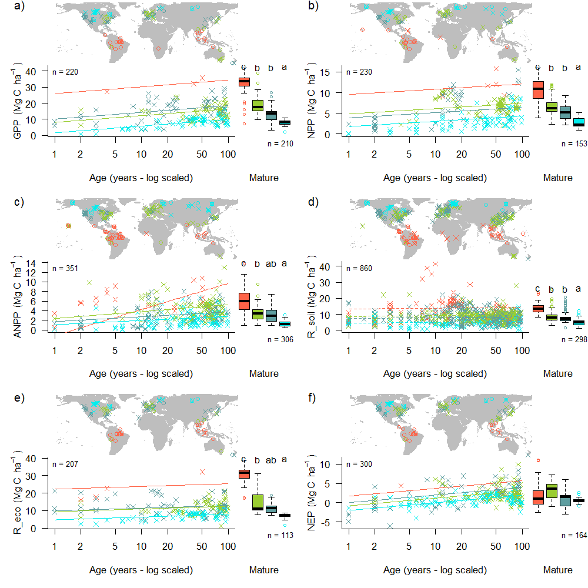

\raggedright

**Title:** Carbon cycling in mature and regrowth forests globally: a macroecological synthesis based on the global Forest Carbon (ForC) database 

**Authors:** 
Kristina J. Anderson-Teixeira^1,2^*

Valentine Herrmann^1^

Becky Banbury Morgan

Ben Bond-Lamberty

Susan Cook-Patton

Abigail Ferson

Jennifer McGarvey

Helene C. Muller-Landau^1^

Maria Wang


**Author Affiliations:**

1. Conservation Ecology Center; Smithsonian Conservation Biology Institute; National Zoological Park, Front Royal, VA 22630, USA
2. Center for Tropical Forest Science-Forest Global Earth Observatory; Smithsonian Tropical Research Institute; Panama, Republic of Panama

*corresponding author: teixeirak@si.edu; +1 540 635 6546

\newpage

### Summary
```{r eval=FALSE, echo=FALSE}
# The Summary should be no longer than 300 words and divided into the following sections: Background, Methods/Design, Review results/ Synthesis and Discussion. Up to 7 Keywords should also be provided. The total length of the article is flexible.
```


*Background.* *The fate of Earth’s climate closely linked to forests, which strongly influence atmospheric carbon dioxide (CO~2~) and climate through their influential role in the global carbon (C) cycle. Synthetic understanding of global forest C cycles is needed to constrain model estimates of forest feedbacks to climate change and to more accurately quantify the influence of land use decisions on climate.*

*Methods/Design.* Here, we draw from the Global Forest C Database, ForC, to provide a macroscopic overview of C cycling in the world’s forests, giving special attention to stand age-related variation. Specifically, we draw upon ## records from ## geographic locations representing ## C cycle variables to characterize ensemble C budgets for four broad forest types (tropical broadleaf evergreen, temperate broadleaf, temperate conifer, and taiga), including estimates for both mature and regrowth (age <100 years) forests. For regrowth forests, we quantify age trends for all variables.

*Review Results/ Synthesis.*  The rate of C cycling generally increased from boreal to tropical regions, whereas C stocks showed less directional variation. The majority of flux variables, together with most live biomass pools, increased significantly with stand age, and the rate of increase again tended to increase from boreal to tropical regions.

*Discussion.* *[Discussion section will interpret results, highlighting new and significant findings, and discuss implications. Tentative headings are “Stand level C cycling in forests globally”, “Age trends in C cycling”, and “Implications for climate change mitigation”.]*
 
*Key words*: forest ecosystems; carbon cycle; stand age; productivity; respiration; biomass; global 

### Background
```{r eval=FALSE, echo=FALSE}
# The Background section needs to present the rationale for why a systematic review of this topic is needed along with a history of what has been done to date and an expectation of what new will emerge from the review, especially if quantitative meta-analyses of studies are being considered.
```

Carbon (C) cycling in forests is central to sustaining life on Earth. Forest ecosystems globally influence climate through their vital role in regulating atmospheric carbon dioxide (CO~2~). Their annual gross CO~2~ sequestration (gross primary productivity, $GPP$) is estimated at >69 Gt C yr^-1^ (Bagdley et al. 2019), or >7 times average annual fossil fuel emissions from 2007-2016 (9.4 ± 0.5 Gt C yr-1; Le Quéré et al 2017) (**update**). While most of this enormous C flux is couterbalanced by CO~2~ releases to the atmosphere through ecosystem respiration ($R_{eco}$) or fire, a small portion was retained in ecosystems over recent decades. The resulting in C sink averaged 3.0 ± 0.8 Gt C yr-1 from 2007-2016, offsetting 32% of anthropogenic fossil fuel emissions (Le Quéré et al 2017) (**update, give range**). Moreover, forests contain substantial C stocks: an estimated 92% of terrestrial biomass  (Pan et al 2013) and 45% of terrestrial C (biomass and soils; Bonan 2008). Globally, net deforestation (*i.e.*, gross deforestation - regrowth) has been a source of CO~2~ emissions, estimated at ~1.1 Gt C yr-1 from YEAR-YEAR (Pan et al 2011), resulting in net C sink of ~1.2-1.7 Gt C yr^-1^ across Earth's forests [Le Quéré et al 2017, @schimel_observing_2015] (**update, give range**). The future of this sink is dependent both upon forest responses to a broad suite of global change drivers and to future land use decisions, and will strongly influence the course of climate change. Understanding, modeling, and managing forest-atmosphere CO~2~ exchange is thereby central to efforts to mitigate climate change [@grassi_key_2017] (Friedlingstein et al 2006, Cavaleri et al 2015, Griscom et al 2017; IPCC1.5).

On an ecosystem level, forest C cycling is central to the flow of energy and materials, and as the basis of food webs... 

Despite the centrality of forest C cycling in regulating both atmospheric CO~2~ and ecosystem function and diversity, we lack a comprehensive understanding of how C cycling varies with across biomes and with stand age. While remote sensing measurements are increasingly useful for global- or regional-scale estimates of forest $GPP$ (Bagdley et al. 2019, [@li_mapping_2019]), aboveground biomass ($B_{ag}$) (REFS), woody mortality (*i.e.*, $B_{ag}$ losses to mortality $M_{woody}$) [@clark_quantifying_2004; @leitold_nino_2018], and to some extent net ecosystem exchange ($NEE$) (REFS), the remainder of C fluxes and stocks can only be quantified by ground-based measurements. Moreover, data on stand characteristics--including species composition, age, and disturbance history--are critical to interpreting and projecting into the future, but [usually rely on ground-based measurements]. Thus, ground-based measurements are, and will continue to be, central to characterizing forest C cycling. 

Tens of thousands of ground-based forest C measurements have been published, but their distribution across literally thousands of scientific articles-- along with variation in data formats, units, measurement methods, *etc.*--have made them effectively inaccessible for many global-scale analyses, including those attempting to quantify the role of forests in the global C cycle (*e.g.*, Pan et al 2011), and model evaluation (Clark et al 2017, Luo et al 2012). Important progress has been made in synthesizing data to address how C cycling varies across forest biomes (Luyssaert et al. 2007; REFS) and stand ages (REFS), yet generally consider only a limited set of C variables [but see @anderson-teixeira_carbon_2016 for the tropics] and do not consider age-by-biome interactions. To address the need for global-scale analyses of forest C cycling, we have developed an open-access Global Forest Carbon database, ForC (@anderson-teixeira_carbon_2016, @anderson-teixeira_forc:_2018). ForC contains data on forest ecosystem C stocks and annual fluxes (>50 variables) and associated data required for interpretation (*e.g.*, stand history, measurement methods) amalgamated from numerous previous data compilations and directly from original publications. ForC currently contains **#** records from **#** plots and **#** distinct geographic areas representing all forested biogeographic and climate zones.

Here, we synthesize ForC data to provide a macroscopic overview of stand-level carbon cycling of the world’s major forest biomes and how it varies with stand age. We address two broad questions: 

1. How do C cycling vary across the worlds major forest biomes (*i.e.*, tropical, temperate broadleaf and deciduous, boreal)?

2. How does C cycling vary with stand age? 

While components of these questions have been previously addressed [@luyssaert_co2_2007; @anderson-teixeira_carbon_2016, @anderson-teixeira_forc:_2018, @banbury_morgan_global_nodate], our analysis represents by far the most comprehensive analysis of C cycling in global forests, and thereby stands to serve as a foundation for improved understanding of global forest C cycling.

### Methods/ Design
```{r eval=FALSE, echo=FALSE}
# The Methods/Design section needs to describe how articles in the reviews were identified and what criteria were used for justifying inclusion in the review. While traditional reviews relying on past experience and expert knowledge are acceptable, editors should encourage reviews that are set up as so-called ‘systematic reviews’ (see the Cochrane Review procedure which initiated the process in the medical and health science: http://community.cochrane.org/ about-us/evidence-based-health-care).
```


This review synthesizes data from the ForC database [https://github.com/forc-db/ForC; @anderson-teixeira_carbon_2016, @anderson-teixeira_forc:_2018]. ForC amalgamates numerous intermediary data sets (*e.g.*, REFS) and original studies. 
Original publications were referenced to check values and obtain information not contained in intermediary data sets, although this process has not been completed for all records. 
The database was developed with goals of understanding how C cycling in forests varies across broad geographic scales and as a function of stand age. 
As such, there has been a focus on incorporating data from regrowth forests (*e.g.*, Anderson et al 2006, Martin et al 2013, Bonner et al 2013) and obtaining stand age data when possible (83% of records in v.2.0; Anderson-Teixeira et al 2018). 
Particular attention was given to developing the database for tropical forests [@anderson-teixeira_carbon_2016], yet these represented only approximately one-third of records in ForC v.2.0 [@anderson-teixeira_forc:_2018]. Since publication of ForC v.2.0, we added the following data to ForC: the Global Database of Soil Respiration Database [SRDB v.##; @bond-lamberty_global_2010], the Global Reforestation Opportunity Assessment (GROA) database (Cook-Patton et al. in press), and [GitHub list](https://github.com/forc-db/ForC/blob/master/database_management_records/ForC_data_additions_log.csv). 
We note that there remains a significant amount of relevant data that is not yet included in ForC, particularly biomass data from national forest inventories (*e.g.*,: REFS). 
The database version used for this analysis has been tagged as a new release on Github (XX) and assigned a DOI through Zenodo (DOI: XX).

For this analysis, we grouped forests into four broad biome types (tropical broadleaf, temperate broadleaf, temperate needleleaf, and boreal needleleaf) and two age classifications (young and mature). 
Climate zones were defined according to Köppen-Geiger zones, which were extracted based on site geographic coordinates from the ESRI Köppen-Geiger map (downloaded June 2014 from http://maps3.arcgisonline.com/ArcGIS/rest/services/A-16/Köppen- Geiger_Observed_and_Predicted_Climate_Shifts/MapServer; Rubel and Kottek 2010).
Tropical climates were defined to include all equatorial (A) zones, temperate climates were defined to include all warm temperate (C) zones and warmer snow climates (Dsa, Dsb, Dwa, Dwb, Dfa, and Dfb), and boreal climates were defined to include the colder snow climates (Dsc, Dsd, Dwc, Dwd, Dfc, and Dfd). 
Any forests in dry (B) and polar (E) Köppen-Geiger zones were excluded from the analysis. 
Leaf type (broadleaf / needleleaf) was defined based on descriptions in original publications (prioritized) or values extracted from a global map based on satellite observations (SYNMAP; Jung et al 2006) and recorded in the  dominant.veg field of the ForC MEAUREMENTS table. 
Stand age was obtained from the stand.age field of MEASUREMENTS table, and forests classified as “young” (< 100 years) or “mature” ($\ge$ 100 years or classified as “mature”, “old growth”, “intact”, or “undisturbed” in original publication). 
Records for which stand age was unknown were excluded from the analysis. 
These groupings were defined based on ForC v.2.0[@anderson-teixeira_forc:_2018], for which they covered 91% of the primary variable records for forests of known age, or 86% of total records. 
The most well-represented forest types excluded were boreal broadleaf and boreal and temperate mixed broadleaf-needleleaf, each with <400 records total for stands of any age.

We drew upon records for *#* annual flux and *#* C stock variables (Table 1). For this analysis, we combined some of ForC’s specific variables (*e.g.*, multiple variables for net primary productivity including various components) into more broadly defined variables (Table 1, [this table](https://github.com/forc-db/ForC/blob/master/figures/C_cycle_diagrams/ForC_variables_mapping_for_C_cycle_diagrams.csv))). 
Although ForC contains information that may be used to standardize or control for methodological differences (*e.g.*, area sampled, min stem diameter sampled, allometric equations applied; Anderson-Teixeira et al 2018), for this analysis we included all relevant data in ForC. 
Throughout ForC, for all measurements drawing from tree census data (*e.g.*, biomass, productivity), the minimum stem diameter sampled was $\le$ 10cm. All records were measured directly or derived from field measurements (as opposed to modeled). 

```{r eval = TRUE, echo=FALSE, warning=FALSE}
library(knitr)
library(kableExtra)
S1 <- read.csv("tables_figures/C_variables.csv", stringsAsFactors = FALSE, check.names = FALSE)
names(S1) [6]  <- paste0(names(S1) [6], footnote_marker_symbol(1))
names(S1) [7]  <- paste0(names(S1) [7], footnote_marker_symbol(2))
kable(S1, format = "latex", booktabs = TRUE, caption = "Table 1. Carbon cycle variables included in this analysis, their sample sizes, and summary of biome differences and age trends.", escape = F)%>%
  # footnote(general = "Complete list of variables with full definitions and association to ForC variables is given in [XXXXX](https://github.com/forc-db/ForC/blob/master/figures/C_cycle_diagrams/ForC_variables_mapping_for_C_cycle_diagrams.csv). ") %>%
  kable_styling(latex_options = c("scale_down", "hold_position"), font_size = 12)  %>%
  add_header_above(c(" ", " ", "N records" = 3, " " , " " )) %>%
  #column_spec(1, width = "4cm") %>%
  column_spec(2, width = "7cm") %>%
  column_spec(3, width = "1.1cm") %>%
  column_spec(4, width = "1cm") %>%
  column_spec(5, width = "1.8cm") %>%
  pack_rows("Annual fluxes", 1, 23, colnum = 2, hline_before = FALSE) %>%
  pack_rows("Stocks", 24, 34, colnum = 2, hline_before = FALSE) %>%
kableExtra::footnote(symbol = c("Tr: Tropical, TeB: Temperate Broadleaf, TeN: Temperate Needleleaf, B: Boreal, n.s.: no significant differences", "+ or -: significant positive or negative trend, xB: significant age x biome interaction, n.s.: no significant age trend"), footnote_as_chunk = FALSE)
```

Analyses drew from ForC-simplified (https://github.com/forc-db/ForC/blob/master/ForC_simplified), which is a rearrangement of ForC intended to facilitate analyses. 
In generating ForC-simplified, all measurements originally expressed in units of dry organic matter ($OM$) were converted to units of C using the IPCC default of $C = 0.47 * OM$ (IPCC 2006). 
Duplicate or otherwise conflicting records were reconciled as described in *APPENDIX A*. 
Records were filtered to remove plots that had undergone significant anthropogenic management or major disturbance since the most recent stand establishment (*i.e.*, that reflected by stand.age). Specifically, we removed all plots flagged as managed in ForC-simplified (managed field). This included plots with any record of managements manipulating CO~2~, temperature, hydrology, nutrients, or biota, as well as any plots whose site or plot name contained the terms “plantation”, "planted", “managed”, “irrigated”, or “fertilized”.  Plots flagged as disturbed in ForC-simplified included stands that had undergone anthropogenic thinning or partial harvest (“Cut” or “Harvest” codes) unless this was very minor (percent.mortality= “minor”). We retained sites that were grazed or had undergone low severity natural disturbances (<10% mortality) including droughts, major storms, fires, and floods. We also removed all plots for which no stand history information had been retrieved. 
 
Data were analyzed to produce basic summaries of C cycle patterns across biomes and stand ages following an approach similar to that of Anderson-Teixeira et al (2016). For mature forests, to obtain the values reported in the C cycle schematics, we first averaged any repeated measurements within a plot, weighting flux measurements according to the length of measurement periods (*i.e.*, end.date - start.date). Values were then averaged across plots clustered within 25 km of one another (geographic.area field of SITES table, sensu Anderson-Teixeira et al 2018), weighting by area.sampled (MEASUREMENTS table) or plot.area (PLOTS table) if available for all records. This step was taken to avoid pseudo-replication and to combine any records from sites with more than one name in ForC. Finally, we computed statistics with geographic.area as the unit of replication. To compare across biomes, [**Valentine, please describe**]. There were enough data to run this analysis for all focal variables but XX. 

For young (<100yrs) forest types, we employed a mixed effects model (XX in R) with biome and log10[stand.age] as fixed effects and plot nested within geographic.area as a random effect. When the effect of stand.age was significant at p $\le$ 0.05 and when each biome had records for stands of at least 10 different ages, a biome - stand.age interaction was included in the model. In the C cycle schematics for young forests, we report equations based on these models. In cases where there was no significant effect of stand.age, records were averaged as for mature stands. 

All database manipulation, analyses, and figure production were fully automated in R (version, citation). Materials required to fully reproduce these analyses, including data, R scripts, and image files, are archived in Zenodo (DOI: TBD]. Data, scripts, and results presented here are also available through the open-access ForC GitHub repository (https://github.com/forc-db/ForC), where many will be updated as the database develops.

### Review Results/ Synthesis
```{r eval=FALSE, echo=FALSE}
# The Review Results/Synthesis section presents the findings of the analyses.
```


*C cycling in mature forests*

Average C cycles for tropical broadleaf, temperate broadleaf, temperate conifer, and boreal forests $\ge$ 100 years old and with no known major disturbance or significant anthropogenic management are presented in Figures 2-5, and statistics for each biome type are also summarized at: [GitHub URL]. Of the # flux and # stock variables mapped in these diagrams, ForC contained estimates from $\ge$ 7 distinct geographic areas for *#* fluxes and *#* stocks in tropical broadleaf forests, # fluxes and # stocks in temperate broadleaf forests, #fluxes and # stocks in temperate conifer forests, and fluxes and # stocks in boreal forests. For variables with records from $\ge$ 7 distinct geographic areas, these ensemble C budgets were generally consistent. That is, component fluxes and stocks summed to within 1 std of more inclusive fluxes in all but one instance (in temperate conifer forests, $aboveground woody biomass + foliage biomass > aboveground biomass + 1std$; Fig. 4). **update this: https://github.com/forc-db/ERL-review/issues/16 ** 

\newpage
\blandscape
```{r echo=FALSE, fig.align = "center", fig.cap = "Figure 2 | C cycle diagram for mature tropical broadleaf forests. All units are Mg C ha$^{-1}$ yr$^{-1}$ (fluxes) or Mg C ha$^{-1}$. Presented are mean ± std, where geographically distinct areas are treated as the unit of replication.  Arrows indicate fluxes, boxes indicate stocks. Dashed shape outlines indicate variables with records from <7 distinct geographic areas, and dashed arrows indicate fluxes with no data. Arrows are scaled as the **square root of flux divided by 5**.", out.width='100%', fig.pos='H'}

  knitr::include_graphics("tables_figures/Tropical broadleaf MATURE.png")
```

```{r echo=FALSE, fig.align = "center", fig.cap = "Figure 3 | C cycle diagram for mature temperate broadleaf forests. All units are Mg C ha$^{-1}$ yr$^{-1}$ (fluxes) or Mg C ha$^{-1}$. Presented are mean ± std, where geographically distinct areas are treated as the unit of replication.  Arrows indicate fluxes, boxes indicate stocks. Dashed shape outlines indicate variables with records from <7 distinct geographic areas, and dashed arrows indicate fluxes with no data.", out.width='100%', fig.pos='H'}

  knitr::include_graphics("tables_figures/Temperate broadleaf MATURE.png")
```

```{r echo=FALSE, fig.align = "center", fig.cap = "Figure 3 | C cycle diagram for mature temperate conifer forests. All units are Mg C ha$^{-1}$ yr$^{-1}$ (fluxes) or Mg C ha$^{-1}$. Presented are mean ± std, where geographically distinct areas are treated as the unit of replication.  Arrows indicate fluxes, boxes indicate stocks. Dashed shape outlines indicate variables with records from <7 distinct geographic areas, and dashed arrows indicate fluxes with no data.", out.width='100%', fig.pos='H'}

  knitr::include_graphics("tables_figures/Temperate conifer MATURE.png")
```

```{r echo=FALSE, fig.align = "center", fig.cap = "Figure 4 | C cycle diagram for mature boreal conifer forests. All units are Mg C ha$^{-1}$ yr$^{-1}$ (fluxes) or Mg C ha$^{-1}$. Presented are mean ± std, where geographically distinct areas are treated as the unit of replication.  Arrows indicate fluxes, boxes indicate stocks. Dashed shape outlines indicate variables with records from <7 distinct geographic areas, and dashed arrows indicate fluxes with no data.", out.width='100%', fig.pos='H'}

  knitr::include_graphics("tables_figures/Boreal conifer MATURE.png")
```
\elandscape

(**check paragraph with latest data**) The largest C fluxes—including $GPP$, $NPP$, $ANPP$, $BNPP$, $R_{soil_het}$, $R_{soil}$, $R_{eco}$, — were highest in tropical forests, intermediate in temperate (broadleaf or conifer) forests, and lowest in boreal forests  ([ForC_variable_averages_per_Biome](https://github.com/forc-db/ForC/blob/master/numbers_and_facts/ForC_variable_averages_per_Biome.csv)) (Fig. 6). The same held true for some of the subsidiary fluxes: ANPP_foliage, ANPP_woody, [**OTHERS?**]. Other subsidiary fluxes—including NPP_woody, ANPP_repro, ANPP_stem, ANPP_branch, woody.mortality, BNPP_coarse, BNPP_fine,  [**OTHERS?**]—deviated from this pattern and/or lacked data for some biomes. Net ecosystem exchange (NEE) did not follow this pattern, with no significant differences across biomes but the largest (negative) average in temperate broadleaf forests, followed by temperate conifer, boreal, and tropical forests. Thus, C cycling rates generally decreased from tropical to temperate to boreal forests, but with less apparent trends for some of the subsidiary fluxes and an important exception in the overall C balance (NEE).


```{r echo=FALSE, fig.align = "center", fig.cap = "Figure 6 | Age trends and biome differences in some of the major C fluxes: (a) $GPP$, (b) $NPP$, (c) $ANPP$, (d) $R_{soil}$, (e) $R_{eco}$, and (f) $NEE$. Map shows data sources ($x$ and $o$ indicate young and mature stands, respectively). Lines...  .", out.width='100%', fig.pos='H'}

  
```

There were less distinct trends in C stocks across biomes (Fig. 7). Biome means for live aboveground and total biomass followed the same general trend as the major fluxes, with biomass of tropical= temperate broadleaf $\ge$ temperate conifer> boreal forests (Fig. 7a). However, the relative differences in these means were much smaller than for the major C fluxes, and there was significant variation within biomes. Maximum aboveground biomass values followed a very different trend than the means: temperate broadleaf> temperate conifer>boreal>tropical. There were some statistically significant biome differences in less frequently sampled C stocks (*e.g.*, woody biomass, foliage biomass, deadwood), but given high within-biome variability in C stocks and relatively low sample sizes, these were likely attributable to sampling biases and methodological differences than to true differences across biomes. 

```{r echo=FALSE, fig.align = "center", fig.cap = "Figure 7 | Age trends and biome differences in some of the major forest C stocks: (a) aboveground biomass, (b) foliage, (c) fine roots, (d) dead wood.", out.width='100%', fig.pos='H'}

  knitr::include_graphics("tables_figures/Figure7.png")
```


*C cycling in young forests* 

(**check paragraph with latest data**) Average C cycles for forests <100 years old are presented in Figures 8-11. In general, ForC contained roughly comparable information on C fluxes in regrowth vs mature forests, with the notable exception of tropical forests, for which there were no fluxes that had been measured in $\ge$ 7 different geographic areas. C stocks were better documented for regrowth stands, with a total of # records from # distinct geographic areas. Both C stocks and fluxes commonly displayed significant trends with stand age for within-biome analyses (Fig. 6-11; detailed below). Differences across biomes typically paralleled those observed for mature forests, with C cycling generally most rapid in the tropics and slowest in boreal forests (Figs. 6-7).  

(**check paragraph with latest data**) ForC contained 14 flux variables with sufficient data for cross-biome analyses of age trends in regrowth forests (see Methods) (Fig. 6-7 and **S#- SI figures including plots for all variables**). Of these, 9 increased significantly with log10[stand.age]: $GPP$, $NPP$, $ANPP$, $ANPP_{foliage}$, $ANPP_{woody}$, $ANPP_{woody-stem}$, $BNPP$, $BNPP_{root-fine}$, $R_{eco}$, and net C sequestration ($-NEE$). The remaining five--$ANPP_{woody-branch}$, $BNPP_{root-coarse}$, $R_{soil-het}$, and $R_{soil-het}$-–displayed no significant relationship to stand age, although all displayed a positive trend. In terms of C stocks, 10 variables had sufficient data to test for age trends. Six of these—total biomass, aboveground biomass, aboveground woody biomass, foliage biomass, root biomass, and coarse root biomass—increased significantly with $log10[stand.age]$. The remaining four displayed non-significant positive trends:  fine root biomass, total dead wood, standing dead wood, and organic layer. 

\newpage
\blandscape
```{r echo=FALSE, fig.align = "center", fig.cap = "Figure 8 | C cycle diagram for young tropical broadleaf forests. All units are Mg C ha$^{-1}$ yr$^{-1}$ (fluxes) or Mg C ha$^{-1}$. Presented are mean ± std, where geographically distinct areas are treated as the unit of replication.  Arrows indicate fluxes, boxes indicate stocks. When age trends are signficant, they are presented with numbered equations; otherwise, means are presented. Dashed shape outlines indicate variables with records from <7 distinct geographic areas, and dashed arrows indicate fluxes with no data.", out.width='100%', fig.pos='H'}

  knitr::include_graphics("tables_figures/Tropical broadleaf YOUNG.png")
```

```{r echo=FALSE, fig.align = "center", fig.cap = "Figure 9 | C cycle diagram for young temperate broadleaf forests. All units are Mg C ha$^{-1}$ yr$^{-1}$ (fluxes) or Mg C ha$^{-1}$. Presented are mean ± std, where geographically distinct areas are treated as the unit of replication.  Arrows indicate fluxes, boxes indicate stocks. When age trends are signficant, they are presented with numbered equations; otherwise, means are presented. Dashed shape outlines indicate variables with records from <7 distinct geographic areas, and dashed arrows indicate fluxes with no data.", out.width='100%', fig.pos='H'}

  knitr::include_graphics("tables_figures/Temperate broadleaf YOUNG.png")
```

```{r echo=FALSE, fig.align = "center", fig.cap = "Figure 10 | C cycle diagram for young temperate conifer forests. All units are Mg C ha$^{-1}$ yr$^{-1}$ (fluxes) or Mg C ha$^{-1}$. Presented are mean ± std, where geographically distinct areas are treated as the unit of replication.  Arrows indicate fluxes, boxes indicate stocks. When age trends are signficant, they are presented with numbered equations; otherwise, means are presented. Dashed shape outlines indicate variables with records from <7 distinct geographic areas, and dashed arrows indicate fluxes with no data.", out.width='100%', fig.pos='H'}

  knitr::include_graphics("tables_figures/Temperate conifer YOUNG.png")
```

```{r echo=FALSE, fig.align = "center", fig.cap = "Figure 11 | C cycle diagram for young boreal conifer forests. All units are Mg C ha$^{-1}$ yr$^{-1}$ (fluxes) or Mg C ha$^{-1}$. Presented are mean ± std, where geographically distinct areas are treated as the unit of replication.  Arrows indicate fluxes, boxes indicate stocks. When age trends are signficant, they are presented with numbered equations; otherwise, means are presented. Dashed shape outlines indicate variables with records from <7 distinct geographic areas, and dashed arrows indicate fluxes with no data.", out.width='100%', fig.pos='H'}

  knitr::include_graphics("tables_figures/Boreal conifer YOUNG.png")
```
\elandscape

### Discussion 
```{r eval=FALSE, echo=FALSE}
# The Discussion section highlights the general conclusions, emphasizes novel findings, puts them in context and identifies issues and inferences for future work or policy considerations.
```

Carbon cycling rates generally increased from boreal to tropical regions and with stand age. Specifically, the major C fluxes were highest in tropical forests, intermediate in temperate (broadleaf or conifer) forests, and lowest in boreal forests—a pattern that generally held for regrowth as well as mature forests (Figs. 6-7). In contrast to C fluxes, there was little directional variation in mature forest C stocks across biomes (Figs. 2-5, 7). The majority of flux variables, together with most live biomass pools, increased significantly with stand age (Figs. 6-7). Together, these results indicate that, moving from cold to tropical climates and from young to old stands, there is a general acceleration of C cycling, whereas C stocks of mature forests are influenced by a different set of drivers. 

*C cycling across biomes*

*Age trends in C cycling*

A relative dearth of data on C cycling in secondary forests, particularly in the tropics (Anderson-Teixeira et al 2016), is problematic in that almost 2/3 of the world’s forests were secondary as of 2010 (FAO 2010), implying an under-filled need to characterize age-related trends in forest C cycling. 


### Acknowledgements
All researchers whose data is included in ForC and this analysis.
Thanks to Norbert Kunert for helpful discussion.
A Smithsonian Scholarly Studies grant to KAT and HML. 


```{r eval=FALSE, echo=FALSE}
# All references should be presented in alphabetical order and should also be bundled in ways that will help the reader to find those that are germane to each of the themes, topics or issues that the authors have used to organize the review. Such a matrix will be included as supplementary material. ERL has no standardized format for subdividing references by cross-cutting themes, but guidance from editors will be helpful to authors.
```
